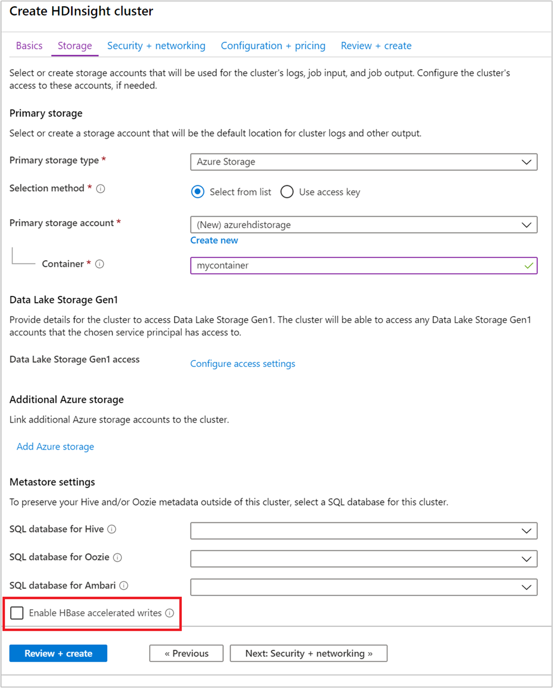

# Azure HDInsight Accelerated Writes for Apache HBase

This article provides background on the **Accelerated Writes** feature for Apache HBase in Azure HDInsight, and how it can be used effectively to improve write performance. **Accelerated Writes** uses [Azure premium SSD managed disks](../../virtual-machines/disks-types.md#premium-ssd) to improve performance of the Apache HBase Write Ahead Log (WAL). To learn more about Apache HBase, see [What is Apache HBase in HDInsight](apache-hbase-overview.md).

## Overview of HBase architecture

In HBase, a **row** consists of one or more **columns** and is identified by a **row key**. Multiple rows make up a **table**. Columns contain **cells**, which are timestamped versions of the value in that column. Columns are grouped into **column families**, and all columns in a column-family are stored together in storage files called **HFiles**.

**Regions** in HBase are used to balance the data processing load. HBase first stores the rows of a table in a single region. The rows are spread across multiple regions as the amount of data in the table increases. **Region Servers** can handle requests for multiple regions.

## Write Ahead Log for Apache HBase

HBase first writes data updates to a type of commit log called a Write Ahead Log (WAL). After the update is stored in the WAL, it's written to the in-memory **MemStore**. When the data in memory reaches its maximum capacity, it's written to disk as an **HFile**.

If a **RegionServer** crashes or becomes unavailable before the MemStore is flushed, the Write Ahead Log can be used to replay updates. Without the WAL, if a **RegionServer** crashes before flushing updates to an **HFile**, all of those updates are lost.

## Accelerated Writes feature in Azure HDInsight for Apache HBase

The Accelerated Writes feature solves the problem of higher write-latencies caused by using Write Ahead Logs that are in cloud storage.  The Accelerated Writes feature for HDInsight Apache HBase clusters, attaches premium SSD-managed disks to every RegionServer (worker node). Write Ahead Logs are then written to the Hadoop File System (HDFS) mounted on these premium managed-disks instead of cloud storage.  Premium managed-disks use Solid-State Disks (SSDs) and offer excellent I/O performance with fault tolerance.  Unlike unmanaged disks, if one storage unit goes down, it won't affect other storage units in the same availability set.  As a result, managed-disks provide low write-latency and better resiliency for your applications. To learn more about Azure-managed disks, see [Introduction to Azure managed disks](../../virtual-machines/managed-disks-overview.md).

## How to enable Accelerated Writes for HBase in HDInsight

To create a new HBase cluster with the Accelerated Writes feature, follow the steps in [Set up clusters in HDInsight](../hdinsight-hadoop-provision-linux-clusters.md) until you reach **Step 3, Storage**. Under **Metastore Settings**, select the checkbox next to **Enable HBase accelerated writes**. Then, continue with the remaining steps for cluster creation.



## Other considerations

To preserve data durability, create a cluster with a minimum of three worker nodes. Once created, you can't scale down the cluster to less than three worker nodes.

Flush or disable your HBase tables before deleting the cluster, so that you don't lose Write Ahead Log data.

```
flush 'mytable'
```

```
disable 'mytable'
```

Follow similar steps when scaling down your cluster: flush your tables and disable your tables to stop incoming data. You can't scale down your cluster to fewer than three nodes.

Following these steps will ensure a successful scale-down and avoid the possibility of a namenode going into safe mode due to under-replicated or temporary files.

If your namenode does go into safemode after a scale down, use hdfs commands to re-replicate the under-replicated blocks and get hdfs out of safe mode. This re-replication will allow you to restart HBase successfully.

## Next steps

* Official Apache HBase documentation on the [Write Ahead Log feature](https://hbase.apache.org/book.html#wal)
* To upgrade your HDInsight Apache HBase cluster to use Accelerated Writes, see [Migrate an Apache HBase cluster to a new version](apache-hbase-migrate-new-version.md).
