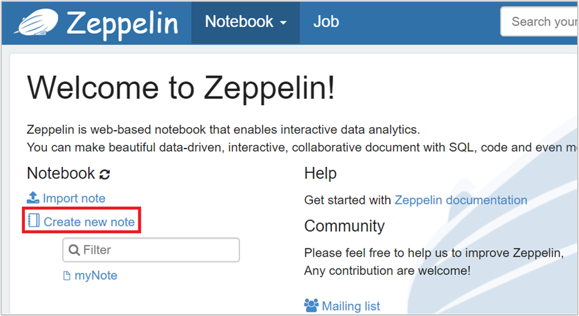

# Use Apache Zeppelin to run Apache Phoenix queries over Apache HBase in Azure HDInsight

Apache Phoenix is an open source, massively parallel relational database layer built on HBase. Phoenix allows you to use SQL like queries over HBase. Phoenix uses JDBC drivers underneath to enable you to create, delete, alter SQL tables, indexes, views and sequences.  You can also use Phoenix to update rows individually and in bulk. Phoenix uses a NOSQL native compilation rather than using MapReduce to compile queries, enabling the creation of low-latency applications on top of HBase.

Apache Zeppelin is an open source web-based notebook that enables you to create data-driven, collaborative documents using interactive data analytics and languages such as SQL and Scala. It helps data developers & data scientists develop, organize, execute, and share code for data manipulation. It allows you to visualize results without referring to the command line or needing the cluster details.

HDInsight users can use Apache Zeppelin to query Phoenix tables. Apache Zeppelin is integrated with HDInsight cluster and there are no additional steps to use it. Simply create a Zeppelin Notebook with JDBC interpreter and start writing your Phoenix SQL queries

## Prerequisites

An Apache HBase cluster on HDInsight. See [Get started with Apache HBase](./apache-hbase-tutorial-get-started-linux.md).

## Create an Apache Zeppelin Note

1. Replace `CLUSTERNAME` with the name of your cluster in the following URL `https://CLUSTERNAME.azurehdinsight.net/zeppelin`. Then enter the URL in a web browser. Enter your cluster login username and password.

1. From the Zeppelin page, select **Create new note**.

    

1. From the **Create new note** dialog, type or select the following values:

    - Note Name: Enter a name for the note.
    - Default interpreter: Select **jdbc** from the drop-down list.

    Then select **Create Note**.

1. Ensure the notebook header shows a connected status. It's denoted by a green dot in the top-right corner.

    

1. Create an HBase table. Enter the following command and then press **Shift + Enter**:

    ```sql
    %jdbc(phoenix)
    CREATE TABLE Company (
    	company_id INTEGER PRIMARY KEY,
    	name VARCHAR(225)
    );
    ```

    The **%jdbc(phoenix)** statement in the first line tells the notebook to use the Phoenix JDBC interpreter.

1. View created tables.

    ```sql
    %jdbc(phoenix)
    SELECT DISTINCT table_name
    FROM SYSTEM.CATALOG
    WHERE table_schem is null or table_schem <> 'SYSTEM';
    ```

1. Insert values in the table.

    ```sql
    %jdbc(phoenix)
    UPSERT INTO dbo.Company VALUES(1, 'Microsoft');
    UPSERT INTO dbo.Company (name, company_id) VALUES('Apache', 2);
    ```

1. Query the table.

    ```sql
    %jdbc(phoenix)
    SELECT * FROM dbo.Company;
    ```

1. Delete a record.

    ```sql
    %jdbc(phoenix)
    DELETE FROM dbo.Company WHERE COMPANY_ID=1;
    ```

1. Drop the table.

    ```sql
    %jdbc(phoenix)
    DROP TABLE dbo.Company;
    ```

## Next steps

- [Apache Phoenix now supports Zeppelin in Azure HDInsight](https://blogs.msdn.microsoft.com/ashish/2018/08/17/apache-phoenix-now-supports-zeppelin-in-azure-hdinsight/)
- [Apache Phoenix grammar](https://phoenix.apache.org/language/index.html)
