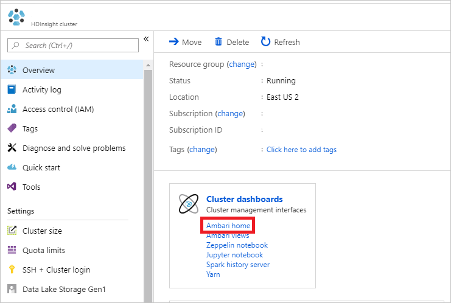
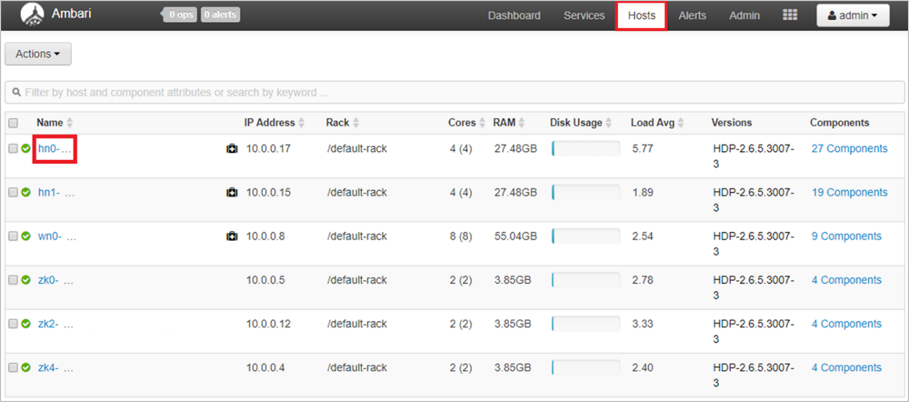
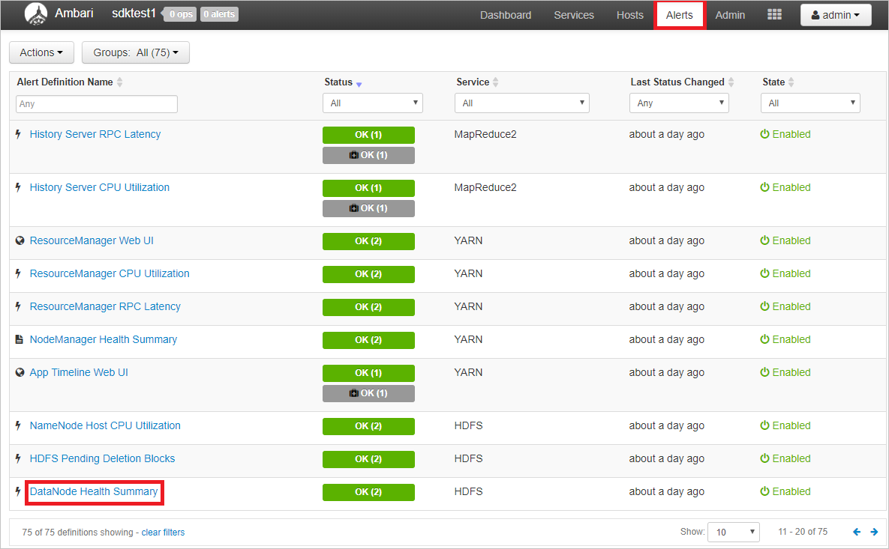
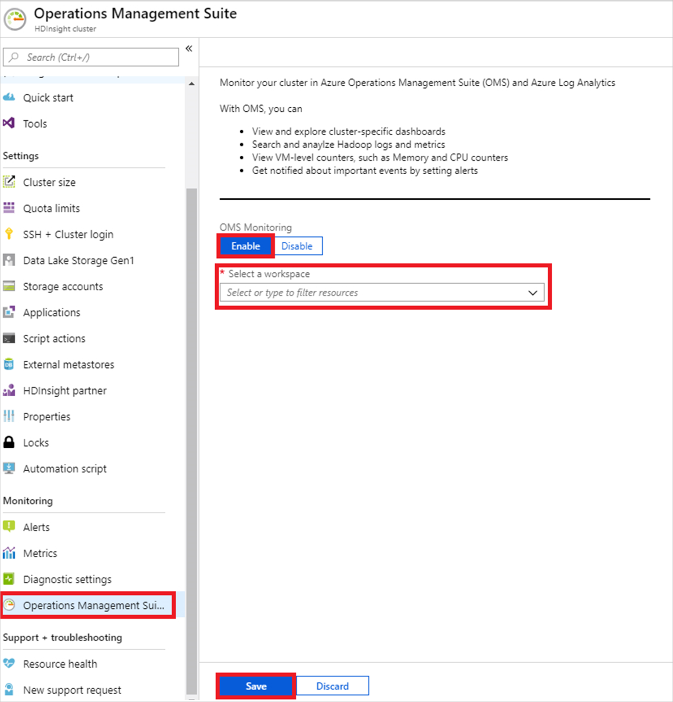
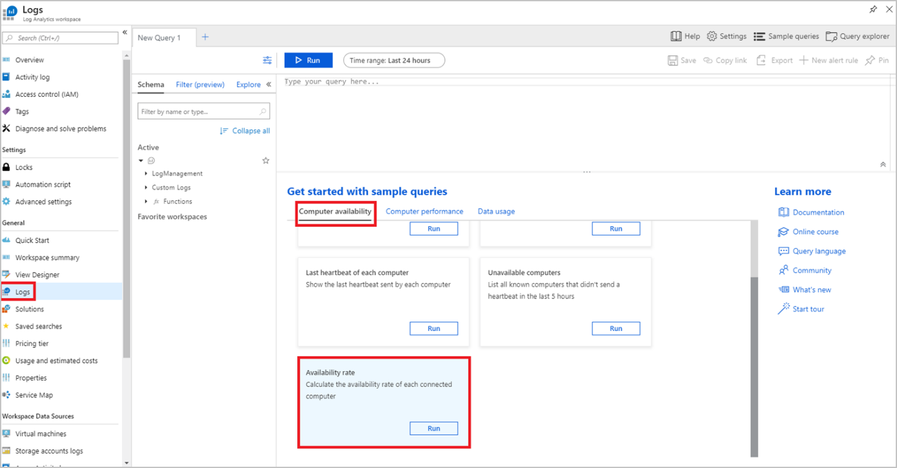
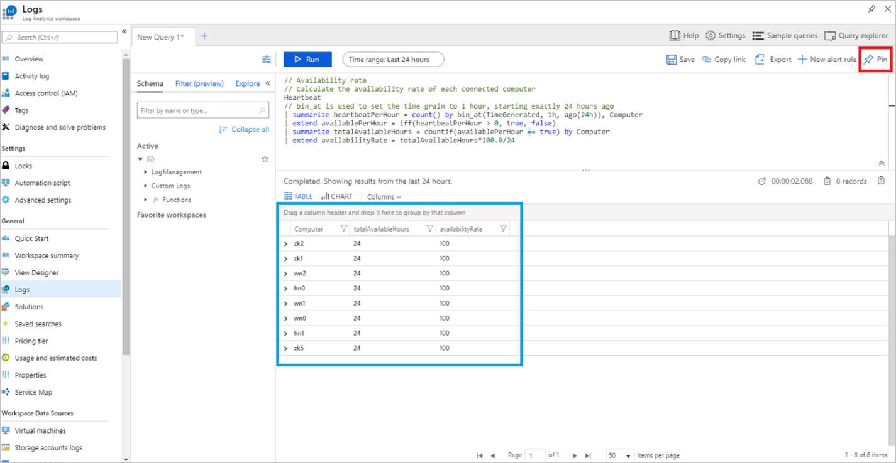
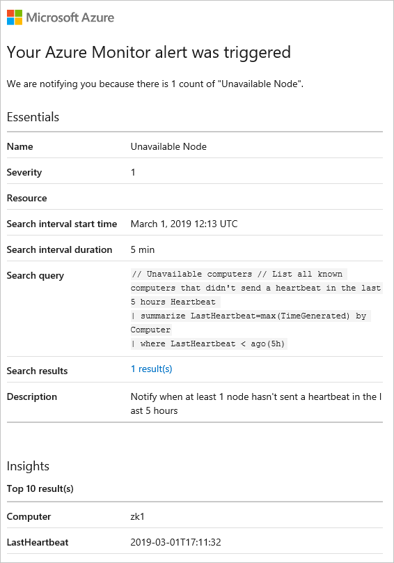
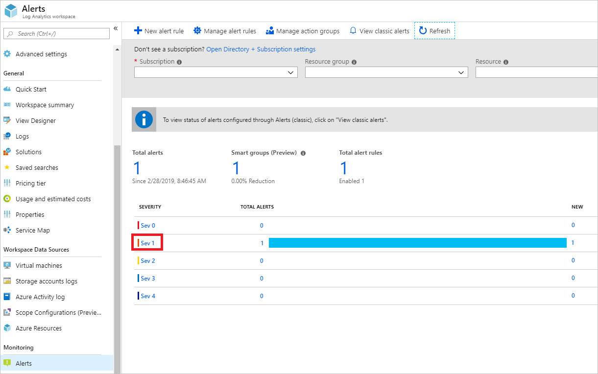

# How to monitor cluster availability with Ambari and Azure Monitor logs

HDInsight clusters include both Apache Ambari, which provides health information
at a glance and predefined alerts, as well as Azure Monitor logs integration,
which provides queryable metrics and logs, as well as configurable alerts.

This doc shows how to use these tools to monitor your cluster and walks through some examples for configuring an Ambari alert, monitoring node availability rate, and creating an Azure Monitor alert that fires when a heartbeat has not been received from one or more nodes in five hours.

## Ambari

### Dashboard

The Ambari dashboard can be accessed by clicking the **Ambari home** link in the
**Cluster dashboards** section of the HDInsight Overview blade in Azure portal
as shown below. Alternatively, it can be accessed by entering the following URL
in a browser [https://\<clustername\>.azurehdinsight.net](https://clustername.azurehdinsight.net/)

You will then be prompted for a cluster login username and password. Enter the
credentials you chose when you created the cluster.

You will then be taken to the Ambari dashboard, which contains widgets that show a
handful of metrics to give you a quick overview of your HDInsight cluster’s
health. These widgets show metrics such as the number of live DataNodes (worker
nodes) and JournalNodes (zookeeper node), NameNodes (head nodes) uptime, as well
metrics specific to certain cluster types, like YARN ResourceManager uptime for
Spark and Hadoop clusters.

### Hosts – view individual node status

You can also view status information for individual nodes. Click the **Hosts**
tab to view a list of all nodes in your cluster and see basic information about
each node. The green check to the left of each node name indicates all
components are up on the node. If a component is down on a node, you will see a
red alert triangle instead of the green check.

You can then click on the **name** of a node to view more detailed host metrics
for that particular node. This view shows the status/availability of each
individual component.

### Ambari alerts

Ambari also offers several configurable alerts that can provide notification of
certain events. When alerts are triggered, they are shown in the upper-left
corner of Ambari in a red badge containing the number of alerts. Clicking this
badge shows a list of current alerts.

To view a list of alert definitions and their statuses, click the **Alerts**
tab, as shown below.

Ambari offers many predefined alerts related to availability, including:

| Alert Name                        | Description                                                                                                                                                                           |
|-----------------------------------|---------------------------------------------------------------------------------------------------------------------------------------------------------------------------------------|
| DataNode Health Summary           | This service-level alert is triggered if there are unhealthy DataNodes                                                                                                                |
| NameNode High Availability Health | This service-level alert is triggered if either the Active NameNode or Standby NameNode are not running.                                                                              |
| Percent JournalNodes Available    | This alert is triggered if the number of down JournalNodes in the cluster is greater than the configured critical threshold. It aggregates the results of JournalNode process checks. |
| Percent DataNodes Available       | This alert is triggered if the number of down DataNodes in the cluster is greater than the configured critical threshold. It aggregates the results of DataNode process checks.       |

A full list of Ambari alerts that help monitor the availability of a cluster can
be found
[here](https://docs.microsoft.com/azure/hdinsight/hdinsight-high-availability-linux#ambari-web-ui),

To view details for an alert or modify criteria, click the **name** of the
alert. Take **DataNode Health Summary** as an example. You can see a description
of the alert as well as the specific criteria that will trigger a ‘warning’ or
‘critical’ alert and the check interval for the criteria. To edit the
configuration, click the **Edit** button in the upper-right corner of the
Configuration box.

Here, you can edit the description and, more importantly, the check interval
and thresholds for warning or critical alerts.

In this example, you could make 2 unhealthy DataNodes trigger a critical alert
and 1 unhealthy DataNode only trigger a warning. Click **Save** when you are
done editing.

### Email notifications

You can also optionally configure email notifications for Ambari alerts. To do
this, when on the **Alerts** tab, click the **Actions** button in the
upper-left, then **Manage Notifications.**

A dialog for managing alert notifications will open. Click the **+** at the
bottom of the dialog and fill out the required fields to provide Ambari with
email server details from which to send emails.

> [!TIP]
> Setting up Ambari email notifications can be a good way to receive alerts
in one place when managing many HDInsight clusters.

## Azure Monitor logs integration

Azure Monitor logs enables data generated by multiple resources, such as HDInsight clusters, to be collected and aggregated in one place to achieve a unified monitoring experience.

As a prerequisite, you will need a Log Analytics Workspace to store the
collected data. If you have not already created one, you can follow instructions
here: [Create a Log Analytics
Workspace](https://docs.microsoft.com/azure/azure-monitor/learn/quick-create-workspace).

### Enable HDInsight Azure Monitor logs integration

From the HDInsight cluster resource page in the portal, click the **Operations
Management Suite** blade. Then, click **enable** and select your Log Analytics
workspace from the dropdown.

### Query metrics and logs tables in the logs blade

Once Azure Monitor log integration is enabled (this may take a few minutes),
navigate to your **Log Analytics Workspace** resource and click on the **Logs**
blade

The **Logs** blade lists a number of sample queries, such as:

| Query Name                      | Description                                                               |
|---------------------------------|---------------------------------------------------------------------------|
| Computers availability today    | Chart the number of computers sending logs, each hour                     |
| List heartbeats                 | List all computer heartbeats from the last hour                           |
| Last heartbeat of each computer | Show the last heartbeat sent by each computer                             |
| Unavailable computers           | List all known computers that didn't send a heartbeat in the last 5 hours |
| Availability rate               | Calculate the availability rate of each connected computer                |

As an example, run the **Availability rate** sample query by clicking **Run** on
that query, as shown in the screenshot above. This will show the availability
rate of each node in your cluster as a percentage. If you have enabled multiple
HDInsight clusters to send metrics to the same Log Analytics workspace, you will
see the availability rate for all nodes in those clusters displayed.

> [!NOTE] 
> Availability rate is measured over a 24-hour period, so your cluster will need to run for at least 24 hours before you see accurate availability
rates.

You can pin this table to a shared dashboard by clicking **Pin** in the
upper-right corner. If you do not have any writable shared dashboards, you can
see how to create one here: [Create and share dashboards in the Azure
portal](https://docs.microsoft.com/azure/azure-portal/azure-portal-dashboards#publish-and-share-a-dashboard).

### Azure Monitor alerts

You can also set up Azure Monitor alerts that will trigger when the value of a
metric or the results of a query meet certain conditions. As an example, let’s
create an alert to send an email when one or more nodes hasn’t sent a heartbeat
in 5 hours (i.e. is presumed to be unavailable).

From the **Logs** blade, run the **Unavailable computers** sample query by
clicking **Run** on that query, as shown below.

If all nodes are available, this query should return 0 results for now. Click
**New alert rule** to begin configuring your alert for this query.

There are three components to an alert: the *resource* for which to create the rule
(the Log Analytics workspace in this case), the *condition* to trigger the
alert, and the *action groups* that determine what will happen when the alert is
triggered.

Click the **condition title**, as shown below, to finish configuring the signal
logic.

This will open the **Configure signal logic** blade.

Set the **Alert logic** section as follows:

*Based on: Number of results, Condition: Greater than, Threshold: 0.*

Since this query only returns unavailable nodes as results, if the number
of results is ever greater than 0, the alert should fire.

In the **Evaluated based on** section, set the **period** and **frequency**
based on how often you want to check for unavailable nodes.

Note that for the purpose of this alert, you want to make sure
**Period=Frequency.** More information about period, frequency, and other alert
parameters can be found
[here](https://docs.microsoft.com/azure/azure-monitor/platform/alerts-unified-log#log-search-alert-rule---definition-and-types).

Click **Done** when you are finished configuring the signal logic.

If you do not already have an existing action group, click **Create New** under
the **Action Groups** section.

This will open the **Add action group** blade. Choose an **Action group name**,
**Short name**, **Subscription**, and **Resource group.** Under the **Actions**
section, choose an **Action Name** and select **Email/SMS/Push/Voice** as the
**Action Type.**

> [!NOTE]
> There are several other actions an alert can trigger besides an
Email/SMS/Push/Voice, such as an Azure Function, LogicApp, Webhook, ITSM, and
Automation Runbook. [Learn More.](https://docs.microsoft.com/azure/azure-monitor/platform/action-groups#action-specific-information)

This will open the **Email/SMS/Push/Voice** blade. Choose a **Name** for the
recipient, **check** the **Email** box, and type an email address to which you
want the alert sent. Click **OK** in the **Email/SMS/Push/Voice** blade, then in
the **Add action group** blade to finish configuring your action group.

After these blades close, you should see your action group listed under the
**Action Groups** section. Finally, complete the **Alert Details** section by
typing an **Alert Rule Name** and **Description** and choosing a **Severity**.
Click **Create Alert Rule** to finish.

> [!TIP]
> The ability to specify **Severity** is a powerful tool that can be used
when creating multiple alerts. For example, you could create one alert to raise
a Warning (Sev 1) if a single head node goes down and another alert that raises
Critical (Sev 0) in the unlikely event that both head nodes go down.

When the condition for this alert is met, the alert will fire and you will
receive an email with the alert details like this:

You can also view all alerts that have fired, grouped by severity, by going to
the **Alerts** blade in your **Log Analytics Workspace**.

Clicking on a severity grouping (i.e. **Sev 1,** as highlighted above) will show
records for all alerts of that severity that have fired like below:

## Next steps
- [Availability and reliability of Apache Hadoop clusters in HDInsight](hdinsight-high-availability-linux.md)
