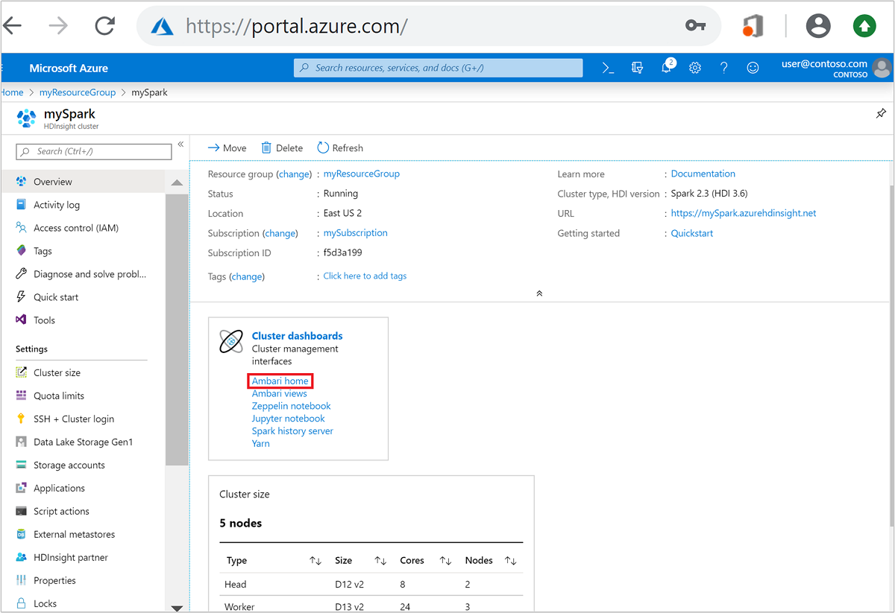
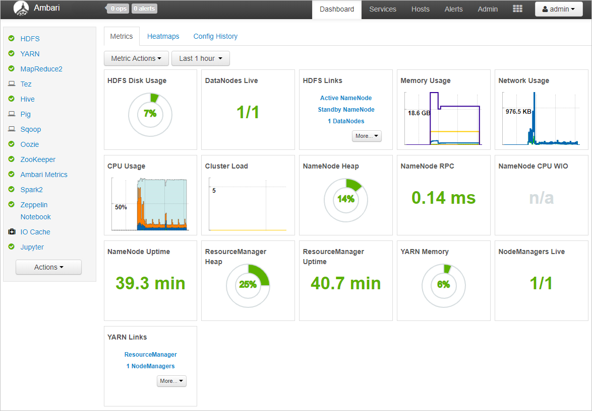
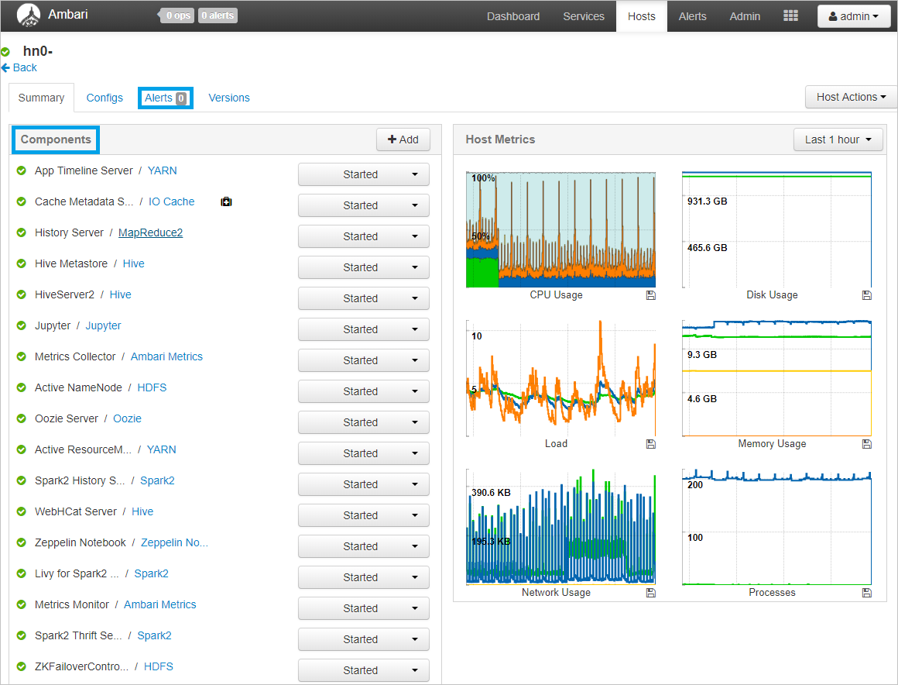
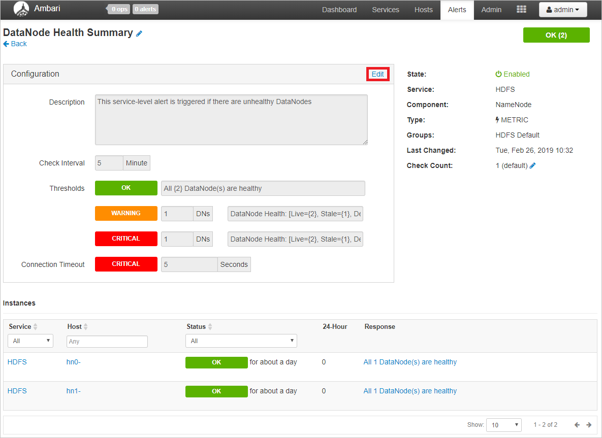
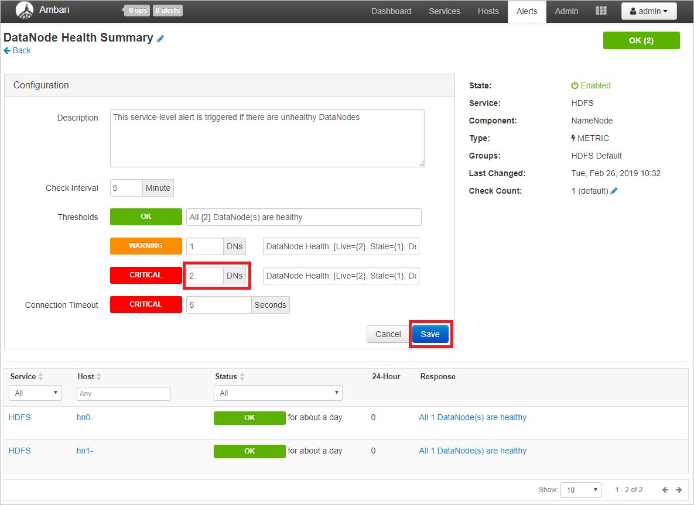

# How to monitor cluster availability with Apache Ambari in Azure HDInsight

HDInsight clusters include Apache Ambari, which provides health information at a glance and predefined alerts.

This article shows how to use Ambari to monitor your cluster and walks through some examples for configuring an Ambari alert, monitoring node availability rate, and creating an Azure Monitor alert that fires when a heartbeat hasn't been received from one or more nodes in five hours.

## Dashboard

The Ambari dashboard can be accessed by selecting the **Ambari home** link in the **Cluster dashboards** section of the HDInsight Overview in Azure portal as shown below. Alternatively, it can be accessed by navigating to `https://CLUSTERNAME.azurehdinsight.net` in a browser where CLUSTERNAME is the name of your cluster.

You'll then be prompted for a cluster login username and password. Enter the credentials you chose when you created the cluster.

You'll then be taken to the Ambari dashboard, which contains widgets that show a handful of metrics to give you a quick overview of your HDInsight cluster's health. These widgets show metrics such as the number of live DataNodes (worker nodes) and JournalNodes (zookeeper node), NameNodes (head nodes) uptime, as well metrics specific to certain cluster types, like YARN ResourceManager uptime for
Spark and Hadoop clusters.

## Hosts – view individual node status

You can also view status information for individual nodes. Select the **Hosts** tab to view a list of all nodes in your cluster and see basic information about each node. The green check to the left of each node name indicates all components are up on the node. If a component is down on a node, you'll see a red alert triangle instead of the green check.

You can then select on the **name** of a node to view more detailed host metrics for that particular node. This view shows the status/availability of each individual component.

## Ambari alerts

Ambari also offers several configurable alerts that can provide notification of certain events. When alerts are triggered, they're shown in the upper-left corner of Ambari in a red badge containing the number of alerts. Selecting this badge shows a list of current alerts.

To view a list of alert definitions and their statuses, select the **Alerts** tab, as shown below.

Ambari offers many predefined alerts related to availability, including:

| Alert Name                        | Description   |
|---|---|
| DataNode Health Summary           | This service-level alert is triggered if there are unhealthy DataNodes|
| NameNode High Availability Health | This service-level alert is triggered if either the Active NameNode or Standby NameNode aren't running.|
| Percent JournalNodes Available    | This alert is triggered if the number of down JournalNodes in the cluster is greater than the configured critical threshold. It aggregates the results of JournalNode process checks. |
| Percent DataNodes Available       | This alert is triggered if the number of down DataNodes in the cluster is greater than the configured critical threshold. It aggregates the results of DataNode process checks.|

To view details for an alert or modify criteria, select the **name** of the alert. Take **DataNode Health Summary** as an example. You can see a description of the alert as well as the specific criteria that will trigger a 'warning' or 'critical' alert and the check interval for the criteria. To edit the configuration, select the **Edit** button in the upper-right corner of the Configuration box.

Here, you can edit the description and, more importantly, the check interval and thresholds for warning or critical alerts.

In this example, you could make 2 unhealthy DataNodes trigger a critical alert and 1 unhealthy DataNode only trigger a warning. Select **Save** when you're done editing.

## Email notifications

You can also optionally configure email notifications for Ambari alerts. To do this, when on the **Alerts** tab, click the **Actions** button in the upper-left, then **Manage Notifications.**

A dialog for managing alert notifications will open. Select the **+** at the bottom of the dialog and fill out the required fields to provide Ambari with email server details from which to send emails.

> [!TIP]
> Setting up Ambari email notifications can be a good way to receive alerts in one place when managing many HDInsight clusters.

## Next steps

- [Availability and reliability of Apache Hadoop clusters in HDInsight](./hdinsight-business-continuity.md)
- [Cluster availability - Azure Monitor logs](./cluster-availability-monitor-logs.md)
- [Use Azure Monitor logs](hdinsight-hadoop-oms-log-analytics-tutorial.md)
- [Apache Ambari email notifications](apache-ambari-email.md)
