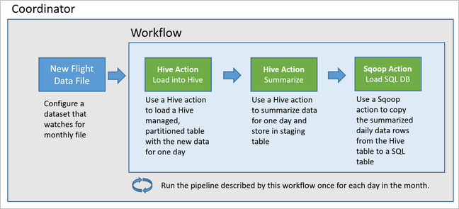
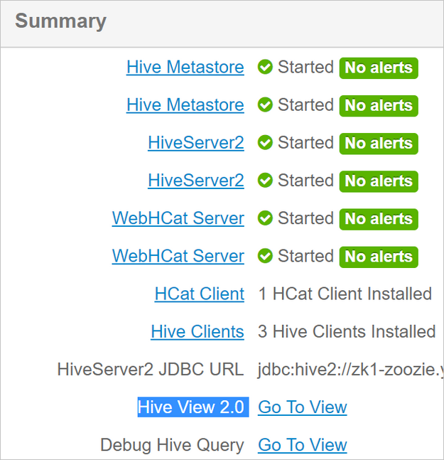
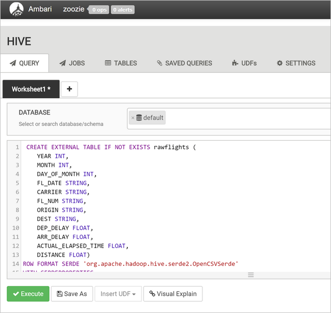
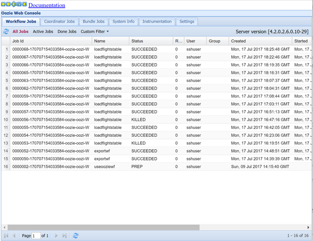
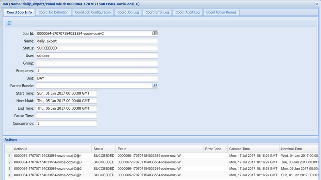

# Operationalize a data analytics pipeline

*Data pipelines* underly many data analytics solutions. As the name suggests, a data pipeline takes in raw data, cleans, and reshapes it as needed, and then typically performs calculations or aggregations before storing the processed data. The processed data is consumed by clients, reports, or APIs. A data pipeline must provide repeatable results, whether on a schedule or when triggered by new data.

This article describes how to operationalize your data pipelines for repeatability, using Oozie running on HDInsight Hadoop clusters. The example scenario walks you through a data pipeline that prepares and processes airline flight time-series data.

In the following scenario, the input data is a flat file containing a batch of flight data for one month. This flight data includes information such as the origin and destination airport, the miles flown, the departure and arrival times, and so forth. The goal with this pipeline is to summarize daily airline performance, where each airline has one row for each day with the average departure and arrival delays in minutes, and the total miles flown that day.

| YEAR | MONTH | DAY_OF_MONTH | CARRIER |AVG_DEP_DELAY | AVG_ARR_DELAY |TOTAL_DISTANCE |
| --- | --- | --- | --- | --- | --- | --- |
| 2017 | 1 | 3 | AA | 10.142229 | 7.862926 | 2644539 |
| 2017 | 1 | 3 | AS | 9.435449 | 5.482143 | 572289 |
| 2017 | 1 | 3 | DL | 6.935409 | -2.1893024 | 1909696 |

The example pipeline waits until a new time period's flight data arrives, then stores that detailed flight information into your Apache Hive data warehouse for long-term analyses. The pipeline also creates a much smaller dataset that summarizes just the daily flight data. This daily flight summary data is sent to a SQL Database to provide reports, such as for a website.

The following diagram illustrates the example pipeline.


## Apache Oozie solution overview

This pipeline uses Apache Oozie running on an HDInsight Hadoop cluster.

Oozie describes its pipelines in terms of *actions*, *workflows*, and *coordinators*. Actions determine the actual work to perform, such as running a Hive query. Workflows define the sequence of actions. Coordinators define the schedule for when the workflow is run. Coordinators can also wait on the availability of new data before launching an instance of the workflow.

The following diagram shows the high-level design of this example Oozie pipeline.



## Provision Azure resources

This pipeline requires an Azure SQL Database and an HDInsight Hadoop cluster in the same location. The Azure SQL Database stores both the summary data produced by the pipeline and the Oozie Metadata Store.

### Provision Azure SQL Database

1. Create an Azure SQL Database. See [Create an Azure SQL Database in the Azure portal](../azure-sql/database/single-database-create-quickstart.md).

1. To make sure that your HDInsight cluster can access the connected Azure SQL Database, configure Azure SQL Database firewall rules to allow Azure services and resources to access the server. You can enable this option in the Azure portal by selecting **Set server firewall**, and selecting **ON** underneath **Allow Azure services and resources to access this server** for Azure SQL Database. For more information, see [Create and manage IP firewall rules](../azure-sql/database/firewall-configure.md#use-the-azure-portal-to-manage-server-level-ip-firewall-rules).

1. Use [Query editor](../azure-sql/database/single-database-create-quickstart.md#query-the-database) to execute the following SQL statements to create the `dailyflights` table that will store the summarized data from each run of the pipeline.

    ```sql
    CREATE TABLE dailyflights
    (
        YEAR INT,
        MONTH INT,
        DAY_OF_MONTH INT,
        CARRIER CHAR(2),
        AVG_DEP_DELAY FLOAT,
        AVG_ARR_DELAY FLOAT,
        TOTAL_DISTANCE FLOAT
    )
    GO

    CREATE CLUSTERED INDEX dailyflights_clustered_index on dailyflights(YEAR,MONTH,DAY_OF_MONTH,CARRIER)
    GO
    ```

Your Azure SQL Database is now ready.

### Provision an Apache Hadoop Cluster

Create an Apache Hadoop cluster with a custom metastore. During cluster creation from the portal, from the **Storage** tab, ensure you select your SQL Database under **Metastore settings**. For more information on selecting a metastore, see [Select a custom metastore during cluster creation](./hdinsight-use-external-metadata-stores.md#select-a-custom-metastore-during-cluster-creation). For more information on cluster creation, see [Get Started with HDInsight on Linux](hadoop/apache-hadoop-linux-tutorial-get-started.md).

## Verify SSH tunneling set up

To use the Oozie Web Console to view the status of your coordinator and workflow instances, set up an SSH tunnel to your HDInsight cluster. For more information, see [SSH Tunnel](hdinsight-linux-ambari-ssh-tunnel.md).

> [!NOTE]  
> You can also use Chrome with the [Foxy Proxy](https://getfoxyproxy.org/) extension to browse your cluster's web resources across the SSH tunnel. Configure it to proxy all request through the host `localhost` on the tunnel's port 9876. This approach is compatible with the Windows Subsystem for Linux, also known as Bash on Windows 10.

1. Run the following command to open an SSH tunnel to your cluster, where `CLUSTERNAME` is the name of your cluster:

    ```cmd
    ssh -C2qTnNf -D 9876 sshuser@CLUSTERNAME-ssh.azurehdinsight.net
    ```

1. Verify the tunnel is operational by navigating to Ambari on your head node by browsing to:

    `http://headnodehost:8080`

1. To access the **Oozie Web Console** from within Ambari, navigate to  **Oozie** > **Quick Links** > [Active server] > **Oozie Web UI**.

## Configure Hive

### Upload data

1. Download an example CSV file that contains flight data for one month. Download its ZIP file `2017-01-FlightData.zip` from the [HDInsight GitHub repository](https://github.com/hdinsight/hdinsight-dev-guide) and unzip it to the CSV file `2017-01-FlightData.csv`.

1. Copy this CSV file up to the Azure Storage account attached to your HDInsight cluster and place it in the `/example/data/flights` folder.

    1. Use SCP to copy the files from your local machine to the local storage of your HDInsight cluster head node.

        ```cmd
        scp ./2017-01-FlightData.csv sshuser@CLUSTERNAME-ssh.azurehdinsight.net:2017-01-FlightData.csv
        ```

    1. Use [ssh command](./hdinsight-hadoop-linux-use-ssh-unix.md) to connect to your cluster. Edit the command below by replacing `CLUSTERNAME` with the name of your cluster, and then enter the command:

        ```cmd
        ssh sshuser@CLUSTERNAME-ssh.azurehdinsight.net
        ```

    1. From you ssh session, use the HDFS command to copy the file from your head node local storage to Azure Storage.

        ```bash
        hadoop fs -mkdir /example/data/flights
        hdfs dfs -put ./2017-01-FlightData.csv /example/data/flights/2017-01-FlightData.csv
        ```

### Create tables

The sample data is now available. However, the pipeline requires two Hive tables for processing, one for the incoming data (`rawFlights`) and one for the summarized data (`flights`). Create these tables in Ambari as follows.

1. Log in to Ambari by navigating to `http://headnodehost:8080`.

2. From the list of services, select **Hive**.

    

3. Select **Go To View** next to the Hive View 2.0 label.

    

4. In the query text area, paste the following statements to create the `rawFlights` table. The `rawFlights` table provides a schema-on-read for the CSV files within the `/example/data/flights` folder in Azure Storage.

    ```sql
    CREATE EXTERNAL TABLE IF NOT EXISTS rawflights (
        YEAR INT,
        MONTH INT,
        DAY_OF_MONTH INT,
        FL_DATE STRING,
        CARRIER STRING,
        FL_NUM STRING,
        ORIGIN STRING,
        DEST STRING,
        DEP_DELAY FLOAT,
        ARR_DELAY FLOAT,
        ACTUAL_ELAPSED_TIME FLOAT,
        DISTANCE FLOAT)
    ROW FORMAT SERDE 'org.apache.hadoop.hive.serde2.OpenCSVSerde'
    WITH SERDEPROPERTIES
    (
        "separatorChar" = ",",
        "quoteChar"     = "\""
    )
    LOCATION '/example/data/flights'
    ```

5. Select **Execute** to create the table.

    

6. To create the `flights` table, replace the text in the query text area with the following statements. The `flights` table is a Hive-managed table that partitions data loaded into it by year, month, and day of month. This table will contain all historical flight data, with the lowest granularity present in the source data of one row per flight.

    ```sql
    SET hive.exec.dynamic.partition.mode=nonstrict;

    CREATE TABLE flights
    (
        FL_DATE STRING,
        CARRIER STRING,
        FL_NUM STRING,
        ORIGIN STRING,
        DEST STRING,
        DEP_DELAY FLOAT,
        ARR_DELAY FLOAT,
        ACTUAL_ELAPSED_TIME FLOAT,
        DISTANCE FLOAT
    )
    PARTITIONED BY (YEAR INT, MONTH INT, DAY_OF_MONTH INT)
    ROW FORMAT SERDE 'org.apache.hadoop.hive.serde2.OpenCSVSerde'
    WITH SERDEPROPERTIES 
    (
        "separatorChar" = ",",
        "quoteChar"     = "\""
    );
    ```

7. Select **Execute** to create the table.

## Create the Oozie workflow

Pipelines typically process data in batches by a given time interval. In this case, the pipeline processes the flight data daily. This approach allows for the input CSV files to arrive daily, weekly, monthly, or annually.

The sample workflow processes the flight data day-by-day, in three major steps:

1. Run a Hive query to extract the data for that day's date range from the source CSV file represented by the `rawFlights` table and insert the data into the `flights` table.
2. Run a Hive query to dynamically create a staging table in Hive for the day, which contains a copy of the flight data summarized by day and carrier.
3. Use Apache Sqoop to copy all the data from the daily staging table in Hive to the destination `dailyflights` table in Azure SQL Database. Sqoop reads the source rows from the data behind the Hive table residing in Azure Storage and loads them into SQL Database using a JDBC connection.

These three steps are coordinated by an Oozie workflow.

1. From your local workstation, create a file called `job.properties`. Use the text below as the starting contents for the file.
Then update the values for your specific environment. The table below the text summarizes each of the properties and indicates where you can find the values for your own environment.

    ```text
    nameNode=wasbs://[CONTAINERNAME]@[ACCOUNTNAME].blob.core.windows.net
    jobTracker=[ACTIVERESOURCEMANAGER]:8050
    queueName=default
    oozie.use.system.libpath=true
    appBase=wasbs://[CONTAINERNAME]@[ACCOUNTNAME].blob.core.windows.net/oozie
    oozie.wf.application.path=${appBase}/load_flights_by_day
    hiveScriptLoadPartition=wasbs://[CONTAINERNAME]@[ACCOUNTNAME].blob.core.windows.net/oozie/load_flights_by_day/hive-load-flights-partition.hql
    hiveScriptCreateDailyTable=wasbs://[CONTAINERNAME]@[ACCOUNTNAME].blob.core.windows.net/oozie/load_flights_by_day/hive-create-daily-summary-table.hql
    hiveDailyTableName=dailyflights${year}${month}${day}
    hiveDataFolder=wasbs://[CONTAINERNAME]@[ACCOUNTNAME].blob.core.windows.net/example/data/flights/day/${year}/${month}/${day}
    sqlDatabaseConnectionString="jdbc:sqlserver://[SERVERNAME].database.windows.net;user=[USERNAME];password=[PASSWORD];database=[DATABASENAME]"
    sqlDatabaseTableName=dailyflights
    year=2017
    month=01
    day=03
    ```

    | Property | Value source |
    | --- | --- |
    | nameNode | The full path to the Azure Storage Container attached to your HDInsight cluster. |
    | jobTracker | The internal hostname to your active cluster's YARN head node. On the Ambari home page, select YARN from the list of services, then choose Active Resource Manager. The hostname URI is displayed at the top of the page. Append the port 8050. |
    | queueName | The name of the YARN queue used when scheduling the Hive actions. Leave as default. |
    | oozie.use.system.libpath | Leave as true. |
    | appBase | The path to the subfolder in Azure Storage where you deploy the Oozie workflow and supporting files. |
    | oozie.wf.application.path | The location of the Oozie workflow `workflow.xml` to run. |
    | hiveScriptLoadPartition | The path in Azure Storage to the  Hive query file `hive-load-flights-partition.hql`. |
    | hiveScriptCreateDailyTable | The path in Azure Storage to the Hive query file `hive-create-daily-summary-table.hql`. |
    | hiveDailyTableName | The dynamically generated name to use for the staging table. |
    | hiveDataFolder | The path in Azure Storage to the data contained by the staging table. |
    | sqlDatabaseConnectionString | The JDBC syntax connection string to your Azure SQL Database. |
    | sqlDatabaseTableName | The name of the table in Azure SQL Database into which summary rows are inserted. Leave as `dailyflights`. |
    | year | The year component of the day for which flight summaries are computed. Leave as is. |
    | month | The month component of the day for which flight summaries are computed. Leave as is. |
    | day | The day of month component of the day for which flight summaries are computed. Leave as is. |

1. From your local workstation, create a file called `hive-load-flights-partition.hql`. Use the code below as the contents for the file.

    ```sql
    SET hive.exec.dynamic.partition.mode=nonstrict;

    INSERT OVERWRITE TABLE flights
    PARTITION (YEAR, MONTH, DAY_OF_MONTH)
    SELECT 
      	FL_DATE,
      	CARRIER,
      	FL_NUM,
      	ORIGIN,
      	DEST,
      	DEP_DELAY,
      	ARR_DELAY,
      	ACTUAL_ELAPSED_TIME,
      	DISTANCE,
    	YEAR,
      	MONTH,
      	DAY_OF_MONTH
    FROM rawflights
    WHERE year = ${year} AND month = ${month} AND day_of_month = ${day};
    ```

    Oozie variables use the syntax `${variableName}`. These variables are set in the `job.properties` file. Oozie substitutes the actual values at runtime.

1. From your local workstation, create a file called `hive-create-daily-summary-table.hql`. Use the code below as the contents for the file.

    ```sql
    DROP TABLE ${hiveTableName};
    CREATE EXTERNAL TABLE ${hiveTableName}
    (
        YEAR INT,
      	MONTH INT,
      	DAY_OF_MONTH INT,
      	CARRIER STRING,
      	AVG_DEP_DELAY FLOAT,
      	AVG_ARR_DELAY FLOAT,
      	TOTAL_DISTANCE FLOAT
    )
    ROW FORMAT DELIMITED
    FIELDS TERMINATED BY '\t' STORED AS TEXTFILE LOCATION '${hiveDataFolder}';
    INSERT OVERWRITE TABLE ${hiveTableName}
    SELECT 	year, month, day_of_month, carrier, avg(dep_delay) avg_dep_delay, 
    		avg(arr_delay) avg_arr_delay, sum(distance) total_distance 
    FROM flights
    GROUP BY year, month, day_of_month, carrier 
    HAVING year = ${year} AND month = ${month} AND day_of_month = ${day};
    ```

    This query creates a staging table that will store only the summarized data for one day, take note of the SELECT statement that computes the average delays and total of distance flown by carrier by day. The data inserted into this table stored at a known location (the path indicated by the hiveDataFolder variable) so that it can be used as the source for Sqoop in the next step.

1. From your local workstation, create a file called `workflow.xml`. Use the code below as the contents for the file. These steps above are expressed as separate actions in Oozie workflow file.

    ```xml
    <workflow-app name="loadflightstable" xmlns="uri:oozie:workflow:0.5">
        <start to = "RunHiveLoadFlightsScript"/>
        <action name="RunHiveLoadFlightsScript">
            <hive xmlns="uri:oozie:hive-action:0.2">
                <job-tracker>${jobTracker}</job-tracker>
                <name-node>${nameNode}</name-node>
                <configuration>
                <property>
                    <name>mapred.job.queue.name</name>
                    <value>${queueName}</value>
                </property>
                </configuration>
                <script>${hiveScriptLoadPartition}</script>
                <param>year=${year}</param>
                <param>month=${month}</param>
                <param>day=${day}</param>
            </hive>
            <ok to="RunHiveCreateDailyFlightTableScript"/>
            <error to="fail"/>
        </action>
    
        <action name="RunHiveCreateDailyFlightTableScript">
            <hive xmlns="uri:oozie:hive-action:0.2">
                <job-tracker>${jobTracker}</job-tracker>
                <name-node>${nameNode}</name-node>
                <configuration>
                <property>
                    <name>mapred.job.queue.name</name>
                    <value>${queueName}</value>
                </property>
                </configuration>
                <script>${hiveScriptCreateDailyTable}</script>
                <param>hiveTableName=${hiveDailyTableName}</param>
                <param>year=${year}</param>
                <param>month=${month}</param>
                <param>day=${day}</param>
                <param>hiveDataFolder=${hiveDataFolder}/${year}/${month}/${day}</param>
            </hive>
            <ok to="RunSqoopExport"/>
            <error to="fail"/>
        </action>
    
        <action name="RunSqoopExport">
            <sqoop xmlns="uri:oozie:sqoop-action:0.2">
                <job-tracker>${jobTracker}</job-tracker>
                <name-node>${nameNode}</name-node>
                <configuration>
                <property>
                    <name>mapred.compress.map.output</name>
                    <value>true</value>
                </property>
                </configuration>
                <arg>export</arg>
                <arg>--connect</arg>
                <arg>${sqlDatabaseConnectionString}</arg>
                <arg>--table</arg>
                <arg>${sqlDatabaseTableName}</arg>
                <arg>--export-dir</arg>
                <arg>${hiveDataFolder}/${year}/${month}/${day}</arg>
                <arg>-m</arg>
                <arg>1</arg>
                <arg>--input-fields-terminated-by</arg>
                <arg>"\t"</arg>
                <archive>mssql-jdbc-7.0.0.jre8.jar</archive>
                </sqoop>
            <ok to="end"/>
            <error to="fail"/>
        </action>
        <kill name="fail">
            <message>Job failed, error message[${wf:errorMessage(wf:lastErrorNode())}] </message>
        </kill>
        <end name="end"/>
    </workflow-app>
    ```

The two Hive queries are accessed by their path in Azure Storage, and the remaining variable values are provided by the `job.properties` file. This file configures the workflow to run for the date January 3, 2017.

## Deploy and run the Oozie workflow

Use SCP from your bash session to deploy your Oozie workflow (`workflow.xml`), the Hive queries (`hive-load-flights-partition.hql` and `hive-create-daily-summary-table.hql`), and the job configuration (`job.properties`).  In Oozie, only the `job.properties` file can exist on the local storage of the headnode. All other files must be stored in HDFS, in this case Azure Storage. The Sqoop action used by the workflow depends on a JDBC driver for communicating with your SQL Database, which must be copied from the head node to HDFS.

1. Create the `load_flights_by_day` subfolder underneath the user's path in the local storage of the head node. From your open ssh session, execute the following command:

    ```bash
    mkdir load_flights_by_day
    ```

1. Copy all files in the current directory (the `workflow.xml` and `job.properties` files) up to the `load_flights_by_day` subfolder. From your local workstation, execute the following command:

    ```cmd
    scp ./* sshuser@CLUSTERNAME-ssh.azurehdinsight.net:load_flights_by_day
    ```

1. Copy workflow files to HDFS. From your open ssh session, execute the following commands:

    ```bash
    cd load_flights_by_day
    hadoop fs -mkdir -p /oozie/load_flights_by_day
    hdfs dfs -put ./* /oozie/load_flights_by_day
    ```

1. Copy `mssql-jdbc-7.0.0.jre8.jar` from the local head node to the workflow folder in HDFS. Revise command as needed if your cluster contains a different jar file. Revise `workflow.xml` as needed to reflect a different jar file. From your open ssh session, execute the following command:

    ```bash
    hdfs dfs -put /usr/share/java/sqljdbc_7.0/enu/mssql-jdbc*.jar /oozie/load_flights_by_day
    ```

1. Run the workflow. From your open ssh session, execute the following command:

    ```bash
    oozie job -config job.properties -run
    ```

1. Observe the status using the Oozie Web Console. From within Ambari, select **Oozie**, **Quick Links**, and then **Oozie Web Console**. Under the **Workflow Jobs** tab, select **All Jobs**.

    

1. When the status is SUCCEEDED, query the SQL Database table to view the inserted rows. Using the Azure portal, navigate to the pane for your SQL Database, select **Tools**, and open the **Query Editor**.

    ```sql
    SELECT * FROM dailyflights
    ```

Now that the workflow is running for the single test day, you can wrap this workflow with a coordinator that schedules the workflow so it runs daily.

## Run the workflow with a coordinator

To schedule this workflow so that it runs daily (or all days in a date range), you can use a coordinator. A coordinator is defined by an XML file, for example `coordinator.xml`:

```xml
<coordinator-app name="daily_export" start="2017-01-01T00:00Z" end="2017-01-05T00:00Z" frequency="${coord:days(1)}" timezone="UTC" xmlns="uri:oozie:coordinator:0.4">
    <datasets>
        <dataset name="ds_input1" frequency="${coord:days(1)}" initial-instance="2016-12-31T00:00Z" timezone="UTC">
            <uri-template>${sourceDataFolder}${YEAR}-${MONTH}-FlightData.csv</uri-template>
            <done-flag></done-flag>
        </dataset>
    </datasets>
    <input-events>
        <data-in name="event_input1" dataset="ds_input1">
            <instance>${coord:current(0)}</instance>
        </data-in>
    </input-events>
    <action>
        <workflow>
            <app-path>${appBase}/load_flights_by_day</app-path>
            <configuration>
                <property>
                    <name>year</name>
                    <value>${coord:formatTime(coord:nominalTime(), 'yyyy')}</value>
                </property>
                <property>
                    <name>month</name>
                    <value>${coord:formatTime(coord:nominalTime(), 'MM')}</value>
                </property>
                <property>
                    <name>day</name>
                    <value>${coord:formatTime(coord:nominalTime(), 'dd')}</value>
                </property>
                <property>
                    <name>hiveScriptLoadPartition</name>
                    <value>${hiveScriptLoadPartition}</value>
                </property>
                <property>
                    <name>hiveScriptCreateDailyTable</name>
                    <value>${hiveScriptCreateDailyTable}</value>
                </property>
                <property>
                    <name>hiveDailyTableNamePrefix</name>
                    <value>${hiveDailyTableNamePrefix}</value>
                </property>
                <property>
                    <name>hiveDailyTableName</name>
                    <value>${hiveDailyTableNamePrefix}${coord:formatTime(coord:nominalTime(), 'yyyy')}${coord:formatTime(coord:nominalTime(), 'MM')}${coord:formatTime(coord:nominalTime(), 'dd')}</value>
                </property>
                <property>
                    <name>hiveDataFolderPrefix</name>
                    <value>${hiveDataFolderPrefix}</value>
                </property>
                <property>
                    <name>hiveDataFolder</name>
                    <value>${hiveDataFolderPrefix}${coord:formatTime(coord:nominalTime(), 'yyyy')}/${coord:formatTime(coord:nominalTime(), 'MM')}/${coord:formatTime(coord:nominalTime(), 'dd')}</value>
                </property>
                <property>
                    <name>sqlDatabaseConnectionString</name>
                    <value>${sqlDatabaseConnectionString}</value>
                </property>
                <property>
                    <name>sqlDatabaseTableName</name>
                    <value>${sqlDatabaseTableName}</value>
                </property>
            </configuration>
        </workflow>
    </action>
</coordinator-app>
```

As you can see, the majority of the coordinator is just passing configuration information to the workflow instance. However, there are a few important items to call out.

* Point 1: The `start` and `end` attributes on the `coordinator-app` element itself control the time interval over which the coordinator runs.

    ```
    <coordinator-app ... start="2017-01-01T00:00Z" end="2017-01-05T00:00Z" frequency="${coord:days(1)}" ...>
    ```

    A coordinator is responsible for scheduling actions within the `start` and `end` date range, according to the interval specified by the `frequency` attribute. Each scheduled action in turn runs the workflow as configured. In the coordinator definition above, the coordinator is configured to run actions from January 1, 2017 to January 5, 2017. The frequency is set to one day by the [Oozie Expression Language](https://oozie.apache.org/docs/4.2.0/CoordinatorFunctionalSpec.html#a4.4._Frequency_and_Time-Period_Representation) frequency expression `${coord:days(1)}`. This results in the coordinator scheduling an action (and hence the workflow) once per day. For date ranges that are in the past, as in this example, the action will be scheduled to run without delay. The start of the date from which an action is scheduled to run is called the *nominal time*. For example, to process the data for January 1, 2017 the coordinator will schedule action with a nominal time of 2017-01-01T00:00:00 GMT.

* Point 2: Within the date range of the workflow, the `dataset` element specifies where to look in HDFS for the data for a particular date range, and configures how Oozie determines whether the data is available yet for processing.

    ```xml
    <dataset name="ds_input1" frequency="${coord:days(1)}" initial-instance="2016-12-31T00:00Z" timezone="UTC">
        <uri-template>${sourceDataFolder}${YEAR}-${MONTH}-FlightData.csv</uri-template>
        <done-flag></done-flag>
    </dataset>
    ```

    The path to the data in HDFS is built dynamically according to the expression provided in the `uri-template` element. In this coordinator, a frequency of one day is also used with the dataset. While the start and end dates on the coordinator element control when the actions are scheduled (and defines their nominal times), the `initial-instance` and `frequency` on the dataset control the calculation of the date that is used in constructing the `uri-template`. In this case, set the initial instance to one day before the start of the coordinator to ensure that it picks up the first day's (1/1/2017) worth of data. The dataset's date calculation rolls forward from the value of `initial-instance` (12/31/2016) advancing in increments of dataset frequency (one day) until it finds the most recent date that doesn't pass the nominal time set by the coordinator (2017-01-01T00:00:00 GMT for the first action).

    The empty `done-flag` element indicates that when Oozie checks for the presence of input data at the appointed time, Oozie determines data whether available by presence of a directory or file. In this case, it's the presence of a csv file. If a csv file is present, Oozie assumes the data is ready and launches a workflow instance to process the file. If there's no csv file present, Oozie assumes the data isn't yet ready and that run of the workflow goes into a waiting state.

* Point 3: The `data-in` element specifies the particular timestamp to use as the nominal time when replacing the values in `uri-template` for the associated dataset.

    ```xml
    <data-in name="event_input1" dataset="ds_input1">
        <instance>${coord:current(0)}</instance>
    </data-in>
    ```

    In this case, set the instance to the expression `${coord:current(0)}`, which translates to using the nominal time of the action as originally scheduled by the coordinator. In other words, when the coordinator schedules the action to run with a nominal time of 01/01/2017, then 01/01/2017 is what is used to replace the YEAR (2017) and MONTH (01) variables in the URI template. Once the URI template is computed for this instance, Oozie checks whether the expected directory or file is available and schedules the next run of the workflow accordingly.

The three preceding points combine to yield a situation where the coordinator schedules processing of the source data in a day-by-day fashion.

* Point 1: The coordinator starts with a nominal date of 2017-01-01.

* Point 2: Oozie looks for data available in `sourceDataFolder/2017-01-FlightData.csv`.

* Point 3: When Oozie finds that file, it schedules an instance of the workflow that will process the data for 2017-01-01. Oozie then continues processing for 2017-01-02. This evaluation repeats up to but not including 2017-01-05.

As with workflows, the configuration of a coordinator is defined in a `job.properties` file, which has a superset of the settings used by the workflow.

```text
nameNode=wasbs://[CONTAINERNAME]@[ACCOUNTNAME].blob.core.windows.net
jobTracker=[ACTIVERESOURCEMANAGER]:8050
queueName=default
oozie.use.system.libpath=true
appBase=wasbs://[CONTAINERNAME]@[ACCOUNTNAME].blob.core.windows.net/oozie
oozie.coord.application.path=${appBase}
sourceDataFolder=wasbs://[CONTAINERNAME]@[ACCOUNTNAME].blob.core.windows.net/example/data/flights/
hiveScriptLoadPartition=wasbs://[CONTAINERNAME]@[ACCOUNTNAME].blob.core.windows.net/oozie/load_flights_by_day/hive-load-flights-partition.hql
hiveScriptCreateDailyTable=wasbs://[CONTAINERNAME]@[ACCOUNTNAME].blob.core.windows.net/oozie/load_flights_by_day/hive-create-daily-summary-table.hql
hiveDailyTableNamePrefix=dailyflights
hiveDataFolderPrefix=wasbs://[CONTAINERNAME]@[ACCOUNTNAME].blob.core.windows.net/example/data/flights/day/
sqlDatabaseConnectionString="jdbc:sqlserver://[SERVERNAME].database.windows.net;user=[USERNAME];password=[PASSWORD];database=[DATABASENAME]"
sqlDatabaseTableName=dailyflights
```

The only new properties introduced in this `job.properties` file are:

| Property | Value source |
| --- | --- |
| oozie.coord.application.path | Indicates the location of the `coordinator.xml` file containing the Oozie coordinator to run. |
| hiveDailyTableNamePrefix | The prefix used when dynamically creating the table name of the staging table. |
| hiveDataFolderPrefix | The prefix of the path where all the staging tables will be stored. |

## Deploy and run the Oozie Coordinator

To run the pipeline with a coordinator, proceed in a similar fashion as for the workflow, except you work from a folder one level above the folder that contains your workflow. This folder convention separates the coordinators from the workflows on disk, so you can associate one coordinator with different child workflows.

1. Use SCP from your local machine to copy the coordinator files up to the local storage of the head node of your cluster.

    ```bash
    scp ./* sshuser@CLUSTERNAME-ssh.azurehdinsight.net:~
    ```

2. SSH into your head node.

    ```bash
    ssh sshuser@CLUSTERNAME-ssh.azurehdinsight.net
    ```

3. Copy the coordinator files to HDFS.

    ```bash
    hdfs dfs -put ./* /oozie/
    ```

4. Run the coordinator.

    ```bash
    oozie job -config job.properties -run
    ```

5. Verify the status using the Oozie Web Console, this time selecting the **Coordinator Jobs** tab, and then  **All jobs**.

    

6. Select a coordinator instance to display the list of scheduled actions. In this case, you should see four actions with nominal times in the range from 1/1/2017 to 1/4/2017.

    

    Each action in this list corresponds to an instance of the workflow that processes one day's worth of data, where the start of that day is indicated by the nominal time.

## Next steps

[Apache Oozie Documentation](https://oozie.apache.org/docs/4.2.0/index.html)
