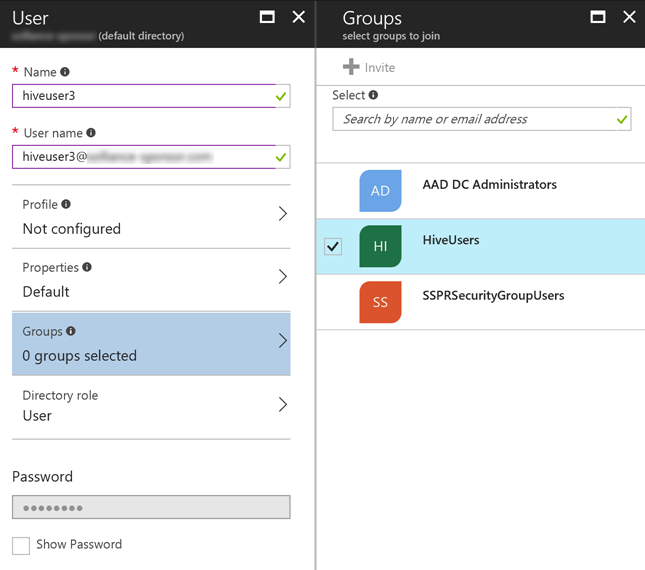
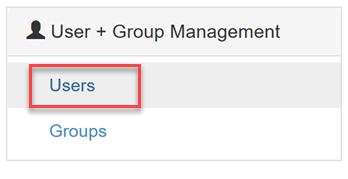
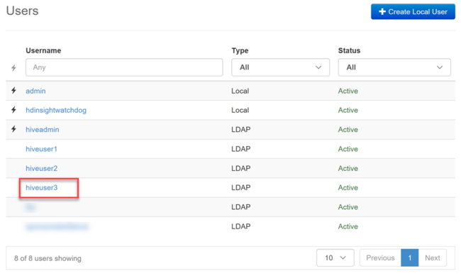

# Synchronize Azure Active Directory users to an HDInsight cluster

[HDInsight clusters with Enterprise Security Package (ESP)](hdinsight-domain-joined-introduction.md) can use strong authentication with Azure Active Directory (Azure AD) users, as well as use *role-based access control* (RBAC) policies. As you add  users and groups to Azure AD, you can synchronize the users who need access to your cluster.

## Prerequisites

If you have not already done so, [create a HDInsight cluster with Enterprise Security Package](hdinsight-domain-joined-configure.md).

## Add new Azure AD users

To view your hosts, open the Ambari Web UI. Each node will be updated with  new unattended upgrade settings.

1. In  the [Azure portal](https://portal.azure.com), navigate to the Azure AD directory associated with your ESP cluster.

2. Select **All users** from the left-hand menu, then select **New user**.

    

3. Complete the new user form. Select groups you created for assigning cluster-based permissions. In this example, create a group named "HiveUsers", to which you can assign new users. The [example instructions](hdinsight-domain-joined-configure.md) for creating an ESP cluster include adding two groups, `HiveUsers` and `AAD DC Administrators`.

    

4. Select **Create**.

## Use the Apache Ambari REST API to synchronize users

User groups specified during the cluster creation process are synchronized at that time. User synchronization occurs automatically once every hour. To synchronize the users immediately, or to synchronize a group other than the groups specified during cluster creation, use the Ambari REST API.

The following method uses POST with the Ambari REST API. For more information, see [Manage HDInsight clusters by using the Apache Ambari REST API](hdinsight-hadoop-manage-ambari-rest-api.md).

1. [Connect to your cluster with SSH](hdinsight-hadoop-linux-use-ssh-unix.md). From the overview pane for your cluster in the Azure portal, select the **Secure Shell (SSH)** button.

    

2. Copy the displayed `ssh` command and paste it into your SSH client. Enter the ssh user password when prompted.

3. After authenticating, enter the following command:

    ```bash
    curl -u admin:<YOUR PASSWORD> -sS -H "X-Requested-By: ambari" \
    -X POST -d '{"Event": {"specs": [{"principal_type": "groups", "sync_type": "existing"}]}}' \
    "https://<YOUR CLUSTER NAME>.azurehdinsight.net/api/v1/ldap_sync_events"
    ```
    
    The response should look like this:

    ```json
    {
      "resources" : [
        {
          "href" : "http://hn0-hadoop.<YOUR DOMAIN>.com:8080/api/v1/ldap_sync_events/1",
          "Event" : {
            "id" : 1
          }
        }
      ]
    }
    ```

4. To see the synchronization status, execute a new `curl` command:

    ```bash
    curl -u admin:<YOUR PASSWORD> https://<YOUR CLUSTER NAME>.azurehdinsight.net/api/v1/ldap_sync_events/1
    ```
    
    The response should look like this:
    
    ```json
    {
      "href" : "http://hn0-hadoop.YOURDOMAIN.com:8080/api/v1/ldap_sync_events/1",
      "Event" : {
        "id" : 1,
        "specs" : [
          {
            "sync_type" : "existing",
            "principal_type" : "groups"
          }
        ],
        "status" : "COMPLETE",
        "status_detail" : "Completed LDAP sync.",
        "summary" : {
          "groups" : {
            "created" : 0,
            "removed" : 0,
            "updated" : 0
          },
          "memberships" : {
            "created" : 1,
            "removed" : 0
          },
          "users" : {
            "created" : 1,
            "removed" : 0,
            "skipped" : 0,
            "updated" : 0
          }
        },
        "sync_time" : {
          "end" : 1497994072182,
          "start" : 1497994071100
        }
      }
    }
    ```

5. This  result shows  that the status is **COMPLETE**,  one new user was created, and the user was assigned a membership. In this example,  the user is assigned to the "HiveUsers" synchronized LDAP group, since the user was added to that same group in Azure AD.

> [!NOTE]  
> The previous method only  synchronizes   the Azure AD groups specified in the **Access user group** property of the domain settings during cluster creation. For more information, see  [create an HDInsight cluster](domain-joined/apache-domain-joined-configure.md).

## Verify the newly added Azure AD user

Open the [Apache Ambari Web UI](hdinsight-hadoop-manage-ambari.md) to verify that the new Azure AD user was added. Access the Ambari Web UI by browsing to **`https://<YOUR CLUSTER NAME>.azurehdinsight.net`**. Enter the cluster administrator username and password.

1. From the Ambari dashboard, select **Manage Ambari** under the **admin** menu.

    

2. Select **Users** under the **User + Group Management** menu group on the left-hand side of the page.

    

3. The new user should be listed within the Users table. The Type is set to `LDAP` rather than  `Local`.

    

## Log in to Ambari as the new user

When the new user (or any other domain user) logs in to Ambari, they use their full Azure AD user name and  domain credentials.  Ambari displays a user  alias, which is the display name of the user in Azure AD. 
The new example user has the user name `hiveuser3@contoso.com`. In Ambari, this new user shows up as `hiveuser3` but the user logs into Ambari as `hiveuser3@contoso.com`.

## See also

* [Configure Apache Hive policies in HDInsight with ESP](hdinsight-domain-joined-run-hive.md)
* [Manage HDInsight clusters with ESP](hdinsight-domain-joined-manage.md)
* [Authorize users to Apache Ambari](hdinsight-authorize-users-to-ambari.md)
