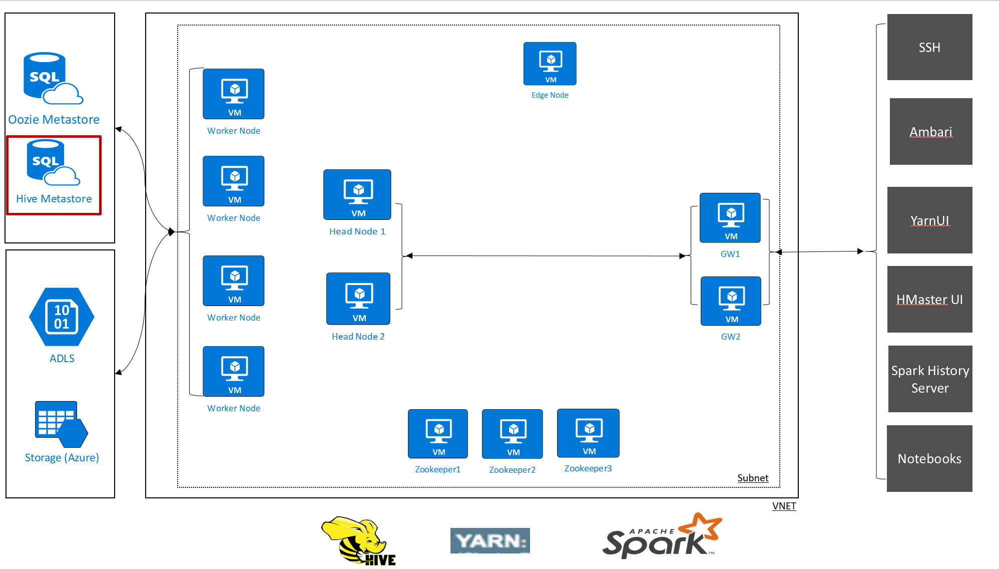
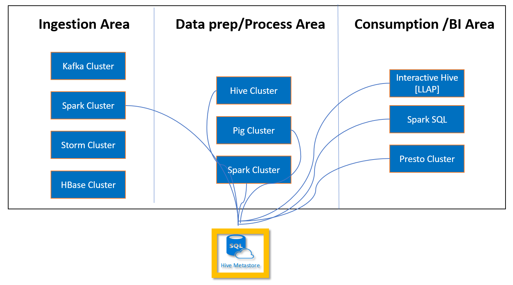
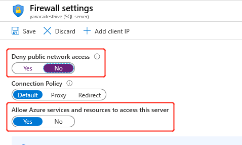

# Use external metadata stores in Azure HDInsight

HDInsight allows you to take control of your data and metadata with external data stores. This feature is available for [Apache Hive metastore](#custom-metastore), [Apache Oozie metastore](#apache-oozie-metastore), and [Apache Ambari database](#custom-ambari-db).

The Apache Hive metastore in HDInsight is an essential part of the Apache Hadoop architecture. A metastore is the central schema repository. The metastore is used by other big data access tools such as Apache Spark, Interactive Query (LLAP), Presto, or Apache Pig. HDInsight uses an Azure SQL Database as the Hive metastore.

There are two ways you can set up a metastore for your HDInsight clusters:

* [Default metastore](#default-metastore)
* [Custom metastore](#custom-metastore)

## Default metastore

By default, HDInsight creates a metastore with every cluster type. You can instead specify a custom metastore. The default metastore includes the following considerations:

* No additional cost. HDInsight creates a metastore with every cluster type without any additional cost to you.

* Each default metastore is part of the cluster lifecycle. When you delete a cluster, the corresponding metastore and metadata are also deleted.

* You can't share the default metastore with other clusters.

* Default metastore is recommended only for simple workloads. Workloads that don't require multiple clusters and don't need metadata preserved beyond the cluster's lifecycle.

> [!IMPORTANT]
> The default metastore provides an Azure SQL Database with a **basic tier 5 DTU limit (not upgradeable)**! Suitable for basic testing purposes. For large or production workloads, we recommend migrating to an external metastore.

## Custom metastore

HDInsight also supports custom metastores, which are recommended for production clusters:

* You specify your own Azure SQL Database as the metastore.

* The lifecycle of the metastore isn't tied to a clusters lifecycle, so you can create and delete clusters without losing metadata. Metadata such as your Hive schemas will persist even after you delete and re-create the HDInsight cluster.

* A custom metastore lets you attach multiple clusters and cluster types to that metastore. For example, a single metastore can be shared across Interactive Query, Hive, and Spark clusters in HDInsight.

* You pay for the cost of a metastore (Azure SQL Database) according to the performance level you choose.

* You can scale up the metastore as needed.

* The cluster and the external metastore must be hosted in the same region.

### Create and config Azure SQL Database for the custom metastore

Create or have an existing Azure SQL Database before setting up a custom Hive metastore for a HDInsight cluster.  For more information, see [Quickstart: Create a single database in Azure SQL Database](../azure-sql/database/single-database-create-quickstart.md?tabs=azure-portal).

While creating the cluster, HDInsight service needs to connect to the external metastore and verify your credentials. Configure Azure SQL Database firewall rules to allow Azure services and resources to access the server. Enable this option in the Azure portal by selecting **Set server firewall**. Then select **No** underneath **Deny public network access**, and **Yes** underneath **Allow Azure services and resources to access this server** for Azure SQL Database. For more information, see [Create and manage IP firewall rules](../azure-sql/database/firewall-configure.md#use-the-azure-portal-to-manage-server-level-ip-firewall-rules)

Private endpoints for SQL stores are not supported.

### Select a custom metastore during cluster creation

You can point your cluster to a previously created Azure SQL Database at any time. For cluster creation through the portal, the option is specified from the **Storage > Metastore settings**.

## Hive metastore guidelines

> [!NOTE]
> Use a custom metastore whenever possible, to help separate compute resources (your running cluster) and metadata (stored in the metastore). Start with the S2 tier, which provides 50 DTU and 250 GB of storage. If you see a bottleneck, you can scale the database up.

* If you intend multiple HDInsight clusters to access separate data, use a separate database for the metastore on each cluster. If you share a metastore across multiple HDInsight clusters, it means that the clusters use the same metadata and underlying user data files.

* Back up your custom metastore periodically. Azure SQL Database generates backups automatically, but the backup retention timeframe varies. For more information, see [Learn about automatic SQL Database backups](../azure-sql/database/automated-backups-overview.md).

* Locate your metastore and HDInsight cluster in the same region. This configuration will provide the highest performance and lowest network egress charges.

* Monitor your metastore for performance and availability using Azure SQL Database Monitoring tools, or Azure Monitor logs.

* When a new, higher version of Azure HDInsight is created against an existing custom metastore database, the system upgrades the schema of the metastore. The upgrade is irreversible without restoring the database from backup.

* If you share a metastore across multiple clusters, ensure all the clusters are the same HDInsight version. Different Hive versions use different metastore database schemas. For example, you can't share a metastore across Hive 2.1 and Hive 3.1 versioned clusters.

* In HDInsight 4.0, Spark and Hive use independent catalogs for accessing SparkSQL or Hive tables. A table created by Spark lives in the Spark catalog. A table created by Hive lives in the Hive catalog. This behavior is different than HDInsight 3.6 where Hive and Spark shared common catalog. Hive and Spark Integration in HDInsight 4.0 relies on Hive Warehouse Connector (HWC). HWC works as a bridge between Spark and Hive. [Learn about Hive Warehouse Connector](../hdinsight/interactive-query/apache-hive-warehouse-connector.md).

* In HDInsight 4.0 if you would like to Share the metastore between Hive and Spark, you can do so by changing the property metastore.catalog.default to hive in your Spark cluster. You can find this property in Ambari Advanced spark2-hive-site-override. It’s important to understand that sharing of metastore only works for external hive tables, this will not work if you have internal/managed hive tables or ACID tables.  

## Apache Oozie metastore

Apache Oozie is a workflow coordination system that manages Hadoop jobs. Oozie supports Hadoop jobs for Apache MapReduce, Pig, Hive, and others.  Oozie uses a metastore to store details about workflows. To increase performance when using Oozie, you can use Azure SQL Database as a custom metastore. The metastore provides access to Oozie job data after you delete your cluster.

For instructions on creating an Oozie metastore with Azure SQL Database, see [Use Apache Oozie for workflows](hdinsight-use-oozie-linux-mac.md).

## Custom Ambari DB

To use your own external database with Apache Ambari on HDInsight, see [Custom Apache Ambari database](hdinsight-custom-ambari-db.md).

## Next steps

* [Set up clusters in HDInsight with Apache Hadoop, Apache Spark, Apache Kafka, and more](./hdinsight-hadoop-provision-linux-clusters.md)