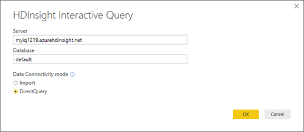

# Visualize Interactive Query Apache Hive data with Microsoft Power BI using direct query in HDInsight

This article describes how to connect Microsoft Power BI to Azure HDInsight Interactive Query clusters and visualize Apache Hive data using direct query. The example provided loads the data from a `hivesampletable` Hive table to Power BI. The `hivesampletable` Hive table contains some mobile phone usage data. Then you plot the usage data on a world map:

You can leverage the [Apache Hive ODBC driver](../hadoop/apache-hadoop-connect-hive-power-bi.md) to do import via the generic ODBC connector in Power BI Desktop. However it is not recommended for BI workloads given non-interactive nature of the Hive query engine. [HDInsight Interactive Query connector](./apache-hadoop-connect-hive-power-bi-directquery.md) and [HDInsight Apache Spark connector](https://docs.microsoft.com/power-bi/spark-on-hdinsight-with-direct-connect) are better choices for their performance.

## Prerequisites
Before going through this article, you must have the following items:

* **HDInsight cluster**. The cluster can be either an HDInsight cluster with Apache Hive or a newly released Interactive Query cluster. For creating clusters, see [Create cluster](../hadoop/apache-hadoop-linux-tutorial-get-started.md#create-cluster).
* **[Microsoft Power BI Desktop](https://powerbi.microsoft.com/desktop/)**. You can download a copy from the [Microsoft Download Center](https://www.microsoft.com/download/details.aspx?id=45331).

## Load data from HDInsight

The `hivesampletable` Hive table comes with all HDInsight clusters.

1. Start Power BI Desktop.

2. From the menu bar, navigate to **Home** > **Get Data** > **More...**.

    

3. From the **Get Data** window, enter **hdinsight** in the search box.  

4. From the search results, select **HDInsight Interactive Query**, and then select **Connect**.  If you don't see **HDInsight Interactive Query**, you need to update your Power BI Desktop to the latest version.

5. Select **Continue** to close the **Connecting to a third-party service** dialog.

6. In the **HDInsight Interactive Query** window, enter the following information and then select **OK**:

    |Property | Value |
    |---|---|
    |Server |Enter the cluster name, for example *myiqcluster.azurehdinsight.net*.|
    |Database |Enter **default** for this article.|
    |Data Connectivity mode |Select **DirectQuery** for this article.|

    

7. Enter the HTTP credentials, and then select **Connect**. The default user name is **admin**.

8. From the **Navigator** window in the left pane, select **hivesampletale**.

9. Select **Load** from the main window.

    

## Visualize data on a map

Continue from the last procedure.

1. From the Visualizations pane, select **Map**, the globe icon. A generic map then appears in the main window.

    

2. From the Fields pane, select **country** and **devicemake**. A world map with the data points appears in the main window after a few moments.

3. Expand the map.

## Next steps
In this article, you learned how to visualize data from HDInsight using Microsoft Power BI.  For more information on data visualization, see the following articles:

* [Visualize Apache Hive data with Microsoft Power BI using ODBC in Azure HDInsight](../hadoop/apache-hadoop-connect-hive-power-bi.md). 
* [Use Apache Zeppelin to run Apache Hive queries in Azure HDInsight](../interactive-query/hdinsight-connect-hive-zeppelin.md).
* [Connect Excel to HDInsight with the Microsoft Hive ODBC Driver](../hadoop/apache-hadoop-connect-excel-hive-odbc-driver.md).
* [Connect Excel to Apache Hadoop by using Power Query](../hadoop/apache-hadoop-connect-excel-power-query.md).
* [Connect to Azure HDInsight and run Apache Hive queries using Data Lake Tools for Visual Studio](../hadoop/apache-hadoop-visual-studio-tools-get-started.md).
* [Use Azure HDInsight Tool for Visual Studio Code](../hdinsight-for-vscode.md).
* [Upload Data to HDInsight](./../hdinsight-upload-data.md).
