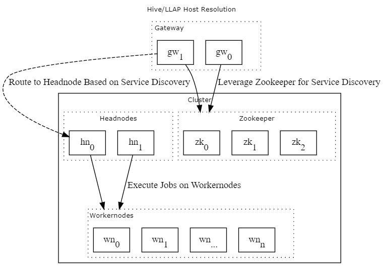
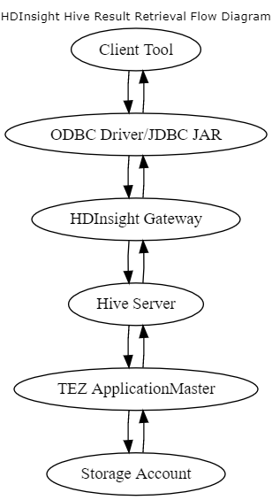

# Gateway deep dive and best practices for Apache Hive in Azure HDInsight

The Azure HDInsight gateway (Gateway) is the HTTPS frontend for HDInsight clusters. The Gateway is responsible for: authentication, host resolution, service discovery, and other helpful features necessary for a modern distributed system. The features provided by the Gateway result in some overhead for which this document will describe the best practices to navigate. Gateway troubleshooting techniques are also discussed.

## The HDInsight gateway

The HDInsight gateway is the only part of an HDInsight cluster that is publicly accessible over the internet. The Gateway service can be accessed without going over the public internet by using the `clustername-int.azurehdinsight.net` internal gateway endpoint. The internal gateway endpoint allows connections to be established to the gateway service without exiting the cluster's virtual network. The Gateway  handles all requests that are sent to the cluster, and  forwards such requests to the correct components and cluster hosts.

The following diagram provides a rough illustration of how the Gateway provides an abstraction in front of all the different host resolution possibilities within HDInsight.

## Motivation

The motivation for putting a gateway in front of HDInsight clusters is to provide an interface for service discovery and user authentication. The authentication mechanisms provided by the gateway are especially relevant to ESP-enabled clusters.

For service discovery, the advantage of the gateway is that each component within the cluster can be accessed as different endpoint under the Gateway website ( `clustername.azurehdinsight.net/hive2`), as opposed to a multitude of `host:port` pairings.

For authentication, the Gateway allows users to authenticate using a `username:password` credential pair. For ESP-enabled clusters, this credential would be the user's domain username and password. Authentication to HDInsight clusters via the Gateway doesn't require the client to acquire a kerberos ticket. Since the Gateway accepts `username:password` credentials and acquires the user's Kerberos ticket on the user's behalf, secure connections can be made to the Gateway from any client host, including clients joined to different AA-DDS domains than the (ESP) cluster.

## Best practices

The Gateway is a single service (load balanced across two hosts) responsible for request forwarding and authentication. The Gateway may become a throughput bottleneck for Hive queries exceeding a certain size. Query performance degradation may be observed when very large **SELECT** queries are executed on the Gateway via ODBC or JDBC. "Very large" means queries that make up more than 5 GB of data across rows or columns. This query could include a long list of rows and, or a wide column count.

The Gateway's performance degradation around queries of a large size is because the data must be transferred from the underlying data store (ADLS Gen2) to: the HDInsight Hive Server, the Gateway, and finally via the JDBC or ODBC drivers to the client host.

The following diagram illustrates the steps involved in a SELECT query.

Apache Hive is a relational abstraction on top of an HDFS-compatible filesystem. This abstraction means **SELECT** statements in Hive correspond to **READ** operations on the filesystem. The **READ** operations are translated into the appropriate schema before reported to the user. The latency of this process increases with data size and total hops required to reach the end user.

Similar behavior may occur when executing **CREATE** or **INSERT** statements of large data, as these commands will correspond to **WRITE** operations in the underlying filesystem. Consider writing data, such as raw ORC, to the filesystem/datalake instead of loading it using **INSERT** or **LOAD**.

In Enterprise Security Pack-enabled clusters, sufficiently complex Apache Ranger policies may cause a slowdown in query compilation time, which may lead to a gateway timeout. If a gateway timeout is noticed in an ESP cluster, consider reducing or combining the number of ranger policies.

## Troubleshooting techniques

There are multiple venues for mitigating and understanding performance issues met as part of the above behavior. Use the following checklist when experiencing query performance degradation over the HDInsight gateway:

* Use the **LIMIT** clause when executing large **SELECT** queries. The **LIMIT** clause will reduce the total rows reported to the client host. The **LIMIT** clause only affects result generation and doesn't change the query plan. To apply the **LIMIT** clause to the query plan, use the configuration `hive.limit.optimize.enable`. **LIMIT** can be combined with an offset using the argument form **LIMIT x,y**.

* Name your columns of interest when running **SELECT** queries instead of using **SELECT \***. Selecting fewer columns will lower the amount of data read.

* Try running the query of interest through Apache Beeline. If result retrieval via Apache Beeline takes an extended period of time,
expect delays when retrieving the same results via external tools.

* Test a basic Hive query to ensure that a connection to the HDInsight Gateway can be established. Try running a basic query from two or more external tools to make sure that no individual tool is running into issues.

* Review any Apache Ambari Alerts to make sure that HDInsight services are healthy. Ambari Alerts can be integrated with Azure Monitor for reporting and analysis.

* If you're using an external Hive Metastore, check that the Azure SQL DB DTU for the Hive Metastore hasn't reached its limit. If the DTU is approaching its limit, you'll need to increase the database size.

* Ensure any third-party tools such as PBI or Tableau are using pagination to view tables or databases. Consult your support partners for these tools for assistance on pagination. The main tool used for pagination is the JDBC `fetchSize` parameter. A small fetch size may result in degraded gateway performance, but a fetch size too large may result in a gateway timeout. Fetch size tuning must be done on a workload basis.

* If your data pipeline involves reading large amount of data from the HDInsight cluster's underlying storage, consider using a tool that interfaces directly with Azure Storage such as Azure Data Factory

* Consider using Apache Hive LLAP when running interactive workloads, as LLAP may provide a smoother experience for quickly returning query results

* Consider increasing the number of threads available for the Hive Metastore service using `hive.server2.thrift.max.worker.threads`. This setting is especially relevant when a high number of concurrent users are submitting queries to the cluster

* Reduce the number of retries used to reach the Gateway from any external tools. If multiple retries are used, consider following an exponential back off retry policy

* Consider enabling compression Hive using the configurations `hive.exec.compress.output` and `hive.exec.compress.intermediate`.

## Next steps

* [Apache Beeline on HDInsight](../hadoop/apache-hadoop-use-hive-beeline.md)
* [HDInsight Gateway Timeout Troubleshooting Steps](./troubleshoot-gateway-timeout.md)
* [Virtual Networks for HDInsight](../hdinsight-plan-virtual-network-deployment.md)
* [HDInsight with Express Route](../connect-on-premises-network.md)