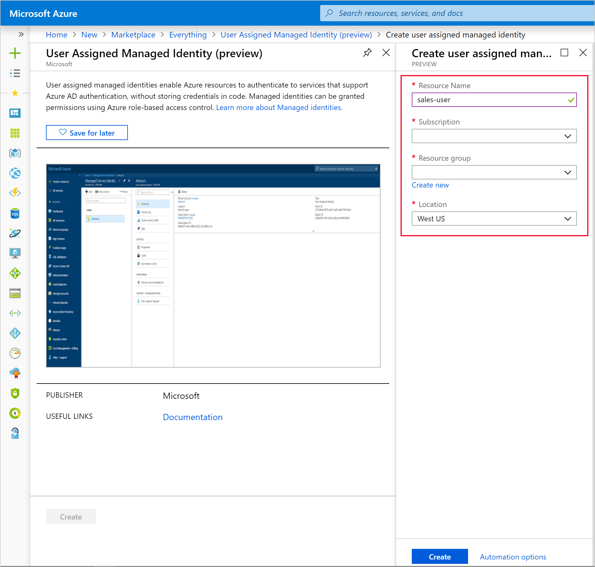
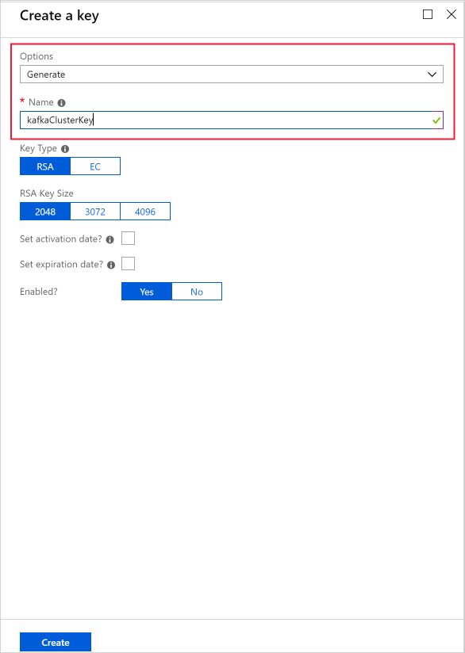
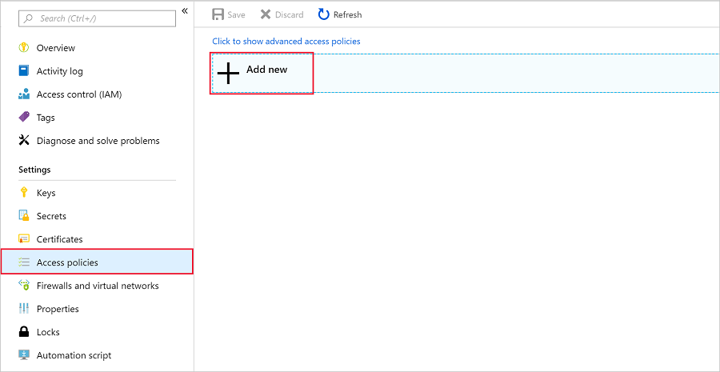
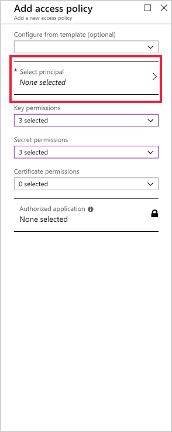
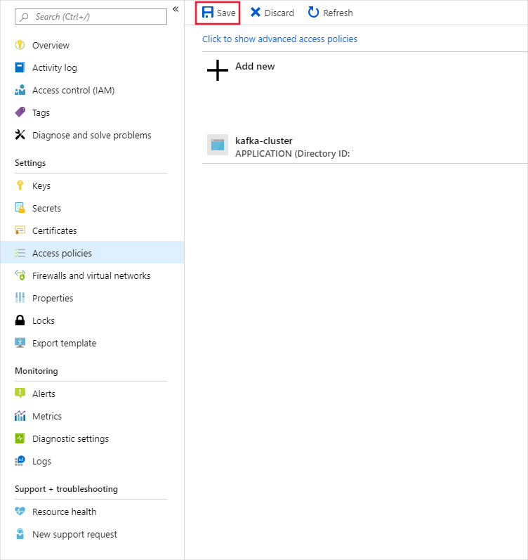
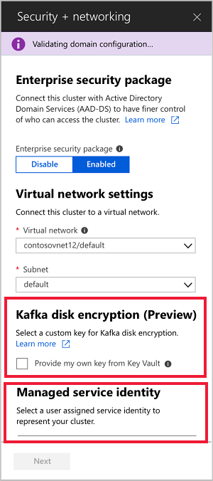

# Bring your own key for Apache Kafka on Azure HDInsight

Azure HDInsight includes Bring Your Own Key (BYOK) support for Apache Kafka. This capability lets you own and manage the keys used to encrypt data at rest.

All managed disks in HDInsight are protected with Azure Storage Service Encryption (SSE). By default, the data on those disks is encrypted using Microsoft-managed keys. If you enable BYOK, you provide the encryption key for HDInsight to use and manage it using Azure Key Vault.

BYOK encryption is a one-step process handled during cluster creation at no additional cost. All you need to do is register HDInsight as a managed identity with Azure Key Vault and add the encryption key when you create your cluster.

All messages to the Kafka cluster (including replicas maintained by Kafka) are encrypted with a symmetric Data Encryption Key (DEK). The DEK is protected using the Key Encryption Key (KEK) from your key vault. The encryption and decryption processes are handled entirely by Azure HDInsight.

You can use the Azure portal or Azure CLI to safely rotate the keys in the key vault. When a key rotates, the HDInsight Kafka cluster starts using the new key within minutes. Enable the "Soft Delete" key protection features to protect against ransomware scenarios and accidental deletion. Key vaults without this protection feature are not supported.

## Get started with BYOK
To create a BYOK enabled Kafka cluster, we will go through the following steps:
1. Create managed identities for Azure resources
2. Setup Azure Key Vault and keys
3. Create HDInsight Kafka cluster with BYOK enabled
4. Rotating the encryption key

## Create managed identities for Azure resources

   To authenticate to Key Vault, create a user-assigned managed identity using the [Azure portal](../../active-directory/managed-identities-azure-resources/how-to-manage-ua-identity-portal.md), [Azure PowerShell](../../active-directory/managed-identities-azure-resources/how-to-manage-ua-identity-powershell.md), [Azure Resource Manager](../../active-directory/managed-identities-azure-resources/how-to-manage-ua-identity-arm.md), or [Azure CLI](../../active-directory/managed-identities-azure-resources/how-to-manage-ua-identity-cli.md). For more information on how managed identities work in Azure HDInsight, see [Managed identities in Azure HDInsight](../hdinsight-managed-identities.md). While Azure Active directory is required for managed identities and BYOK to Kafka, Enterprise Security Package (ESP) isn't a requirement. Be sure to save the managed identity resource ID for when you add it to the Key Vault access policy.

   

## Setup the Key Vault and keys

   HDInsight only supports Azure Key Vault. If you have your own key vault, you can import your keys into Azure Key Vault. Remember that the keys must have "Soft Delete". The "Soft Delete" feature is available through the REST, .NET/C#, PowerShell, and Azure CLI interfaces.

   1. To create a new key vault, follow the [Azure Key Vault](../../key-vault/key-vault-overview.md) quickstart. For more information about importing existing keys, visit [About keys, secrets, and certificates](../../key-vault/about-keys-secrets-and-certificates.md).

   2. Enable "soft-delete" on the key-vault by using the [az keyvault update](/cli/azure/keyvault?view=azure-cli-latest#az-keyvault-update) cli command.

        ```Azure CLI
        az keyvault update --name <Key Vault Name> --enable-soft-delete
        ```

   3. Create keys

        a. To create a new key, select **Generate/Import** from the **Keys** menu under **Settings**.

        

        b. Set **Options** to **Generate** and give the key a name.

        

        c. Select the key you created from the list of keys.

        

        d. When you use your own key for Kafka cluster encryption, you need to provide the key URI. Copy the **Key identifier** and save it somewhere until you're ready to create your cluster.

        

    4. Add managed identity to the key vault access policy.

        a. Create a new Azure Key Vault access policy.

        

        b. Under **Select Principal**, choose the user-assigned managed identity you created.

        

        c. Set **Key Permissions** to **Get**, **Unwrap Key**, and **Wrap Key**.

        

        d. Set **Secret Permissions** to **Get**, **Set**, and **Delete**.

        

        e. Click on **Save**. 

        

## Create HDInsight cluster

   You're now ready to create a new HDInsight cluster. BYOK can only be applied to new clusters during cluster creation. Encryption can't be removed from BYOK clusters, and BYOK can't be added to existing clusters.

   

   During cluster creation, provide the full key URL, including the key version. For example, `https://contoso-kv.vault.azure.net/keys/kafkaClusterKey/46ab702136bc4b229f8b10e8c2997fa4`. You also need to assign the managed identity to the cluster and provide the key URI.

## Rotating the Encryption key

   There might be scenarios where you might want to change the encryption keys used by the Kafka cluster after it has been created. This can be easily via the portal. For this operation, the cluster must have access to both the current key and the intended new key, otherwise the rotate key operation will fail.

   To rotate the key, you must have the full url of the new key (See Step 3 of [Setup the Key Vault and Keys](#setup-the-key-vault-and-keys)). Once you have that, go to the Kafka cluster properties section in the portal and click on **Change Key** under **Disk Encryption Key URL**. Enter in the new key url and submit to rotate the key.

   

## FAQ for BYOK to Apache Kafka

**How does the Kafka cluster access my key vault?**

   Associate a managed identity with the HDInsight Kafka cluster during cluster creation. This managed identity can be created before or during cluster creation. You also need to grant the managed identity access to the key vault where the key is stored.

**Is this feature available for all Kafka clusters on HDInsight?**

   BYOK encryption is only possible for Kafka 1.1 and above clusters.

**Can I have different keys for different topics/partitions?**

   No, all managed disks in the cluster are encrypted by the same key.

**What happens if the cluster loses access to the key vault or the key?**
   If the cluster loses access to the key, warnings will be shown in the Apache Ambari portal. In this state, the **Change Key** operation will fail. Once key access is restored, Ambari warnings will go away and operations such as key rotation can be successfully performed.

   

**How can I recover the cluster if the keys are deleted?**

   Since only “Soft Delete” enabled keys are supported, if the keys are recovered in the key vault, the cluster should regain access to the keys. To recover an Azure Key Vault key, see [Undo-AzKeyVaultKeyRemoval](/powershell/module/az.keyvault/Undo-AzKeyVaultKeyRemoval) or [az-keyvault-key-recover](/cli/azure/keyvault/key?view=azure-cli-latest#az-keyvault-key-recover).

**Can I have producer/consumer applications working with a BYOK cluster and a non-BYOK cluster simultaneously?**

   Yes. The use of BYOK is transparent to producer/consumer applications. Encryption happens at the OS layer. No changes need to be made to existing producer/consumer Kafka applications.

**Are OS disks/Resource disks also encrypted?**

   No. OS disks and Resource disks are not encrypted.

**If a cluster is scaled up, will the new brokers support BYOK seamlessly?**

   Yes. The cluster needs access to the key in the key vault during scale up. The same key is used to encrypt all managed disks in the cluster.

**Is BYOK available in my location?**

   Kafka BYOK is available in all public clouds.

## Next steps

* For more information about Azure Key Vault, see [What is Azure Key Vault](../../key-vault/key-vault-overview.md)?
* To get started with Azure Key Vault, see [Getting Started with Azure Key Vault](../../key-vault/key-vault-overview.md).
