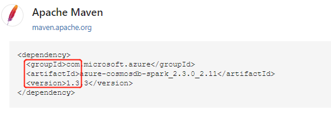
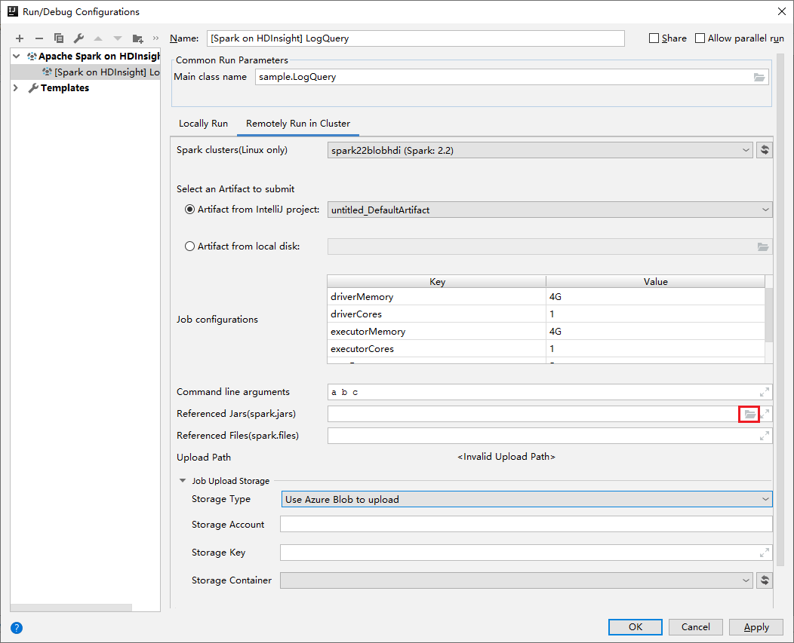

# Manage Spark application dependencies

In this article, you learn how to manage dependencies for your Spark applications running on HDInsight. We cover both Scala and PySpark at Spark application and cluster scope.

Use quick links to jump to the section based on your user case:
* [Set up Spark job jar dependencies using Jupyter Notebook](#use-jupyter-notebook)
* [Set up Spark job jar dependencies using Use Azure Toolkit for IntelliJ](#use-azure-toolkit-for-intellij)
* [Configure jar dependencies for Spark cluster](#jar-libs-for-cluster)
* [Safely manage jar dependencies](#safely-manage-jar-dependencies)
* [Set up Spark job Python packages using Jupyter Notebook](#use-jupyter-notebook-1)
* [Safely manage Python packages for Spark cluster](#python-packages-for-cluster)

## Jar libs for one Spark job
### Use Jupyter Notebook
When a Spark session starts in Jupyter Notebook on Spark kernel for Scala, you can configure packages from:

* [Maven Repository](https://search.maven.org/), or community-contributed packages at [Spark Packages](https://spark-packages.org/).
* Jar files stored on your cluster’s primary storage.

You'll use the `%%configure` magic to configure the notebook to use an external package. In notebooks that use external packages, make sure you call the `%%configure` magic in the first code cell. This ensures that the kernel is configured to use the package before the session starts.

>
>[!IMPORTANT]  
>If you forget to configure the kernel in the first cell, you can use the `%%configure` with the `-f` parameter, but that will restart the session and all progress will be lost.

**Sample for packages from Maven Repository or Spark Packages**

After locating the package from Maven Repository, gather the values for **GroupId**, **ArtifactId**, and **Version**. Concatenate the three values, separated by a colon (**:**).

   

Make sure the values you gather match your cluster. In this case, we're using Spark Cosmos DB connector package for Scala 2.11 and Spark 2.3 for HDInsight 3.6 Spark cluster. If you are not sure, run `scala.util.Properties.versionString` in code cell on Spark kernel to get cluster Scala version. Run `sc.version` to get cluster Spark version.

```
%%configure { "conf": {"spark.jars.packages": "com.microsoft.azure:azure-cosmosdb-spark_2.3.0_2.11:1.3.3" }}
```

**Sample for Jars stored on primary storage**

Use the [URI scheme](../hdinsight-hadoop-linux-information.md#URI-and-scheme) for jar files on your clusters primary storage. This would be `wasb://` for Azure Storage, `abfs://` for Azure Data Lake Storage Gen2 or `adl://` for Azure Data Lake Storage Gen1. If secure transfer is enabled for Azure Storage or Data Lake Storage Gen2, the URI would be `wasbs://` or `abfss://`. See [secure transfer](../../storage/common/storage-require-secure-transfer.md).

Use comma-separated list of jar paths for multiple jar files, Globs are allowed. The jars are included on the driver and executor classpaths.

```
%%configure { "conf": {"spark.jars": "wasb://mycontainer@mystorageaccount.blob.core.windows.net/libs/azure-cosmosdb-spark_2.3.0_2.11-1.3.3.jar" }}
```

After configuring external packages, you can run import in code cell to verify if the packages has been placed correctly.

```scala
import com.microsoft.azure.cosmosdb.spark._
```

### Use Azure Toolkit for IntelliJ
[Azure Toolkit for IntelliJ plug-in](./apache-spark-intellij-tool-plugin.md) provides UI experience to submit Spark Scala application to an HDInsight cluster. It provides `Referenced Jars` and `Referenced Files` properties to configure jar libs paths when submitting the Spark application. See more details about [How to use Azure Toolkit for IntelliJ plug-in for HDInsight](./apache-spark-intellij-tool-plugin.md#run-a-spark-scala-application-on-an-hdinsight-spark-cluster).



## Jar libs for cluster
In some cases, you may want to configure the jar dependencies at cluster level so that every application can be set up with same dependencies by default. The approach is to add your jar paths to Spark driver and executor class path.

1. Run below sample script actions to copy jar files from primary storage `wasb://mycontainer@mystorageaccount.blob.core.windows.net/libs/*` to cluster local file system `/usr/libs/sparklibs`. The step is needed as linux uses `:` to separate class path list, but HDInsight only support storage paths with scheme like `wasb://`. The remote storage path won't work correctly if you directly add it to class path.

    ```bash
    sudo mkdir -p /usr/libs/sparklibs
    sudo hadoop fs -copyToLocal wasb://mycontainer@mystorageaccount.blob.core.windows.net/libs/*.* /usr/libs/sparklibs
    ```

2. Change Spark service configuration from Ambari to update the class path. Go to **Ambari > Spark > Configs > Custom Spark2-defaults**. **Add Property** as follows. Use `:` to separate paths if you have more than one path to add. Globs are allowed.

    ```
    spark.driver.extraClassPath=/usr/libs/sparklibs/*
    spark.executor.extraClassPath=/usr/libs/sparklibs/*
    ```

   

3. Save the changed configurations and restart impacted services.

   

You can automate the steps using [script actions](../hdinsight-hadoop-customize-cluster-linux.md). Script action for [adding Hive custom libraries](https://hdiconfigactions.blob.core.windows.net/linuxsetupcustomhivelibsv01/setup-customhivelibs-v01.sh) is a good reference. When changing Spark service configs, make sure you use Ambari APIs instead of modifying the config files directly. 

## Safely manage jar dependencies
HDInsight cluster has built-in jar dependencies, and updates for these jar versions happen from time to time. To avoid version conflict between built-in jars and the jars you bring for reference, consider [shading your application dependencies](./safely-manage-jar-dependency.md).

## Python packages for one Spark job
### Use Jupyter Notebook
HDInsight Jupyter Notebook PySpark kernel doesn't support installing Python packages from PyPi or Anaconda package repository directly. If you have `.zip`, `.egg`, or `.py` dependencies, and want to reference them for one Spark session, follow below steps:

1. Run below sample script actions to copy `.zip`, `.egg` or `.py` files from primary storage `wasb://mycontainer@mystorageaccount.blob.core.windows.net/libs/*` to cluster local file system `/usr/libs/pylibs`. The step is needed as linux uses `:` to separate search path list, but HDInsight only support storage paths with scheme like `wasb://`. The remote storage path won't work correctly when you use `sys.path.insert`.

    ```bash
    sudo mkdir -p /usr/libs/pylibs
    sudo hadoop fs -copyToLocal wasb://mycontainer@mystorageaccount.blob.core.windows.net/libs/*.* /usr/libs/pylibs
    ```

2. In your notebook, run below code in a code cell with PySpark kernel:

   ```python
   import sys
   sys.path.insert(0, "/usr/libs/pylibs/pypackage.zip")
   ```

3. Run `import` to check if your packages have been included successfully.  

## Python packages for cluster
You can install Python packages from Anaconda to the cluster using conda command via script actions. The packages installed are at cluster level and apply to all applications. 

HDInsight Spark cluster has two built-in Python installations, Anaconda Python 2.7 and Anaconda Python 3.5. To understand more about default Python settings for services, and how to safely install external Python packages without breaking the cluster, see more details in [Safely manage Python dependencies for your cluster](./apache-spark-python-package-installation.md).
