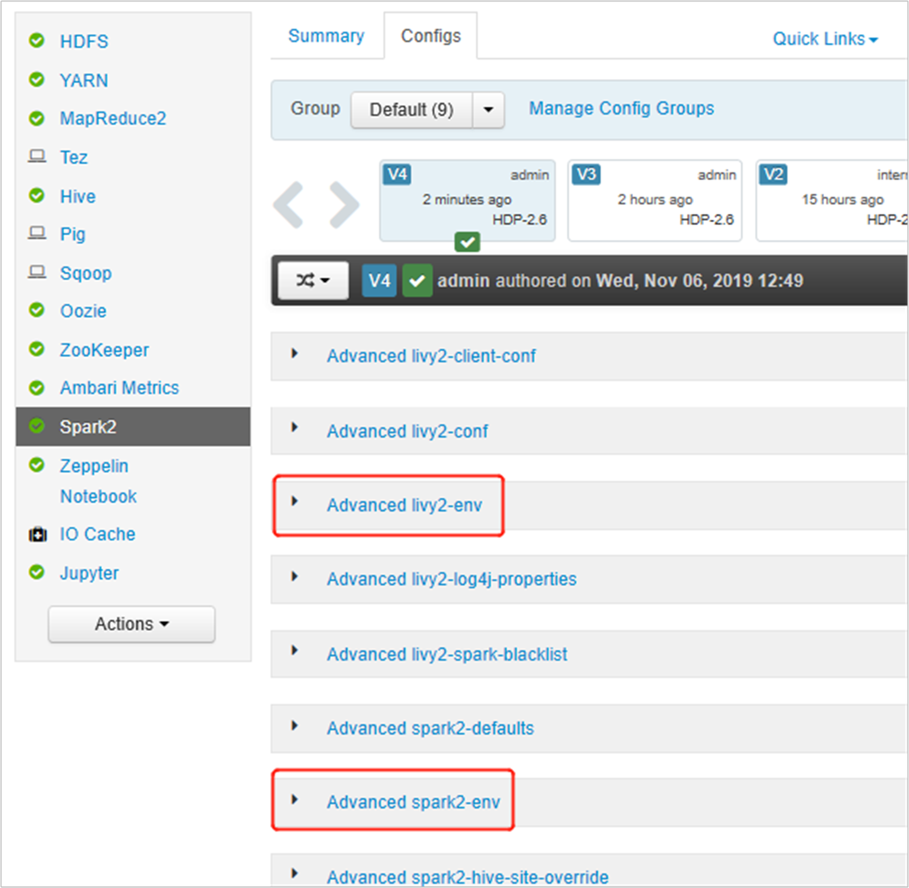
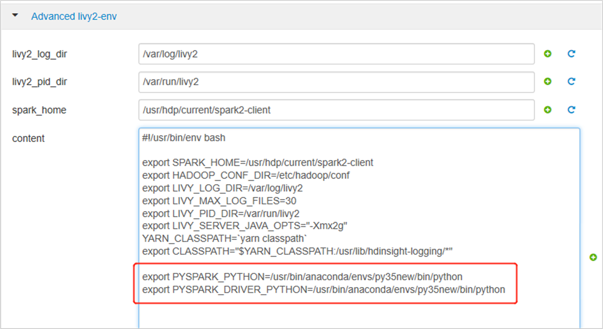
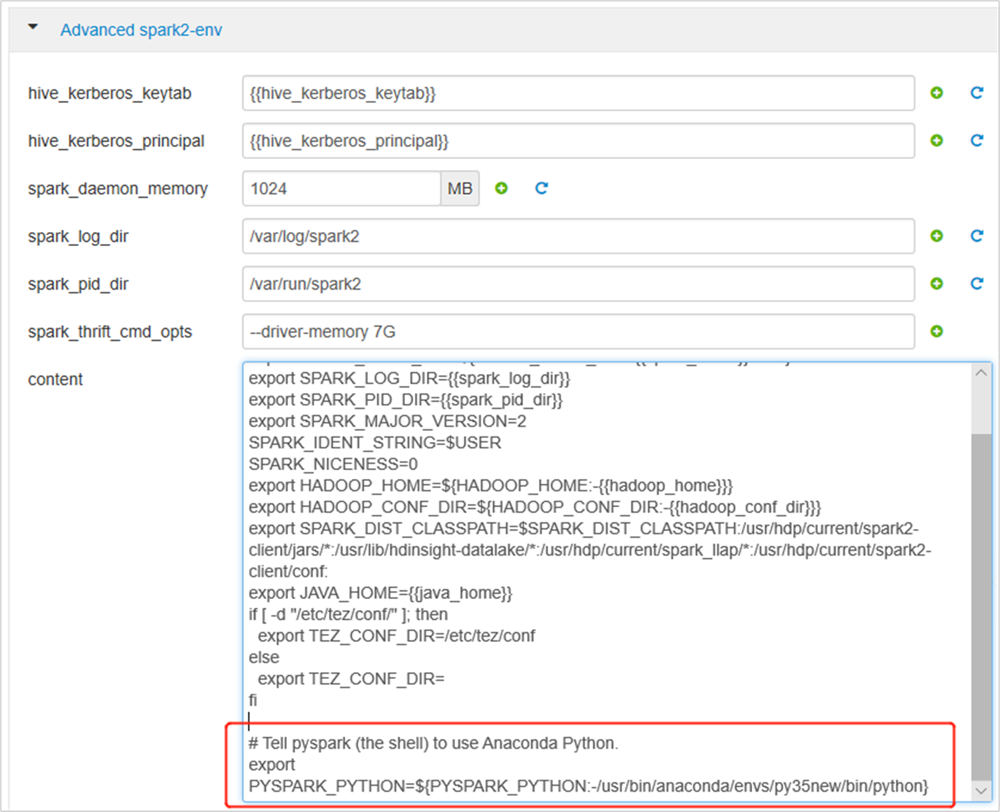

# Safely manage Python environment on Azure HDInsight using Script Action

> [!div class="op_single_selector"]
> * [Using cell magic](apache-spark-jupyter-notebook-use-external-packages.md)
> * [Using Script Action](apache-spark-python-package-installation.md)

HDInsight has two built-in Python installations in the Spark cluster, Anaconda Python 2.7 and Python 3.5. Customers may need to customize the Python environment. Like installing external Python packages or another Python version. Here, we show the best practice of safely managing Python environments for Apache Spark clusters on HDInsight.

## Prerequisites

An Apache Spark cluster on HDInsight. For instructions, see [Create Apache Spark clusters in Azure HDInsight](apache-spark-jupyter-spark-sql.md). If you don't already have a Spark cluster on HDInsight, you can run script actions during cluster creation. Visit the documentation on [how to use custom script actions](../hdinsight-hadoop-customize-cluster-linux.md).

## Support for open-source software used on HDInsight clusters

The Microsoft Azure HDInsight service uses an environment of open-source technologies formed around Apache Hadoop. Microsoft Azure provides a general level of support for open-source technologies. For more information, see [Azure Support FAQ website](https://azure.microsoft.com/support/faq/). The HDInsight service provides an additional level of support for built-in components.

There are two types of open-source components that are available in the HDInsight service:

|Component |Description |
|---|---|
|Built-in|These components are pre-installed on HDInsight clusters and provide core functionality of the cluster. For example, Apache Hadoop YARN Resource Manager, the Apache Hive query language (HiveQL), and the Mahout library belong to this category. A full list of cluster components is available in [What's new in the Apache Hadoop cluster versions provided by HDInsight](../hdinsight-component-versioning.md).|
|Custom|You, as a user of the cluster, can install or use in your workload any component available in the community or created by you.|

> [!IMPORTANT]
> Components provided with the HDInsight cluster are fully supported. Microsoft Support helps to isolate and resolve issues related to these components.
>
> Custom components receive commercially reasonable support to help you to further troubleshoot the issue. Microsoft support may be able to resolve the issue OR they may ask you to engage available channels for the open source technologies where deep expertise for that technology is found. For example, there are many community sites that can be used, like: [MSDN forum for HDInsight](https://social.msdn.microsoft.com/Forums/azure/home?forum=hdinsight), `https://stackoverflow.com`. Also Apache projects have project sites on `https://apache.org`.

## Understand default Python installation

HDInsight Spark cluster is created with Anaconda installation. There are two Python installations in the cluster, Anaconda Python 2.7 and Python 3.5. The table below shows the default Python settings for Spark, Livy, and Jupyter.

| |Python 2.7|Python 3.5|
|----|----|----|
|Path|/usr/bin/anaconda/bin|/usr/bin/anaconda/envs/py35/bin|
|Spark|Default set to 2.7|N/A|
|Livy|Default set to 2.7|N/A|
|Jupyter|PySpark kernel|PySpark3 kernel|

## Safely install external Python packages

HDInsight cluster depends on the built-in Python environment, both Python 2.7 and Python 3.5. Directly installing custom packages in those default built-in environments may cause unexpected library version changes. And break the cluster further. To safely install custom external Python packages for your Spark applications, follow below steps.

1. Create Python virtual environment using conda. A virtual environment provides an isolated space for your projects without breaking others. When creating the Python virtual environment, you can specify python version that you want to use. You still need to create virtual environment even though you would like to use Python 2.7 and 3.5. This requirement is to make sure the cluster's default environment not getting broke. Run script actions on your cluster for all nodes with below script to create a Python virtual environment.

    -   `--prefix` specifies a path where a conda virtual environment lives. There are several configs that need to be changed further based on the path specified here. In this example, we use the py35new, as the cluster has an existing virtual environment called py35 already.
    -   `python=` specifies the Python version for the virtual environment. In this example, we use version 3.5, the same version as the cluster built in one. You can also use other Python versions to create the virtual environment.
    -   `anaconda` specifies the package_spec as anaconda to install Anaconda packages in the virtual environment.
    
    ```bash
    sudo /usr/bin/anaconda/bin/conda create --prefix /usr/bin/anaconda/envs/py35new python=3.5 anaconda --yes
    ```

2. Install external Python packages in the created virtual environment if needed. Run script actions on your cluster for all nodes with below script to install external Python packages. You need to have sudo privilege here to write files to the virtual environment folder.

    Search the [package index](https://pypi.python.org/pypi) for the complete list of packages that are available. You can also get a list of available packages from other sources. For example, you can install packages made available through [conda-forge](https://conda-forge.org/feedstocks/).

    Use below command if you would like to install a library with its latest version:

    - Use conda channel:

        -   `seaborn` is the package name that you would like to install.
        -   `-n py35new` specify the virtual environment name that just gets created. Make sure to change the name correspondingly based on your virtual environment creation.

        ```bash
        sudo /usr/bin/anaconda/bin/conda install seaborn -n py35new --yes
        ```

    - Or use PyPi repo, change `seaborn` and `py35new` correspondingly:
        ```bash
        sudo /usr/bin/anaconda/env/py35new/bin/pip install seaborn
        ```

    Use below command if you would like to install a library with a specific version:

    - Use conda channel:

        -   `numpy=1.16.1` is the package name and version that you would like to install.
        -   `-n py35new` specify the virtual environment name that just gets created. Make sure to change the name correspondingly based on your virtual environment creation.

        ```bash
        sudo /usr/bin/anaconda/bin/conda install numpy=1.16.1 -n py35new --yes
        ```

    - Or use PyPi repo, change `numpy==1.16.1` and `py35new` correspondingly:

        ```bash
        sudo /usr/bin/anaconda/env/py35new/bin/pip install numpy==1.16.1
        ```

    if you don't know the virtual environment name, you can SSH to the head node of the cluster and run `/usr/bin/anaconda/bin/conda info -e` to show all virtual environments.

3. Change Spark and Livy configs and point to the created virtual environment.

    1. Open Ambari UI, go to Spark2 page, Configs tab.

        

    2. Expand Advanced livy2-env, add below statements at bottom. If you installed the virtual environment with a different prefix, change the path correspondingly.

        ```bash
        export PYSPARK_PYTHON=/usr/bin/anaconda/envs/py35new/bin/python
        export PYSPARK_DRIVER_PYTHON=/usr/bin/anaconda/envs/py35new/bin/python
        ```

        

    3. Expand Advanced spark2-env, replace the existing export PYSPARK_PYTHON statement at bottom. If you installed the virtual environment with a different prefix, change the path correspondingly.

        ```bash
        export PYSPARK_PYTHON=${PYSPARK_PYTHON:-/usr/bin/anaconda/envs/py35new/bin/python}
        ```

        

    4. Save the changes and restart affected services. These changes need a restart of Spark2 service. Ambari UI will prompt a required restart reminder, click Restart to restart all affected services.

        

4. If you would like to use the new created virtual environment on Jupyter. Change Jupyter configs and restart Jupyter. Run script actions on all header nodes with below statement to point Jupyter to the new created virtual environment. Make sure to modify the path to the prefix you specified for your virtual environment. After running this script action, restart Jupyter service through Ambari UI to make this change available.

    ```bash
    sudo sed -i '/python3_executable_path/c\ \"python3_executable_path\" : \"/usr/bin/anaconda/envs/py35new/bin/python3\"' /home/spark/.sparkmagic/config.json
    ```

    You could double confirm the Python environment in Jupyter Notebook by running below code:

    

## Known issue

There's a known bug for Anaconda version `4.7.11`, `4.7.12`, and `4.8.0`. If you see your script actions hanging at `"Collecting package metadata (repodata.json): ...working..."` and failing with `"Python script has been killed due to timeout after waiting 3600 secs"`. You can download [this script](https://gregorysfixes.blob.core.windows.net/public/fix-conda.sh) and run it as script actions on all nodes to fix the issue.

To check your Anaconda version, you can SSH to the cluster header node and run `/usr/bin/anaconda/bin/conda --v`.

## Next steps

* [Overview: Apache Spark on Azure HDInsight](apache-spark-overview.md)
* [External packages with Jupyter notebooks in Apache Spark](apache-spark-jupyter-notebook-use-external-packages.md)
* [Track and debug jobs running on an Apache Spark cluster in HDInsight](apache-spark-job-debugging.md)
