# Troubleshoot Apache Spark by using Azure HDInsight

Learn about the top issues and their resolutions when working with [Apache Spark](https://spark.apache.org/) payloads in [Apache Ambari](https://ambari.apache.org/).

## How do I configure an Apache Spark application by using Apache Ambari on clusters?

### Resolution steps

Spark configuration values can be tuned help avoid an Apache Spark application OutofMemoryError exception. The following steps show default Spark configuration values in Azure HDInsight: 

1. In the list of clusters, select **Spark2**.

    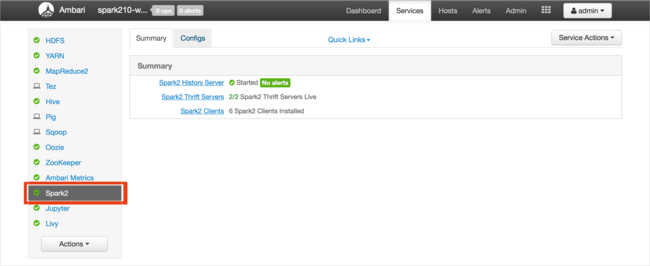

2. Select the **Configs** tab.

    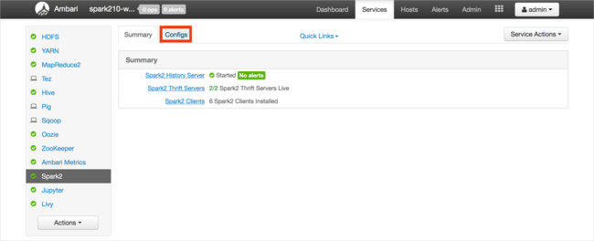

3. In the list of configurations, select **Custom-spark2-defaults**.

    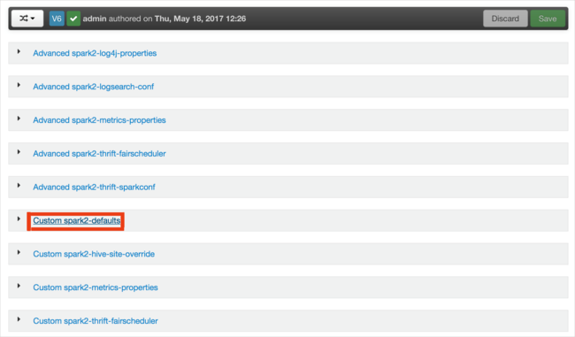

4. Look for the value setting that you need to adjust, such as **spark.executor.memory**. In this case, the value of **4608m** is too high.

    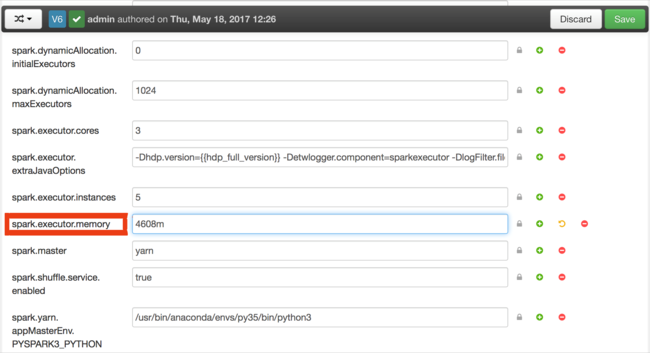

5. Set the value to the recommended setting. The value **2048m** is recommended for this setting.

    

6. Save the value, and then save the configuration. On the toolbar, select **Save**.

    

    You are notified if any configurations need attention. Note the items, and then select **Proceed Anyway**. 

    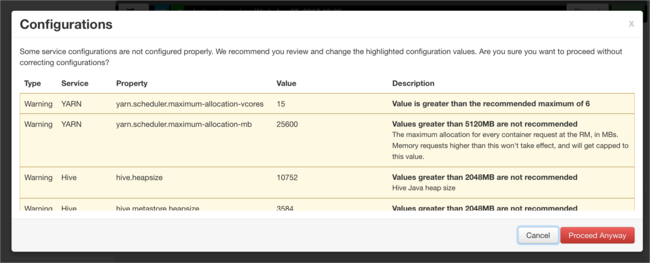

    Write a note about the configuration changes, and then select **Save**.

    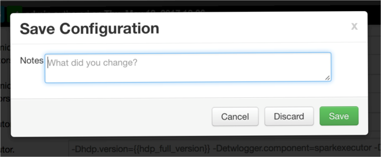

7. Whenever a configuration is saved, you are prompted to restart the service. Select **Restart**.

    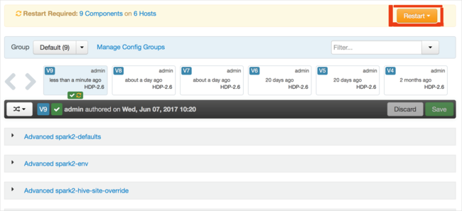

    Confirm the restart.

    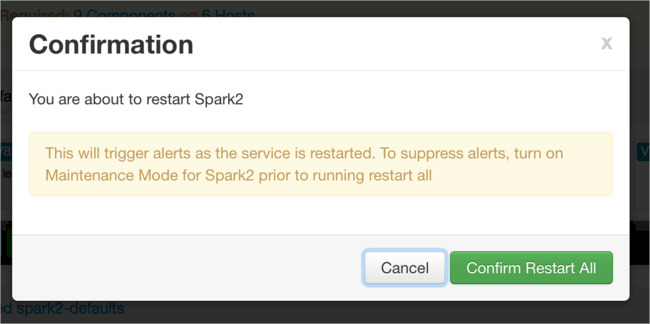

    You can review the processes that are running.

    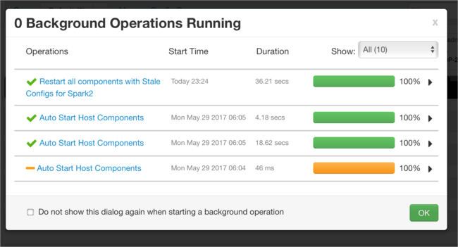

8. You can add configurations. In the list of configurations, select **Custom-spark2-defaults**, and then select **Add Property**.

    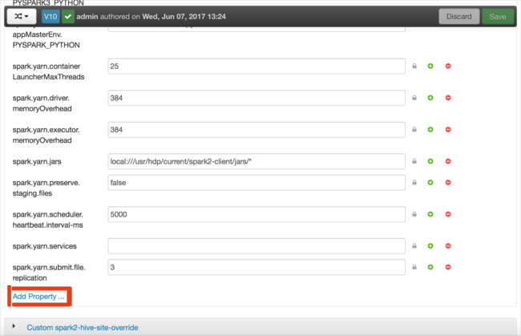

9. Define a new property. You can define a single property by using a dialog box for specific settings such as the data type. Or, you can define multiple properties by using one definition per line. 

    In this example, the **spark.driver.memory** property is defined with a value of **4g**.

    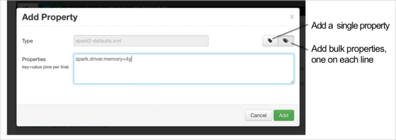

10. Save the configuration, and then restart the service as described in steps 6 and 7.

These changes are cluster-wide but can be overridden when you submit the Spark job.

### Additional reading

[Apache Spark job submission on HDInsight clusters](https://web.archive.org/web/20190112152841/https://blogs.msdn.microsoft.com/azuredatalake/2017/01/06/spark-job-submission-on-hdinsight-101/)

## How do I configure an Apache Spark application by using a Jupyter notebook on clusters?

### Resolution steps

1. To determine which Spark configurations need to be set and to what values, see What causes an Apache Spark application OutofMemoryError exception.

2. In the first cell of the Jupyter notebook, after the **%%configure** directive, specify the Spark configurations in valid JSON format. Change the actual values as necessary:

    

### Additional reading

[Apache Spark job submission on HDInsight clusters](https://web.archive.org/web/20190112152841/https://blogs.msdn.microsoft.com/azuredatalake/2017/01/06/spark-job-submission-on-hdinsight-101/)


## How do I configure an Apache Spark application by using Apache Livy on clusters?

### Resolution steps

1. To determine which Spark configurations need to be set and to what values, see What causes an Apache Spark application OutofMemoryError exception. 

2. Submit the Spark application to Livy by using a REST client like cURL. Use a command similar to the following. Change the actual values as necessary:

    ```apache
    curl -k --user 'username:password' -v -H 'Content-Type: application/json' -X POST -d '{ "file":"wasb://container@storageaccountname.blob.core.windows.net/example/jars/sparkapplication.jar", "className":"com.microsoft.spark.application", "numExecutors":4, "executorMemory":"4g", "executorCores":2, "driverMemory":"8g", "driverCores":4}'  
    ```

### Additional reading

[Apache Spark job submission on HDInsight clusters](https://web.archive.org/web/20190112152841/https://blogs.msdn.microsoft.com/azuredatalake/2017/01/06/spark-job-submission-on-hdinsight-101/)

## How do I configure an Apache Spark application by using spark-submit on clusters?

### Resolution steps

1. To determine which Spark configurations need to be set and to what values, see What causes an Apache Spark application OutofMemoryError exception.

2. Launch spark-shell by using a command similar to the following. Change the actual value of the configurations as necessary: 

    ```apache
    spark-submit --master yarn-cluster --class com.microsoft.spark.application --num-executors 4 --executor-memory 4g --executor-cores 2 --driver-memory 8g --driver-cores 4 /home/user/spark/sparkapplication.jar
    ```

### Additional reading

[Apache Spark job submission on HDInsight clusters](https://web.archive.org/web/20190112152841/https://blogs.msdn.microsoft.com/azuredatalake/2017/01/06/spark-job-submission-on-hdinsight-101/)

## Next steps

If you didn't see your problem or are unable to solve your issue, visit one of the following channels for more support:

* [Spark memory management overview](https://spark.apache.org/docs/latest/tuning.html#memory-management-overview).

* [Debugging Spark application on HDInsight clusters](https://blogs.msdn.microsoft.com/azuredatalake/2016/12/19/spark-debugging-101/).

* Get answers from Azure experts through [Azure Community Support](https://azure.microsoft.com/support/community/).

* Connect with [@AzureSupport](https://twitter.com/azuresupport) - the official Microsoft Azure account for improving customer experience. Connecting the Azure community to the right resources: answers, support, and experts.

* If you need more help, you can submit a support request from the [Azure portal](https://portal.azure.com/?#blade/Microsoft_Azure_Support/HelpAndSupportBlade/). Select **Support** from the menu bar or open the **Help + support** hub. For more detailed information, review [How to create an Azure support request](https://docs.microsoft.com/azure/azure-supportability/how-to-create-azure-support-request). Access to Subscription Management and billing support is included with your Microsoft Azure subscription, and Technical Support is provided through one of the [Azure Support Plans](https://azure.microsoft.com/support/plans/).
