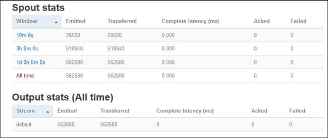

# Quickstart: Create and monitor an Apache Storm topology in Azure HDInsight

Apache Storm is a scalable, fault-tolerant, distributed, real-time computation system for processing streams of data. With Storm on Azure HDInsight, you can create a cloud-based Storm cluster that performs big data analytics in real time.

In this quickstart, you use an example from the Apache [storm-starter](https://github.com/apache/storm/tree/v2.0.0/examples/storm-starter) project to create and monitor an Apache Storm topology to an existing Apache Storm cluster.

## Prerequisites

* An Apache Storm cluster on HDInsight. See [Create Apache Hadoop clusters using the Azure portal](../hdinsight-hadoop-create-linux-clusters-portal.md) and select **Storm** for **Cluster type**.

* An SSH client. For more information, see [Connect to HDInsight (Apache Hadoop) using SSH](../hdinsight-hadoop-linux-use-ssh-unix.md).

## Create the topology

1. Connect to your Storm cluster. Edit the command below by replacing `CLUSTERNAME` with the name of your Storm cluster, and then enter the command:

    ```cmd
    ssh sshuser@CLUSTERNAME-ssh.azurehdinsight.net
    ```

2. The **WordCount** example is included on your HDInsight cluster at `/usr/hdp/current/storm-client/contrib/storm-starter/`. The topology generates random sentences and counts how many times words occur. Use the following command to start the **wordcount** topology on the cluster:

    ```bash
    storm jar /usr/hdp/current/storm-client/contrib/storm-starter/storm-starter-topologies-*.jar org.apache.storm.starter.WordCountTopology wordcount
    ```

## Monitor the topology

Storm provides a web interface for working with running topologies, and is included on your HDInsight cluster.

Use the following steps to monitor the topology using the Storm UI:

1. To display the Storm UI, open a web browser to `https://CLUSTERNAME.azurehdinsight.net/stormui`. Replace `CLUSTERNAME` with the name of your cluster.

2. Under **Topology Summary**, select the **wordcount** entry in the **Name** column. Information about the topology is displayed.

    

    The new page provides the following information:

    |Property | Description |
    |---|---|
    |Topology stats|Basic information on the topology performance, organized into time windows. Selecting a specific time window changes the time window for information displayed in other sections of the page.|
    |Spouts|Basic information about spouts, including the last error returned by each spout.|
    |Bolts|Basic information about bolts.|
    |Topology configuration|Detailed information about the topology configuration.|
    |Activate|Resumes processing of a deactivated topology.|
    |Deactivate|Pauses a running topology.|
    |Rebalance|Adjusts the parallelism of the topology. You should rebalance running topologies after you have changed the number of nodes in the cluster. Rebalancing adjusts parallelism to compensate for the increased/decreased number of nodes in the cluster. For more information, see [Understanding the parallelism of an Apache Storm topology](https://storm.apache.org/documentation/Understanding-the-parallelism-of-a-Storm-topology.html).|
    |Kill|Terminates a Storm topology after the specified timeout.|

3. From this page, select an entry from the **Spouts** or **Bolts** section. Information about the selected component is displayed.

    

    The new page displays the following information:

    |Property | Description |
    |---|---|
    |Spout/Bolt stats|Basic information on the component performance, organized into time windows. Selecting a specific time window changes the time window for information displayed in other sections of the page.|
    |Input stats (bolt only)|Information on components that produce data consumed by the bolt.|
    |Output stats|Information on data emitted by this bolt.|
    |Executors|Information on instances of this component.|
    |Errors|Errors produced by this component.|

4. When viewing the details of a spout or bolt, select an entry from the **Port** column in the **Executors** section to view details for a specific instance of the component.

        2015-01-27 14:18:02 b.s.d.task [INFO] Emitting: split default ["with"]
        2015-01-27 14:18:02 b.s.d.task [INFO] Emitting: split default ["nature"]
        2015-01-27 14:18:02 b.s.d.executor [INFO] Processing received message source: split:21, stream: default, id: {}, [snow]
        2015-01-27 14:18:02 b.s.d.task [INFO] Emitting: count default [snow, 747293]
        2015-01-27 14:18:02 b.s.d.executor [INFO] Processing received message source: split:21, stream: default, id: {}, [white]
        2015-01-27 14:18:02 b.s.d.task [INFO] Emitting: count default [white, 747293]
        2015-01-27 14:18:02 b.s.d.executor [INFO] Processing received message source: split:21, stream: default, id: {}, [seven]
        2015-01-27 14:18:02 b.s.d.task [INFO] Emitting: count default [seven, 1493957]

    In this example, the word **seven** has occurred 1493957 times. This count is how many times the word has been encountered since this topology was started.

## Stop the topology

Return to the **Topology summary** page for the word-count topology, and then select the **Kill** button from the **Topology actions** section. When prompted, enter 10 for the seconds to wait before stopping the topology. After the timeout period, the topology no longer appears when you visit the **Storm UI** section of the dashboard.

## Clean up resources

After you complete the quickstart, you may want to delete the cluster. With HDInsight, your data is stored in Azure Storage, so you can safely delete a cluster when it is not in use. You are also charged for an HDInsight cluster, even when it is not in use. Since the charges for the cluster are many times more than the charges for storage, it makes economic sense to delete clusters when they are not in use.

To delete a cluster, see [Delete an HDInsight cluster using your browser, PowerShell, or the Azure CLI](../hdinsight-delete-cluster.md).

## Next steps

In this quickstart, you used an example from the Apache [storm-starter](https://github.com/apache/storm/tree/v2.0.0/examples/storm-starter) project to create and monitor an Apache Storm topology to an existing Apache Storm cluster. Advance to the next article to learn the basics of managing and monitoring Apache Storm topologies.

> [!div class="nextstepaction"]
>[Deploy and manage Apache Storm topologies on Azure HDInsight](./apache-storm-deploy-monitor-topology-linux.md)