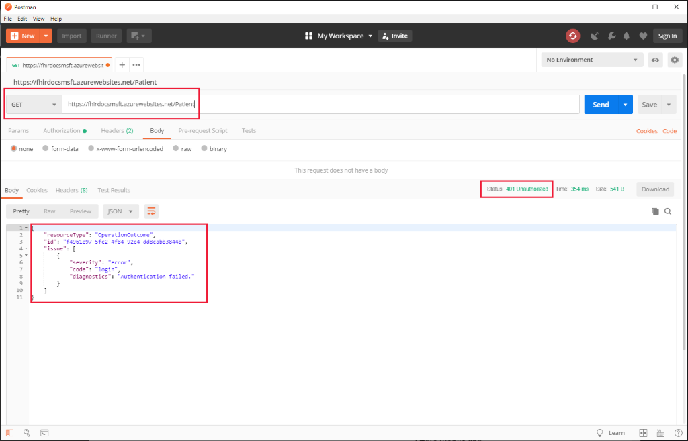
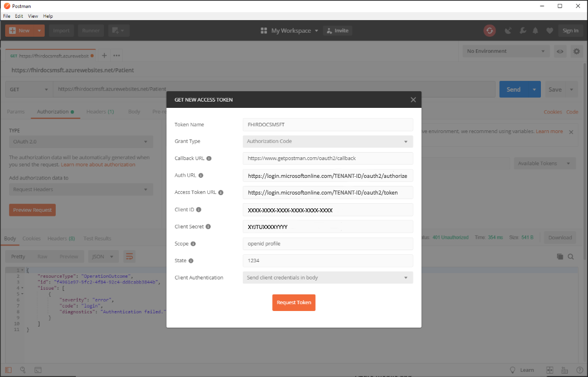

# Access Azure API for FHIR with Postman

A client application would access an FHIR API through a [REST API](https://www.hl7.org/fhir/http.html). You may also want to interact directly with the FHIR server as you build applications, for example, for debugging purposes. In this tutorial, we will walk through the steps needed to use [Postman](https://www.getpostman.com/) to access an FHIR server. Postman is a tool often used for debugging when building applications that access APIs.

## Prerequisites

- A FHIR endpoint in Azure. You can set that up using the managed Azure API for FHIR or the Open Source FHIR server for Azure. Set up the managed Azure API for FHIR using [Azure portal](fhir-paas-portal-quickstart.md), [PowerShell](fhir-paas-powershell-quickstart.md), or [Azure CLI](fhir-paas-cli-quickstart.md).
- Postman installed. You can get it from [https://www.getpostman.com](https://www.getpostman.com)

## FHIR server and authentication details

In order to use Postman, the following details are needed:

- Your FHIR server URL, for example `https://MYACCOUNT.azurehealthcareapis.com`
- The identity provider `Authority` for your FHIR server, for example, `https://login.microsoftonline.com/.{TENANT-ID}`
- The configured `audience`. This is is usually the URL of the FHIR server, e.g. `https://MYACCOUNT.azurehealthcareapis.com` or just `https://azurehealthcareapis.com`.
- The `client_id` (or application ID) of the [client application](register-confidential-azure-ad-client-app.md) you will be using to access the FHIR service.
- The `client_secret` (or application secret) of the client application.

Finally, you should check that `https://www.getpostman.com/oauth2/callback` is a registered reply URL for your client application.

## Connect to FHIR server

Using Postman, do a `GET` request to `https://fhir-server-url/metadata`:


The metadata URL for Azure API for FHIR is `https://MYACCOUNT.azurehealthcareapis.com/metadata`. In this example, the FHIR server URL is `https://fhirdocsmsft.azurewebsites.net` and the capability statement of the server is available at `https://fhirdocsmsft.azurewebsites.net/metadata`. That endpoint should be accessible without authentication.

If you attempt to access restricted resources, you should get an "Authentication failed" response:



## Obtaining an access token

To obtain a valid access token, select "Authorization" and pick TYPE "OAuth 2.0":


Hit "Get New Access Token" and a dialog appears:



You will need to some details:

| Field                 | Example Value                                                                                                   | Comment                    |
|-----------------------|-----------------------------------------------------------------------------------------------------------------|----------------------------|
| Token Name            | MYTOKEN                                                                                                         | A name you choose          |
| Grant Type            | Authorization Code                                                                                              |                            |
| Callback URL          | `https://www.getpostman.com/oauth2/callback`                                                                      |                            |
| Auth URL              | `https://login.microsoftonline.com/{TENANT-ID}/oauth2/authorize?resource=<audience>` | `audience` is `https://MYACCOUNT.azurehealthcareapis.com` for Azure API for FHIR |
| Access Token URL      | `https://login.microsoftonline.com/{TENANT ID}/oauth2/token`                                                      |                            |
| Client ID             | `XXXXXXXX-XXX-XXXX-XXXX-XXXXXXXXXXXX`                                                                            | Application ID             |
| Client Secret         | `XXXXXXXX`                                                                                                        | Secret client key          |
| Scope | `<Leave Blank>` |
| State                 | `1234`                                                                                                            |                            |
| Client Authentication | Send client credentials in body                                                                                 |                 

Hit "Request Token" and you will be guided through the Azure Active Directory Authentication flow and a token will be returned to Postman. If you run into problems open the Postman Console (from the "View->Show Postman Console" menu item).

Scroll down on the returned token screen and hit "Use Token":


The token should now be populated in the "Access Token" field and you can select tokens from "Available Tokens". If you "Send" again to repeat the `Patient` resource search, you should get a Status `200 OK`:


In this case, there are no patients in the database and the search is empty.

If you inspect the access token with a tool like [https://jwt.ms](https://jwt.ms), you should see content like:

```jsonc
{
  "aud": "https://MYACCOUNT.azurehealthcareapis.com",
  "iss": "https://sts.windows.net/{TENANT-ID}/",
  "iat": 1545343803,
  "nbf": 1545343803,
  "exp": 1545347703,
  "acr": "1",
  "aio": "AUQAu/8JXXXXXXXXXdQxcxn1eis459j70Kf9DwcUjlKY3I2G/9aOnSbw==",
  "amr": [
    "pwd"
  ],
  "appid": "xxxxxxxx-xxxx-xxxx-xxxx-xxxxxxxxxxxx",
  "oid": "xxxxxxxx-xxxx-xxxx-xxxx-xxxxxxxxxxxx",
  "appidacr": "1",

  ...// Truncated
}
```

In troubleshooting situations, validating that you have the correct audience (`aud` claim) is a good place to start. The managed Azure API for FHIR uses [identity object IDs](find-identity-object-ids.md) to restrict access to the service. Make sure that `oid` claim of the token contains an object ID from the list of allowed object IDs.

It is also possible to [get a token for the Azure API for FHIR using the Azure CLI](get-healthcare-apis-access-token-cli.md).

## Inserting a patient

Now that you have a valid access token. You can insert a new patient. Switch to method "POST" and add the following JSON document in the body of the request:

[!code-json[](samples/sample-patient.json)]

Hit "Send" and you should see that the patient is successfully created:


If you repeat the patient search, you should now see the patient record:


## Next steps

In this tutorial, you've accessed an FHIR API using postman. Read about the supported API features in our supported features section.
 
>[!div class="nextstepaction"]
>[Supported features](fhir-features-supported.md)