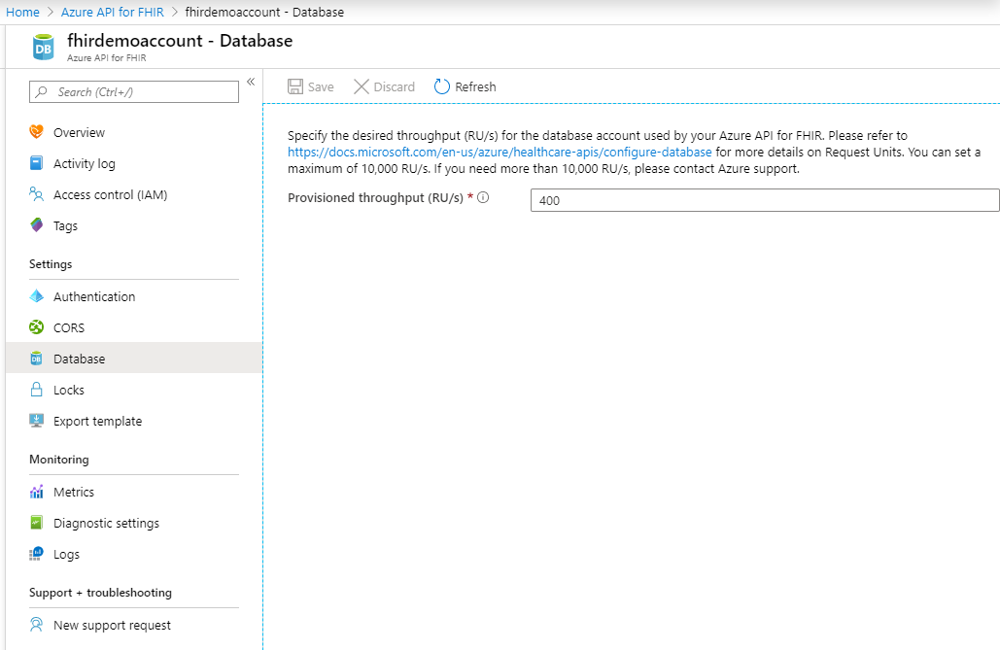

# Configure Database settings 

Azure API for FHIR uses database to store its data. Performance of the underlying database depends on the number of Request Units (RU) selected during service provisioning or in database settings after the service has been provisioned.

Azure API for FHIR borrows the concept of RUs from Cosmos DB (see [Request Units in Azure Cosmos DB](https://docs.microsoft.com/azure/cosmos-db/request-units)) when setting the performance of underlying database. 

Throughput must be provisioned to ensure that sufficient system resources are available for your database at all times. How many RUs you need for your application depends on operations you perform. Operations can range from simple read and writes to more complex queries. 

> [!NOTE]
> As different operations consume different number of RU, we return the actual number of RUs consumed in every API call in response header. This way you can profile the number of RUs consumed by your application.

To change this setting in the Azure portal, you can navigate to your Azure API for FHIR and open the Database blade, then change the Provisioned throughput to the desired value depending on your performance needs. You can change the value up to a maximum of 10,000 RU/s.* If you need a higher value, contact Azure support.

> [!NOTE] 
> Higher value means higher Azure API for FHIR throughput and higher cost of the service.

