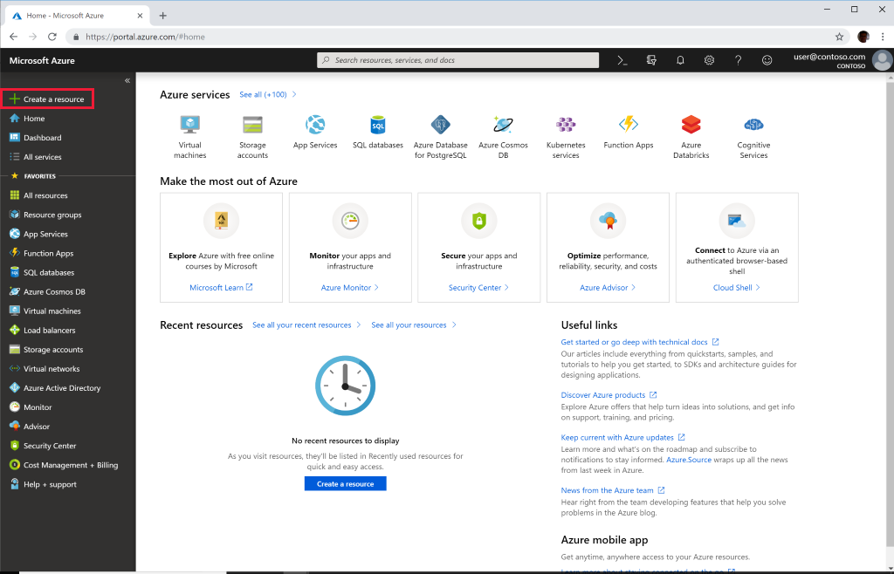

# Quickstart: Deploy Azure API for FHIR using Azure portal

In this quickstart, you'll learn how to deploy Azure API for FHIR using the Azure portal.

If you don't have an Azure subscription, create a [free account](https://azure.microsoft.com/free/?WT.mc_id=A261C142F) before you begin.

## Create new resource

Open the [Azure portal](https://portal.azure.com) and click **Create a resource**

## Search for Azure API for FHIR

You can find Azure API for FHIR by typing "FHIR" into the search box:

:::image type="content" source="media/quickstart-paas-portal/portal-search-healthcare-apis.png" alt-text="Search for Healthcare APIs":::

## Create Azure API for FHIR account

Select **Create** to create a new Azure API for FHIR account:

:::image type="content" source="media/quickstart-paas-portal/portal-create-healthcare-apis.png" alt-text="Create Azure API for FHIR account":::

## Enter account details

Select an existing resource group or create a new one, choose a name for the account, and finally click **Review + create**:

:::image type="content" source="media/quickstart-paas-portal/portal-new-healthcareapi-details.png" alt-text="New healthcare api details":::

Confirm creation and await FHIR API deployment.

## Additional settings (optional)

You can also click **Next: Additional settings** to view the authentication settings. The default configuration for the Azure API for FHIR is to [use Azure RBAC for assigning data plane roles](configure-azure-rbac.md). When configured in this mode, the "Authority" for the FHIR service will be set to the Azure Active Directory tenant of the subscription:

:::image type="content" source="media/rbac/confirm-azure-rbac-mode-create.png" alt-text="Default Authentication settings":::

Notice that the box for entering allowed object IDs is grayed out, since we use Azure RBAC for configuring role assignments in this case.

If you wish to configure the FHIR service to use an external or secondary Azure Active Directory tenant, you can change the Authority and enter object IDs for user and groups that should be allowed access to the server. For more information, see the [local RBAC configuration](configure-local-rbac.md) guide.

## Fetch FHIR API capability statement

To validate that the new FHIR API account is provisioned, fetch a capability statement by pointing a browser to `https://<ACCOUNT-NAME>.azurehealthcareapis.com/metadata`.

## Clean up resources

When no longer needed, you can delete the resource group, Azure API for FHIR, and all related resources. To do so, select the resource group containing the Azure API for FHIR account, select **Delete resource group**, then confirm the name of the resource group to delete.

## Next steps

In this quickstart guide, you've deployed the Azure API for FHIR into your subscription. To set additional settings in your Azure API for FHIR, proceed to the additional settings how-to guide.

>[!div class="nextstepaction"]
>[Additional settings in Azure API for FHIR](azure-api-for-fhir-additional-settings.md)
