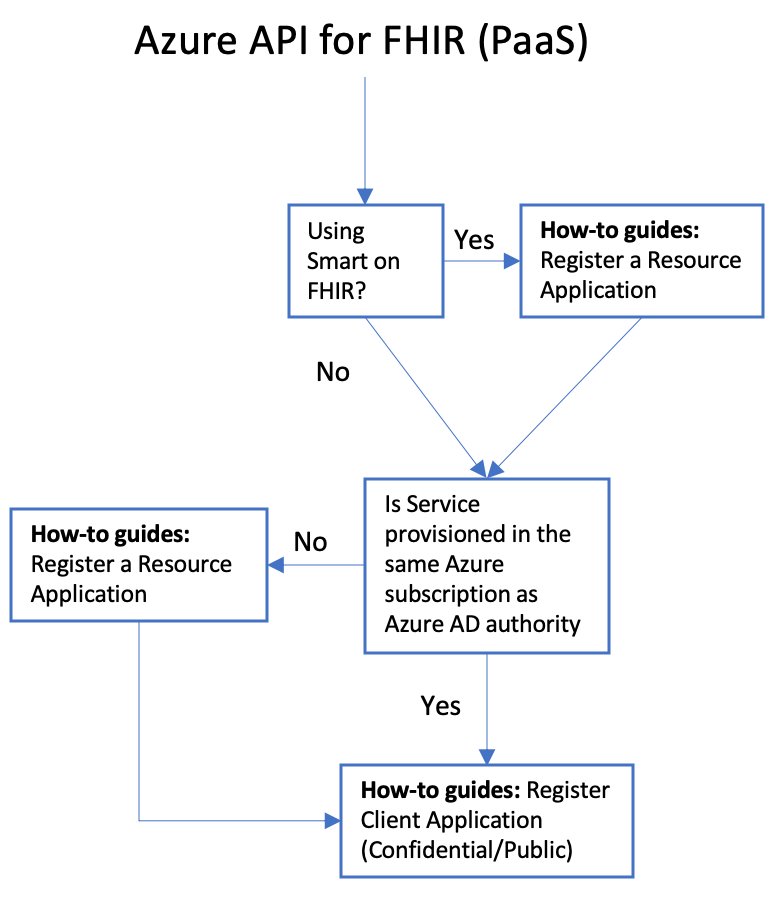
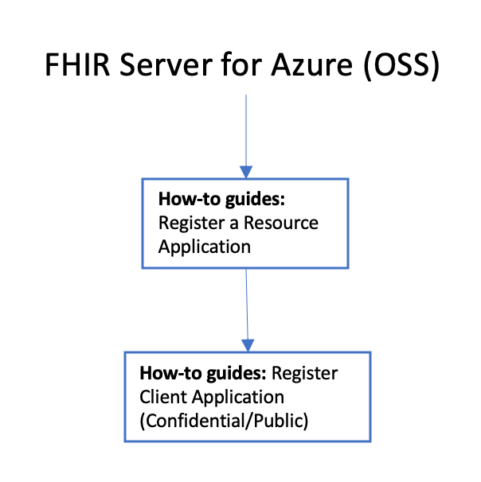

# Tutorial: Decision flow on setting up the environment

There are several configuration options in setting up Azure API for FHIR (PaaS) or FHIR Server for Azure (OSS), and they all come down to:
* Are we using or plan to use SMART on FHIR?
* Are we deploying OSS version or Managed Service (PaaS)?
* Are you using the same Azure AD tenant to secure access to Azure subscript and FHIR server?

## Decision flow for Azure API for FHIR and FHIR server for Azure 

If you are using Azure API for FHIR (Managed Service), then follow the following flow

If you are deploying FHIR Server for Azure (OSS version), then the decision flow is more simple.

## Next steps

In this tutorial, you have gone through decision flow on how to setup Azure AD environment based on the version of FHIR Service you are deploying.

At this point, we are ready to setup development environment and provision FHIR Service to crate first Application.

>[!div class="nextstepaction"]
>[Setup development environment and provision service](tutorial-2-setup-environment.md)