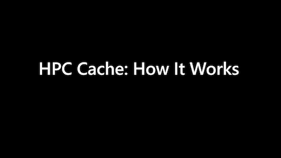
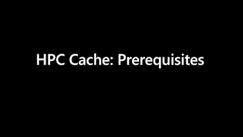

# Prerequisites for Azure HPC Cache

Before using the Azure portal to create a new Azure HPC Cache, make sure your environment meets these requirements.

## Video overviews

Watch these videos for a quick overview of the system's components and what they need to work together.

(Click the video image or the link to watch.)

* [How it works](https://azure.microsoft.com/resources/videos/how-hpc-cache-works/) - Explains how Azure HPC Cache interacts with storage and clients

  [](https://azure.microsoft.com/resources/videos/how-hpc-cache-works/)  

* [Prerequisites](https://azure.microsoft.com/resources/videos/hpc-cache-prerequisites/) - Describes requirements for NAS storage, Azure Blob storage, network access, and client access

  [](https://azure.microsoft.com/resources/videos/hpc-cache-prerequisites/)

Read the rest of this article for specific recommendations.

## Azure subscription

A paid subscription is recommended.
<!-- 
> [!NOTE]
> The Azure HPC Cache team must add your subscription to the access list before it can be used to create a cache instance. This procedure helps ensure that each customer gets high-quality responsiveness from their caches. Fill out [this form](https://aka.ms/onboard-hpc-cache) to request access.  -->

## Network infrastructure

Two network-related prerequisites should be set up before you can use your cache:

* A dedicated subnet for the Azure HPC Cache instance
* DNS support so that the cache can access storage and other resources

### Cache subnet

The Azure HPC Cache needs a dedicated subnet with these qualities:

* The subnet must have at least 64 IP addresses available.
* The subnet cannot host any other VMs, even for related services like client machines.
* If you use multiple Azure HPC Cache instances, each one needs its own subnet.

The best practice is to create a new subnet for each cache. You can create a new virtual network and subnet as part of creating the cache.

### DNS access

The cache needs DNS to access resources outside of its virtual network. Depending on which resources you are using, you might need to set up a customized DNS server and configure forwarding between that server and Azure DNS servers:

* To access Azure Blob storage endpoints and other internal resources, you need the Azure-based DNS server.
* To access on-premises storage, you need to configure a custom DNS server that can resolve your storage hostnames.

If you only need access to Blob storage, you can use the default Azure-provided DNS server for your cache. However, if you need access to other resources, you should create a custom DNS server and configure it to forward any Azure-specific resolution requests to the Azure DNS server.

A simple DNS server also can be used to load balance client connections among all the available cache mount points.

Learn more about Azure virtual networks and DNS server configurations in [Name resolution for resources in Azure virtual networks](https://docs.microsoft.com/azure/virtual-network/virtual-networks-name-resolution-for-vms-and-role-instances).

## Permissions

Check these permission-related prerequisites before starting to create your cache.

* The cache instance needs to be able to create virtual network interfaces (NICs). The user who creates the cache must have sufficient privileges in the subscription to create NICs.

* If using Blob storage, Azure HPC Cache needs authorization to access your storage account. Use role-based access control (RBAC) to give the cache access to your Blob storage. Two roles are required: Storage Account Contributor and Storage Blob Data Contributor.

  Follow the instructions in [Add storage targets](hpc-cache-add-storage.md#add-the-access-control-roles-to-your-account) to add the roles.

## Storage infrastructure

The cache supports Azure Blob containers or NFS hardware storage exports. Add storage targets after you create the cache.

Each storage type has specific prerequisites.

### Blob storage requirements

If you want to use Azure Blob storage with your cache, you need a compatible storage account and either an empty Blob container or a container that is populated with Azure HPC Cache formatted data as described in [Move data to Azure Blob storage](hpc-cache-ingest.md).

Create the account before attempting to add a storage target. You can create a new container when you add the target.

To create a compatible storage account, use these settings:

* Performance: **Standard**
* Account kind: **StorageV2 (general purpose v2)**
* Replication: **Locally redundant storage (LRS)**
* Access tier (default): **Hot**

It's a good practice to use a storage account in the same location as your cache.

You also must give the cache application access to your Azure storage account as mentioned in [Permissions](#permissions), above. Follow the procedure in [Add storage targets](hpc-cache-add-storage.md#add-the-access-control-roles-to-your-account) to give the cache the required access roles. If you are not the storage account owner, have the owner do this step.

### NFS storage requirements
<!-- linked from configuration.md -->

If using an NFS storage system (for example, an on-premises hardware NAS system), make sure it meets these requirements. You might need to work with the network administrators or firewall managers for your storage system (or data center) to verify these settings.

> [!NOTE]
> Storage target creation will fail if the cache has insufficient access to the NFS storage system.

More information is included in [Troubleshoot NAS configuration and NFS storage target issues](troubleshoot-nas.md).

* **Network connectivity:** The Azure HPC Cache needs high-bandwidth network access between the cache subnet and the NFS system's data center. [ExpressRoute](https://docs.microsoft.com/azure/expressroute/) or similar access is recommended. If using a VPN, you might need to configure it to clamp TCP MSS at 1350 to make sure large packets are not blocked. Read [VPN packet size restrictions](troubleshoot-nas.md#adjust-vpn-packet-size-restrictions) for additional help troubleshooting VPN settings.

* **Port access:** The cache needs access to specific TCP/UDP ports on your storage system. Different types of storage have different port requirements.

  To check your storage system's settings, follow this procedure.

  * Issue an `rpcinfo` command to your storage system to check the needed ports. The command below lists the ports and formats the relevant results in a table. (Use your system's IP address in place of the *<storage_IP>* term.)

    You can issue this command from any Linux client that has NFS infrastructure installed. If you use a client inside the cluster subnet, it also can help verify connectivity between the subnet and the storage system.

    ```bash
    rpcinfo -p <storage_IP> |egrep "100000\s+4\s+tcp|100005\s+3\s+tcp|100003\s+3\s+tcp|100024\s+1\s+tcp|100021\s+4\s+tcp"| awk '{print $4 "/" $3 " " $5}'|column -t
    ```

  Make sure that all of the ports returned by the ``rpcinfo`` query allow unrestricted traffic from the Azure HPC Cache's subnet.

  * If you can't use the `rpcinfo` command, make sure that these commonly used ports allow inbound and outbound traffic:

    | Protocol | Port  | Service  |
    |----------|-------|----------|
    | TCP/UDP  | 111   | rpcbind  |
    | TCP/UDP  | 2049  | NFS      |
    | TCP/UDP  | 4045  | nlockmgr |
    | TCP/UDP  | 4046  | mountd   |
    | TCP/UDP  | 4047  | status   |

    Some systems use different port numbers for these services - consult your storage system's documentation to be sure.

  * Check firewall settings to be sure that they allow traffic on all of these required ports. Be sure to check firewalls used in Azure as well as on-premises firewalls in your data center.

* **Directory access:** Enable the `showmount` command on the storage system. Azure HPC Cache uses this command to check that your storage target configuration points to a valid export, and also to make sure that multiple mounts don't access the same subdirectories (a risk for file collision).

  > [!NOTE]
  > If your NFS storage system uses NetApp's ONTAP 9.2 operating system, **do not enable `showmount`**. [Contact Microsoft Service and Support](hpc-cache-support-ticket.md) for help.

  Learn more about directory listing access in the NFS storage target [troubleshooting article](troubleshoot-nas.md#enable-export-listing).

* **Root access** (read/write): The cache connects to the back-end system as user ID 0. Check these settings on your storage system:
  
  * Enable `no_root_squash`. This option ensures that the remote root user can access files owned by root.

  * Check export policies to make sure they do not include restrictions on root access from the cache's subnet.

  * If your storage has any exports that are subdirectories of another export, make sure the cache has root access to the lowest segment of the path. Read [Root access on directory paths](troubleshoot-nas.md#allow-root-access-on-directory-paths) in the NFS storage target troubleshooting article for details.

* NFS back-end storage must be a compatible hardware/software platform. Contact the Azure HPC Cache team for details.

## Set up Azure CLI access (optional)

If you want to create or manage Azure HPC Cache from the Azure command-line interface (Azure CLI), you need to install the CLI software and the hpc-cache extension. Follow the instructions in [Set up Azure CLI for Azure HPC Cache](az-cli-prerequisites.md).

## Next steps

* [Create an Azure HPC Cache instance](hpc-cache-create.md) from the Azure portal
