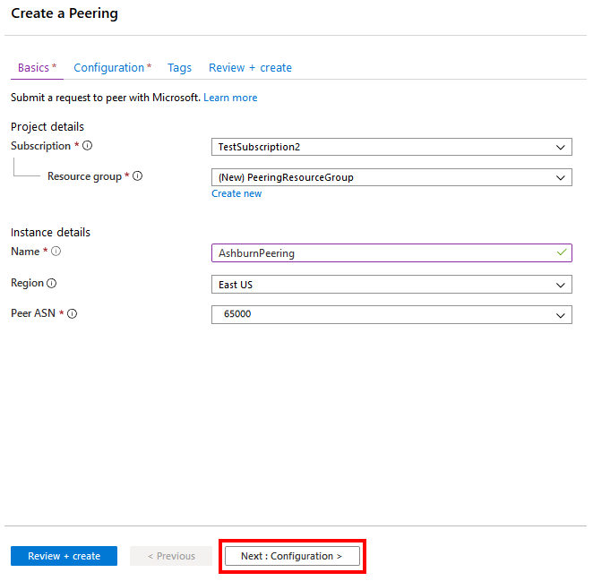

1. Click **Create a resource** > **See all**.

    > [!div class="mx-imgBorder"]
    > 

1. Search for *Peering* in the search box and hit *Enter* on your keyboard. From the results, click on **Peering** resource.

    > [!div class="mx-imgBorder"]
    > 

1. Once **Peering** is launched, review the page to understand details. When ready, click **Create**.

    > [!div class="mx-imgBorder"]
    > 

1. On the **Create a Peering** page, under **Basics** tab, fill out the fields as shown below.

    > [!div class="mx-imgBorder"]
    > 

    * Choose your Azure **Subscription**.
    * For **Resource group**, you can either choose an existing resource group from drop-down or create a new group by clicking **Create new**. We will create a new resource group for this example.
    * **Name** corresponds to resource name and can be anything you choose.
    * **Region** is auto-selected if you chose an existing resource group in the step above. If you chose to create a new resource group, then you need to also choose the Azure region where you want the resource to reside. East US

        > [!NOTE]
        > Region where resource group resides is independent of the location where you want to create peering with Microsoft. But it is best practice to organize your peering resources within resource groups that reside in the closest Azure regions. Eg: for peerings in Ashburn, you can create a resource group in *East US* or *East US2*

    * Choose your ASN in the **Peer ASN** field.

        > [!IMPORTANT]
        > * You can only choose an ASN with ValidationState as "Approved" before submitting a peering request. If you just submitted your PeerAsn request, wait for 12 hours or so for ASN association to be "Approved". If the ASN you select is pending validation you will see an error message. 
        > * If you do not see the ASN you need to choose, then check if you have selected the correct subscription. If so, check if you have already created PeerAsn using [Associate Peer ASN to Azure Subscription](../howto-subscription-association-portal.md).

        > [!div class="mx-imgBorder"]
        > 

    * Click on **Next : Configuration >** to continue.
