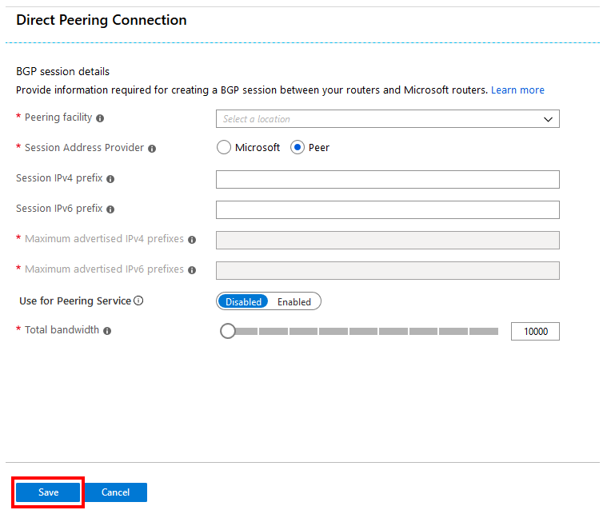
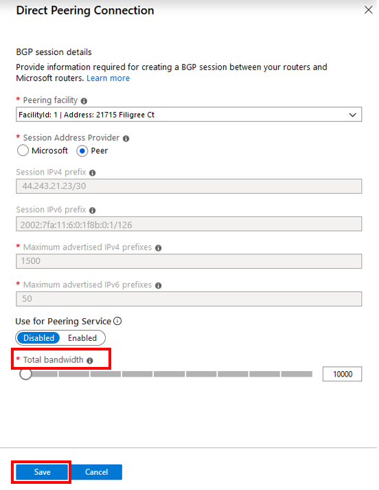

This section describes how to perform the following modification operations for Direct peering:

### Add Direct peering connections
1. Click on the **+ Add connections** button on the top and configure a new peering connection.
    > [!div class="mx-imgBorder"]
    > 
1. Fill-out the **Direct peering Connection** form and click **Save**. For help with configuring a peering connection review the steps under "Create and provision a Direct peering" section above.
    > [!div class="mx-imgBorder"]
    > 

### Remove Direct peering connections

Removing a connection is not currently supported on portal. Contact [Microsoft peering](mailto:peeringexperience@microsoft.com).

### Upgrade or downgrade bandwidth on Active connections
1. Click on a peering connection you want to modify and then, click on the **...** > **Edit connection** button.
    > [!div class="mx-imgBorder"]
    > 
1. Modify bandwidth as shown below and then click **Save**.
    > [!div class="mx-imgBorder"]
    > 

### Add IPv4/IPv6 session on Active connections.
1. Click on a peering connection you want to modify and then, click on the **...** > **Edit connection** button as shown above.
1. Add **Session IPv4 prefix** or **Session IPv6 prefix** info and click **Save**.

### Remove IPv4/IPv6 session on Active connections.
    Removing a **Session IPv4 prefix** or **Session IPv6 prefix** info is not currently supported on portal. Contact [Microsoft peering](mailto:peeringexperience@microsoft.com).
