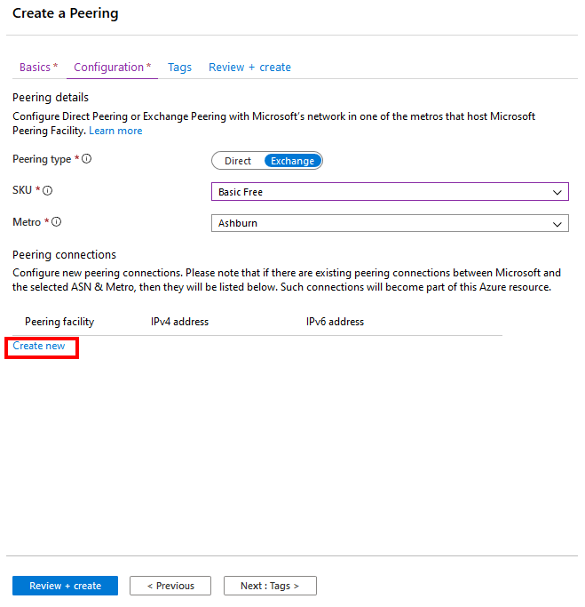
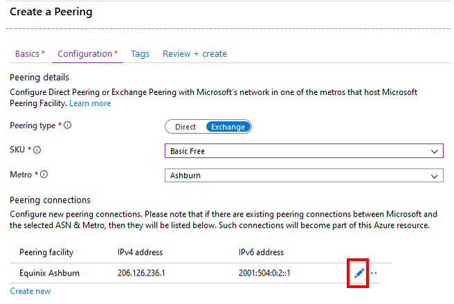
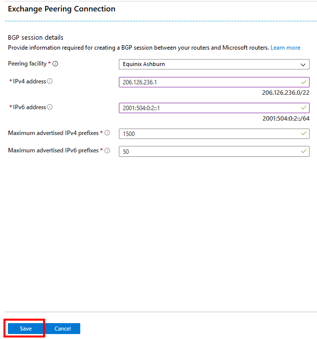
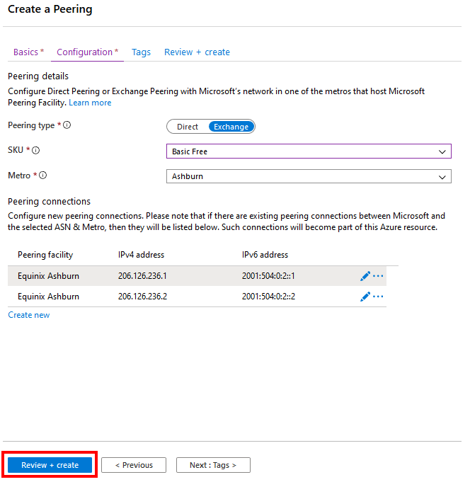
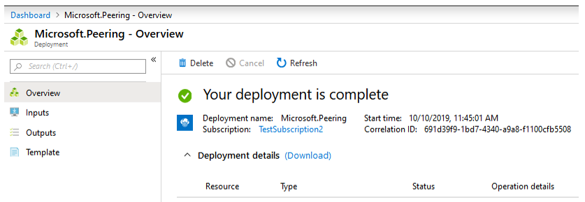

1. On the **Create a Peering** page, under **Configuration** tab, fill out the fields as shown below.

    > [!div class="mx-imgBorder"]
    > 

    * For **Peering type**, select *Exchange*.
    * Select **SKU** as *Basic Free*.
    * Choose the **Metro** location for where you want to set up peering.

        > [!NOTE]
        > If you already have peering connections with Microsoft in the selected **Metro** location, and you are using portal for the first time to set up peering in that location, then your existing peering connections will be listed in the **Peering connections** section as shown below. Microsoft will automatically convert these peering connections to Azure resource so that you can manage them all along with the new connections, in one place.See [Convert a legacy Exchange peering to Azure resource using the portal](../howto-legacy-exchange-portal.md) for more info.
        >

1. Under **Peering connections**, click **Create new** to add a line for each new connection you want to set up.

    * To configure/modify connection settings click the edit button for a line.

        > [!div class="mx-imgBorder"]
        > 

    * To delete a line, click on **...** button > **Delete**.

        > [!div class="mx-imgBorder"]
        > 

    * You are required to provide all the settings for a connection as shown below.

         > [!div class="mx-imgBorder"]
         > 

        1. Select the **Peering facility** where the connection needs to be set up.
        1. In the fields **IPv4 address** and **IPv6 address**, enter IPv4 and IPv6 address respectively that would be configured in Microsoft routers using the neighbor command.
        1. Enter the number of IPv4 and IPv6 prefixes you will advertise in the fields **Maximum advertised IPv4 addresses** and **Maximum advertised IPv6 addresses** respectively.
        1. Click **OK** to save your connection settings.

1. Repeat above step to add more connections at any facility where Microsoft is colocated with your network, within the **Metro** selected previously.

1. After adding all the required connections, click on **Review + create**.

    > [!div class="mx-imgBorder"]
    > 

1. Observe that portal runs basic validation of the information you entered. This is displayed in a ribbon on the top, as *Running final validation...*.

    > [!div class="mx-imgBorder"]
    > 

1. After it turns to *Validation Passed*, verify your information and submit the request by clicking **Create**. If you need to modify your request, click on **Previous** and repeat the steps above.

    > [!div class="mx-imgBorder"]
    > 

1. Once you submit the request, wait for it to complete deployment. If deployment fails, contact [Microsoft peering](mailto:peering@microsoft.com). A successful deployment will appear as below.

    > [!div class="mx-imgBorder"]
    > 
