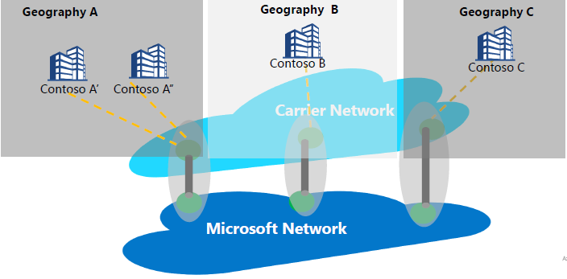

# Internet peering vs. Peering Service

Internet peering refers to any interconnection between Microsoft’s global network (AS8075) and Carriers or Service Providers network. A Service Provider can become a Peering Service partner by implementing the Peering Service partnership requirements explained below to provide reliable and high-performing public connectivity with optimal routing from the customer to the Microsoft network.

## About Peering Service
Peering Service is a partnership program with key service providers to provide best-in-class public Internet connectivity to their enterprise users. Partners who are part of the program will have direct, highly available, geo-redundant connections and optimized routing to Microsoft. Peering Service is an addition to the Microsoft connectivity portfolio:
*	ExpressRoute for private connectivity to IaaS or PaaS resources (support for private IP space)
	*	Partner based connectivity
	*	Direct 100G connectivity to Microsoft
*	IPSEC over the Internet for VPN connectivity to the cloud
*	SD-WAN connectivity to Azure through Virtual WAN

The target segment for Peering Service is SaaS connectivity, SD-WAN customers willing to do internet breakout at the branch and any customers having a dual strategy MPLS and enterprise-grade Internet.

The primary goal when connecting to Microsoft Cloud should be to minimize latency by reducing the round-trip time (RTT) from a user site to the Microsoft Global Network, which is Microsoft's public network backbone that interconnects all of Microsoft's datacenters and multiple cloud application entry points. See [Getting the best connectivity and performance in Office 365](https://techcommunity.microsoft.com/t5/Office-365-Blog/Getting-the-best-connectivity-and-performance-in-Office-365/ba-p/124694).

> [!div class="mx-imgBorder"]
> 

In the figure above each branch office of a global enterprise connects to the nearest possible Microsoft edge location possible through the partner's network.

**Peering Service customer benefits:**
* Best public routing over internet to Microsoft Cloud Services for optimal performance and reliability.
* Ability to select the preferred SP to connect to Microsoft Cloud.
* Traffic insights such as latency reporting, and prefix monitoring.
* Optimum Network Hops (AS Hops) from Microsoft Cloud.
* Route analytics and statistics - Events for Border Gateway Protocol ([BGP](https://en.wikipedia.org/wiki/Border_Gateway_Protocol)) route anomalies (leak/hijack detection), and suboptimal routing.

## Peering Service partnership requirements
* Connectivity to Microsoft Cloud at a location nearest to customer. A partner Service Provider will route user traffic to Microsoft edge closest to user. Similarly, on traffic towards the user, Microsoft will route traffic (using BGP tag) to the edge location closest to the user and SP will deliver the traffic to the user.
* Partner will maintain high available, high throughput, and geo-redundant connectivity with Microsoft Global Network.
* Partner can utilize their existing peering to support Peering Service if it meets the requirement

## FAQ
For frequently asked questions, see [Peering Service - FAQ](service-faqs.md).

## Next steps

* Learn more about customer benefits with [Peering Service](https://docs.microsoft.com/azure/peering-service/).
* Learn about steps to enable a Direct peering for Peering Service in [Peering Service partner walkthrough](walkthrough-peering-service-all.md).
