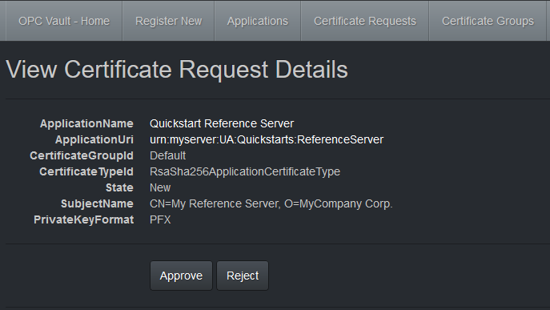
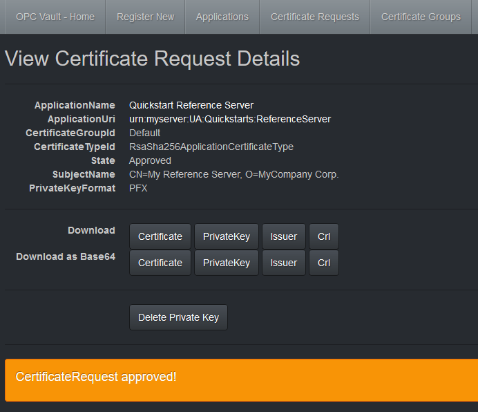
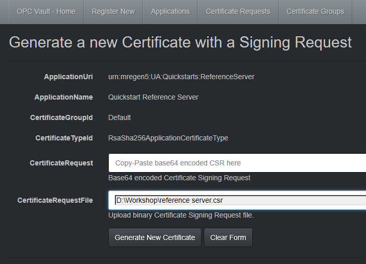
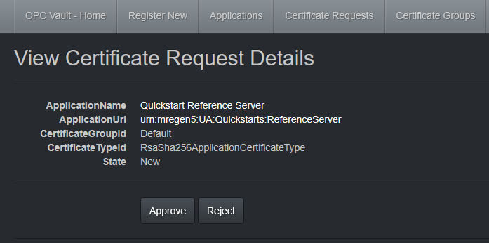
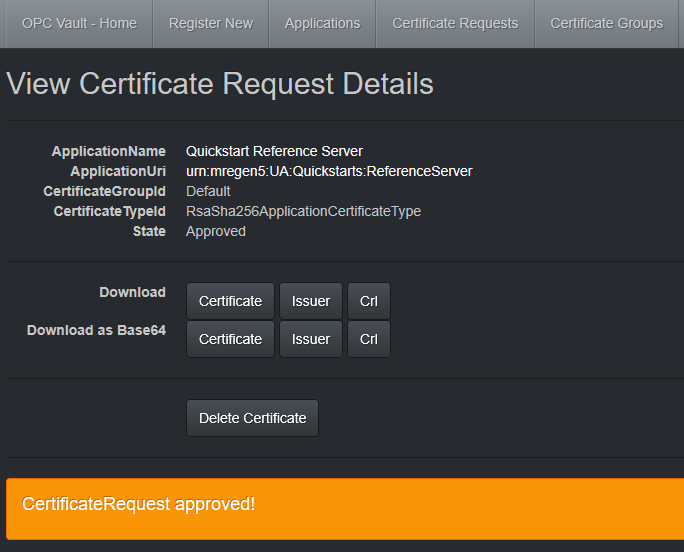

# Use the OPC Vault certificate management service

> [!IMPORTANT]
> While we update this article, see [Azure Industrial IoT](https://azure.github.io/Industrial-IoT/) for the most up to date content.

This article explains how to register applications, and how to issue signed application certificates for your OPC UA devices.

## Prerequisites

### Deploy the certificate management service

First, deploy the service to the Azure cloud. For details, see [Deploy the OPC Vault certificate management service](howto-opc-vault-deploy.md).

### Create the Issuer CA certificate

If you haven't done so yet, create the Issuer CA certificate. For details, see [Create and manage the Issuer certificate for OPC Vault](howto-opc-vault-manage.md).

## Secure OPC UA applications

### Step 1: Register your OPC UA application 

> [!IMPORTANT]
> The Writer role is required to register an application.

1. Open your certificate service at `https://myResourceGroup-app.azurewebsites.net`, and sign in.
2. Go to **Register New**. For an application registration, a user needs to have at least the Writer role assigned.
2. The entry form follows naming conventions in OPC UA. For example, in the following screenshot, the settings for the [OPC UA Reference Server](https://github.com/OPCFoundation/UA-.NETStandard/tree/master/Applications/ReferenceServer) sample in the OPC UA .NET Standard stack is shown:

   

5. Select **Register** to register the application in the certificate service application database. The workflow directly guides the user to the next step to request a signed certificate for the application.

### Step 2: Secure your application with a CA signed application certificate

Secure your OPC UA application by issuing a signed certificate based on a Certificate Signing
Request (CSR). Alternatively, you can request a new key pair, which includes a new private key in PFX or PEM format. For information about which method is supported for your application, see the documentation of your OPC UA device. In general, the CSR method is recommended, because it doesn't require a private key to be transferred over a wire.

#### Request a new certificate with a new keypair

1. Go to **Applications**.
3. Select **New Request** for a listed application.

   

3. Select **Request new KeyPair and Certificate** to request a private key and a new signed certificate with the public key for your application.

   

4. Fill in the form with a subject and the domain names. For the private key, choose PEM or PFX with password. Select **Generate New KeyPair** to create the certificate request.

   

5. Approval requires a user with the Approver role, and with signing permissions in Azure Key Vault. In the typical workflow, the Approver and Requester roles should be assigned to different users. Select **Approve** or **Reject** to start or cancel the actual creation of the key pair and the signing operation. The new key pair is created and stored securely in Azure Key Vault, until downloaded by the certificate requester. The resulting certificate with public key is signed by the CA. These operations can take a few seconds to finish.

   

7. The resulting private key (PFX or PEM) and certificate (DER) can be downloaded from here in the format selected as binary file download. A base64 encoded version is also available, for example, to copy and paste the certificate to a command line or text entry. 
8. After the private key is downloaded and stored securely, you can select **Delete Private Key**. The certificate with the public key remains available for future use.
9. Due to the use of a CA signed certificate, the CA cert and Certificate Revocation List (CRL) should be downloaded here as well.

Now it depends on the OPC UA device how to apply the new key pair. Typically, the CA cert and CRL are copied to a `trusted` folder, while the public and private keys of the application certificate are applied to an `own` folder in the certificate store. Some devices might already support server push for certificate updates. Refer to the documentation of your OPC UA device.

#### Request a new certificate with a CSR 

1. Go to **Applications**.
3. Select **New Request** for a listed application.

   

3. Select **Request new Certificate with Signing Request** to request a new signed certificate for your application.

   

4. Upload CSR by selecting a local file or by pasting a base64 encoded CSR in the form. Select **Generate New Certificate**.

   

5. Approval requires a user with the Approver role, and with signing permissions in Azure Key Vault. Select **Approve** or **Reject** to start or cancel the actual signing operation. The resulting certificate with public key is signed by the CA. This operation can take a few seconds to finish.

   

6. The resulting certificate (DER) can be downloaded from here as binary file. A base64 encoded version is also available, for example, to copy and paste the certificate to a command line or text entry. 
10. After the certificate is downloaded and stored securely, you can select **Delete Certificate**.
11. Due to the use of a CA signed certificate, the CA cert and CRL should be downloaded here as well.

Now it depends on the OPC UA device how to apply the new certificate. Typically, the CA cert and CRL are copied to a `trusted` folder, while the application certificate is applied to an `own` folder in the certificate store. Some devices might already support server push for certificate updates. Refer to the documentation of your OPC UA device.

### Step 3: Device secured

The OPC UA device is now ready to communicate with other OPC UA devices secured by CA signed certificates, without further configuration.

## Next steps

Now that you have learned how to secure OPC UA devices, you can:

> [!div class="nextstepaction"]
> [Run a secure certificate management service](howto-opc-vault-secure-ca.md)
