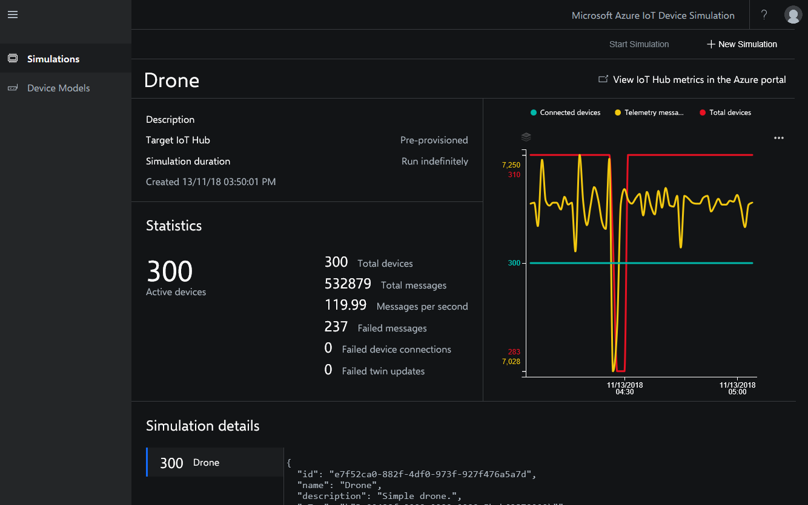

# Device Simulation solution accelerator overview

In a cloud-based IoT solution, your devices connect to a cloud endpoint to send telemetry such as temperature, location, and status. Your solution consumes this telemetry, enabling you to take actions or derive insights from it.

When you develop an IoT Solution, experimentation and testing are essential parts of that process. Simulation is an important tool throughout this process. With Device Simulation you can:

* Quickly get a prototype up and running and then iterate by adjusting simulated device behavior on the fly. This process lets you prove out the idea before investing in costly hardware. You can create custom devices through the web UI to generate a prototype device in seconds.
* Validate the solution works as expected from device to solution by simulating real-world device behaviors. You can script complex device behaviors using JavaScript to generate realistic simulated telemetry.
* Scale test your solution by simulating normal, peak, and beyond peak load conditions. Scale tests also help you to right size the Azure resources needed to run your solution.

With Device Simulation, you can define device models to simulate your real devices. This model includes message formats, twin properties, and methods. You can also simulate complex device behaviors with JavaScript.

You can run simulations for one to thousands of devices connecting to any IoT hub. To help with testing, you can optionally deploy an IoT hub along with Device Simulation for a standalone environment.

Device Simulation is free. However, Device Simulation deploys to your Azure subscription in the cloud and does consume Azure resources. If Device Simulation doesn't meet your requirements, the [source code is also available on GitHub](https://github.com/Azure/device-simulation-dotnet) for you to copy and modify.

## Sample simulations

When you deploy Device Simulation, you get some sample simulations and sample devices. You can use these samples to learn how to use Device Simulation. To get started, run a [sample simulation that simulates 10 trucks](quickstart-device-simulation-deploy.md). You can also [create your own simulation using one of the many sample devices provided](iot-accelerators-device-simulation-create-simulation.md).

## Custom simulated devices

You can use the Device Simulation to [create custom device models](iot-accelerators-device-simulation-create-custom-device.md) to use in your simulations. For example, you could define a new refrigerator device model that sends temperature and humidity telemetry. Custom simulated devices are ideal for simple device behaviors with random, incrementing, or decrementing telemetry values.

## Advanced simulated devices

When you need more control over the telemetry values a device sends, you can use an advanced device model. Advanced device models enable JavaScript support to manipulate the sent telemetry values. For example, you could simulate the interior temperature of a parked car on a hot sunny day - as the exterior temperature rise, the interior temperature increases exponentially.

Advanced device models let you [create and upload your own device models](iot-accelerators-device-simulation-advanced-device.md) that consist of a JSON device definition file and corresponding JavaScript files.

Advanced device models let you:

* Specify the message format sent from the device along with the telemetry types.
* Use custom scripting to generate telemetry values that maintain state of the device over time.
* Use custom scripting to specify how the simulated device responds to methods.

## Next steps

In this article, you learned about the Device Simulation solution accelerator and its capabilities. To get started using the solution accelerator, continue to the quickstart:

> [!div class="nextstepaction"]
> [Deploy and run an IoT device simulation in Azure](quickstart-device-simulation-deploy.md)
