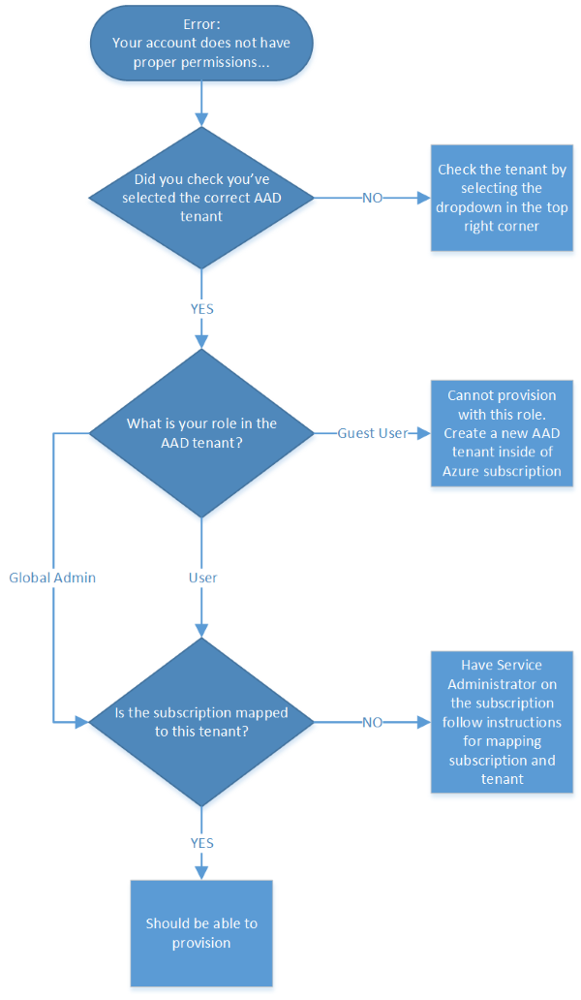

# Frequently asked questions for IoT solution accelerators

See also, the [Connected Factory-specific FAQ](iot-accelerators-faq-cf.md).

### Where can I find the source code for the solution accelerators?

The source code is stored in the following GitHub repositories:

* [Connected Factory solution accelerator](https://github.com/Azure/azure-iot-connected-factory)
* [Device simulation solution accelerator](https://github.com/Azure/azure-iot-pcs-device-simulation)

### Where can I find the remote monitoring and predictive maintenance solution accelerators?

As of December 10th 2020, the remote monitoring and predictive maintenance accelerators have been removed from the [Azure IoT solution accelerators](https://www.azureiotsolutions.com/Accelerators) site and are no longer available for new deployments. The GitHub repositories for both the accelerators have been archived. The code is still available for anyone to access but the repositories aren't taking any new contributions.

### What happens to my existing remote monitoring and predictive maintenance deployments?

Existing deployments aren't impacted by the removal of the remote monitoring and predictive maintenance solution accelerators and will continue to work. Forked repositories also aren't impacted. The master repositories on GitHub have been archived.

### How do I deploy device simulation solution accelerator?

To deploy the device simulation solution accelerator, see the [device simulation](https://github.com/Azure/azure-iot-pcs-device-simulation/blob/master/README.md) GitHub repository.

### Where can I find information about the removed solution accelerators?

See the following pages on the previous versions site:

* [Remote monitoring](/previous-versions/azure/iot-accelerators/about-iot-accelerators)
* [Predictive maintenance](/previous-versions/azure/iot-accelerators/about-iot-accelerators)

### What SDKs can I use to develop device clients for the solution accelerators?

You can find links to the different language (C, .NET, Java, Node.js, Python) IoT device SDKs in the [Microsoft Azure IoT SDKs](https://github.com/Azure/azure-iot-sdks) GitHub repositories.

If you're using the DevKit device, you can find resources and samples in the [IoT DevKit SDK](https://github.com/Microsoft/devkit-sdk) GitHub repository.

### I'm a service administrator and I'd like to change the directory mapping between my subscription and a specific Azure AD tenant. How do I complete this task?

See [To add an existing subscription to your Azure AD directory](../active-directory/fundamentals/active-directory-how-subscriptions-associated-directory.md#to-associate-an-existing-subscription-to-your-azure-ad-directory)

### I want to change a Service Administrator or Co-Administrator when logged in with an organizational account

See the support article [Changing Service Administrator and Co-Administrator when logged in with an organizational account](https://azure.microsoft.com/support/changing-service-admin-and-co-admin).

### Why am I seeing this error? "Your account does not have the proper permissions to create a solution. Please check with your account administrator or try with a different account."

Look at the following diagram for guidance:

> [!NOTE]
> If you continue to see the error after validating you are a global administrator of the Azure AD tenant and a co-administrator of the subscription, have your account administrator remove the user and reassign necessary permissions in this order. First, add the user as a global administrator and then add user as a co-administrator of the Azure subscription. If issues persist, contact [Help & Support](https://portal.azure.com/#blade/Microsoft_Azure_Support/HelpAndSupportBlade).

### Why am I seeing this error when I have an Azure subscription? "An Azure subscription is required to create pre-configured solutions. You can create a free trial account in just a couple of minutes."

If you're certain you have an Azure subscription, validate the tenant mapping for your subscription and check that the correct tenant is selected in the dropdown. If you’ve validated the tenant is correct, follow the preceding diagram and validate the mapping of your subscription and this Azure AD tenant.

### What's the difference between deleting a resource group in the Azure portal and clicking delete on a solution accelerator in azureiotsolutions.com?

* If you delete the solution accelerator in [azureiotsolutions.com](https://www.azureiotsolutions.com/), you delete all the resources that were deployed when you created the solution accelerator. If you added additional resources to the resource group, these resources are also deleted.
* If you delete the resource group in the [Azure portal](https://portal.azure.com), you only delete the resources in that resource group. You also need to delete the Azure Active Directory application associated with the solution accelerator.

### Can I continue to leverage my existing investments in Azure IoT solution accelerators?

Yes. Any solution that exists today continues to work in your Azure subscription and the source code stays available in GitHub.

### How many IoT Hub instances can I provision in a subscription?

By default you can provision [10 IoT hubs per subscription](../azure-resource-manager/management/azure-subscription-service-limits.md#iot-hub-limits). You can create an [Azure support ticket](https://portal.azure.com/#blade/Microsoft_Azure_Support/HelpAndSupportBlade) to raise this limit. As a result, since every solution accelerator provisions a new IoT Hub, you can only provision up to 10 solution accelerators in a given subscription.

### How many Azure Cosmos DB instances can I provision in a subscription?

Fifty. You can create an [Azure support ticket](https://portal.azure.com/#blade/Microsoft_Azure_Support/HelpAndSupportBlade) to raise this limit, but by default, you can only provision 50 Cosmos DB instances per subscription.

### Can I create a solution accelerator if I have Microsoft Azure for DreamSpark?

> [!NOTE]
> Microsoft Azure for DreamSpark is now known as Microsoft Imagine for students.

Currently, you cannot create a solution accelerator with a [Microsoft Azure for DreamSpark](https://azure.microsoft.com/pricing/member-offers/imagine/) account. However, you can create a [free trial account for Azure](https://azure.microsoft.com/free/) in just a couple of minutes that enables you create a solution accelerator.

### How do I delete an Azure AD tenant?

See Eric Golpe's blog post [Walkthrough of Deleting an Azure AD Tenant](/archive/blogs/ericgolpe/walkthrough-of-deleting-an-azure-ad-tenant).

### Next steps

You can also explore some of the other features and capabilities of the IoT solution accelerators:

* [Deploy Connected Factory solution accelerator](quickstart-connected-factory-deploy.md)
* [IoT security from the ground up](../iot-fundamentals/iot-security-ground-up.md)