# Tutorial: Manage your connected devices in bulk

In this tutorial, you use the Remote Monitoring solution accelerator to manage the configuration of your connected devices in bulk.

As an operator at Contoso, you need to configure a group of devices with a new firmware version. You don't want to have to update the firmware on each device individually. To update the firmware on a group of devices, you can use device groups and automatic device management in the Remote Monitoring solution accelerator. Any device you add to the device group gets the latest firmware as soon as the device comes online.

In this tutorial, you:

>[!div class="checklist"]
> * Create a device group
> * Prepare and host the firmware
> * Create a device configuration in the Azure portal
> * Import a device configuration into your Remote Monitoring solution
> * Deploy the configuration to the devices in the device group
> * Monitor the deployment

If you don't have an Azure subscription, create a [free account](https://azure.microsoft.com/free/?WT.mc_id=A261C142F) before you begin.

<!--
If this is going to be a tutorial - we need to split this include into two so that we can accommodate the additional prerequisites:

[!INCLUDE [iot-accelerators-tutorial-prereqs](../../includes/iot-accelerators-tutorial-prereqs.md)]
-->

## Prerequisites

To follow this tutorial, you need a deployed instance of the Remote Monitoring solution accelerator in your Azure subscription.

If you haven't deployed the Remote Monitoring solution accelerator yet, you should complete the [Deploy a cloud-based remote monitoring solution](quickstart-remote-monitoring-deploy.md) quickstart.

You need an Azure storage account to host your firmware files. You can use an existing storage account, or [create a new storage account](../storage/common/storage-account-create.md) in your subscription.

The tutorial uses an [IoT DevKit](https://microsoft.github.io/azure-iot-developer-kit/) device as a sample device.

You need the following software installed on your local machine:

* [Visual Studio Code (VS Code)](https://code.visualstudio.com/).
* The [Azure IoT Workbench](https://marketplace.visualstudio.com/items?itemName=vsciot-vscode.vscode-iot-workbench) VS Code extension.

Before you start:

* Make sure the [bootloader on your IoT DevKit  device is at version 1.4.0 or higher](https://microsoft.github.io/azure-iot-developer-kit/docs/firmware-upgrading/).
* Make sure the IoT DevKit SDK is at the same version as the bootloader. You can update the IoT DevKit SDK using the Azure IoT Workbench in VS Code. Open the command palette and enter **Arduino: Board Manager**. For more information, see [Prepare the development environment](../iot-hub/iot-hub-arduino-iot-devkit-az3166-get-started.md#prepare-the-development-environment).

You also need to connect at least one IoT DevKit device to your Remote Monitoring solution accelerator. If you haven't connected an IoT DevKit device, see [Connect MXChip IoT DevKit AZ3166 to the IoT Remote Monitoring solution accelerator](./iot-accelerators-arduino-iot-devkit-az3166-devkit-remote-monitoring-v2.md).

## Navigate to the dashboard

To view to the Remote Monitoring solution dashboard in your browser, first navigate to [Microsoft Azure IoT Solution Accelerators](https://www.azureiotsolutions.com/Accelerators#dashboard). You may be asked to sign in using your Azure subscription credentials.

Then click **Launch** on the tile for the Remote Monitoring solution accelerator you deployed in the [Quickstart](quickstart-remote-monitoring-deploy.md).

## Create a device group

To automatically update the firmware on a group of devices, the devices must be members of a device group in your Remote Monitoring solution:

1. On the **Devices** page, select all the **IoT DevKit** devices you've connected to the solution accelerator. Then click **Jobs**.

1. In the **Jobs** panel, select **Tags**, set the job name to **AddDevKitTag**, and then add a text tag called **IsDevKitDevice** with a value **Y**. Then click **Apply**.

1. Now you can use the tag values to create a device group. On the **Devices** page, click **Manage device groups**.

1. Create a text filter that uses the tag name **IsDevKitDevice** and value **Y** in the condition. Save the device group as **IoT DevKit devices**.

Later in this tutorial, you use this device group to apply a device configuration that updates the firmware of all the members.

## Prepare and host the firmware

The [Azure IoT Workbench](https://marketplace.visualstudio.com/items?itemName=vsciot-vscode.vscode-iot-workbench) VS Code extension includes the sample device code for the firmware update.

### Open the Firmware OTA sample in VS Code

1. Make sure your IoT DevKit isn't connected to your computer. Start VS Code, and then connect the DevKit to your computer.

1. Press **F1** to open the command palette, type and select **IoT Workbench: Examples**. Then select **IoT DevKit** as the board.

1. Find **Firmware OTA** and click **Open Sample**. A new VS Code window opens and shows the **firmware_ota** project folder:

    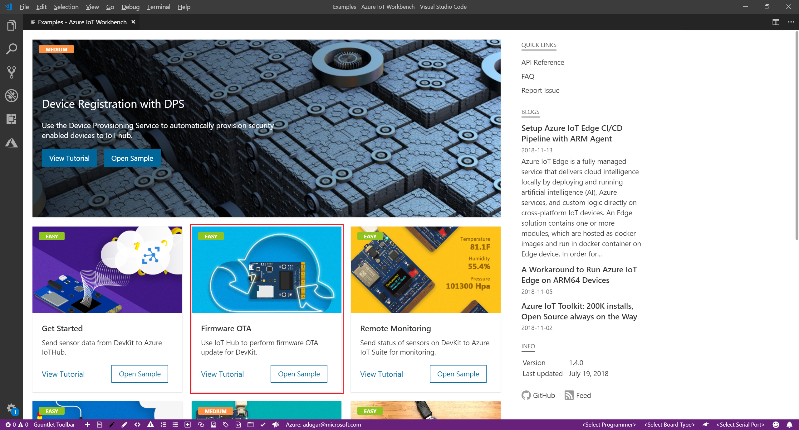

### Build the new firmware

The initial version of the device firmware is 1.0.0. The new firmware should have a higher version number.

1. In VS Code, open the **FirmwareOTA.ino** file and change the `currentFirmwareVersion` from `1.0.0` to `1.0.1`:

    

1. Open the command palette, then type and select **IoT Workbench: Device**. Then select **Device Compile** to compile the code:

    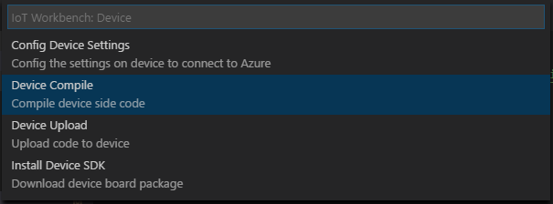

    VS Code saves the compiled file in the `.build` folder in the project. Depending on your settings, VS Code may hide the `.build` folder in the explorer view.

### Generate the CRC value and calculate the firmware file size

1. Open the command palette, then type and select **IoT Workbench: Device**. Then select **Generate CRC**:

    

1. VS Code generates and prints the CRC value, the firmware filename and path, and the file size in the output window. Make a note of these values for later:

    

### Upload the firmware to the cloud

Use your Azure storage account to host your new firmware file in the cloud.

1. Navigate to your storage account in the Azure portal. In the Services section, select **Blobs**. Create a public container called **firmware** to store your firmware files:

    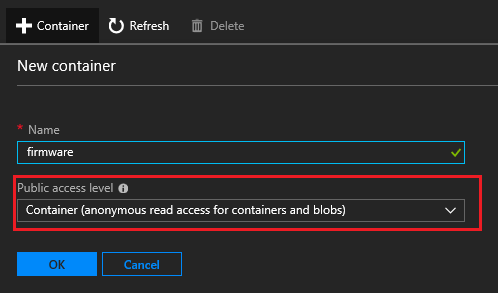

1. To upload your firmware file to the container, Select the **firmware** container and click **Upload**.

1. Select the **FirmwareOTA.ino.bin**. You made a note of the full path to this file in the previous section.

1. After the firmware file upload complete, make a note of the file URL.

### Build and upload the original firmware to the IoT DevKit device

1. In VS Code, open the **FirmwareOTA.ino** file and change the `currentFirmwareVersion` back to `1.0.0`:

    

1. Open the command palette, then type and select **IoT Workbench: Device**. Then select **Device Upload**:

    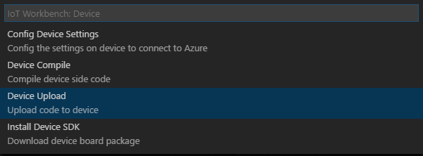

1. VS Code verifies and uploads the code to your IoT DevKit device.

1. When the upload finishes, the IoT DevKit device reboots. When the reboot is complete, the screen of IoT DevKit shows **FW version: 1.0.0**, and that it's checking for new firmware:

    

## Create a device configuration

A device configuration specifies the desired state of your devices. Typically, a developer [creates the configuration](../iot-hub/iot-hub-automatic-device-management.md#create-a-configuration) on the **IoT device configuration** page in the Azure portal. A device configuration is a JSON document that specifies the desired state of your devices and a set of metrics.

Save the following configuration as file called **firmware-update.json** on your local machine. Replace the `YOURSTRORAGEACCOUNTNAME`, `YOURCHECKSUM`, and `YOURPACKAGESIZE` placeholders with the values you made a note of previously:

```json
{
  "id": "firmware-update",
  "schemaVersion": null,
  "labels": {
    "Version": "1.0.1",
    "Devices": "IoT DevKit"
  },
  "content": {
    "deviceContent": {
      "properties.desired.firmware": {
        "fwVersion": "1.0.1",
        "fwPackageURI": "https://YOURSTRORAGEACCOUNTNAME.blob.core.windows.net/firmware/FirmwareOTA.ino.bin",
        "fwPackageCheckValue": "YOURCHECKSUM",
        "fwSize": YOURPACKAGESIZE
      }
    }
  },
  "targetCondition": "",
  "priority": 10,
  "systemMetrics": {
    "results": {
      "targetedCount": 0,
      "appliedCount": 0
    },
    "queries": {
      "targetedCount": "",
      "appliedCount": "select deviceId from devices where configurations.[[firmware-update]].status = 'Applied'"
    }
  },
  "metrics": {
    "results": {
      "Current": 1
    },
    "queries": {
      "Current": "SELECT deviceId FROM devices WHERE properties.reported.firmware.fwUpdateStatus='Current' AND properties.reported.firmware.type='IoTDevKit'",
      "Downloading": "SELECT deviceId FROM devices WHERE properties.reported.firmware.fwUpdateStatus='Downloading' AND properties.reported.firmware.type='IoTDevKit'",
      "Verifying": "SELECT deviceId FROM devices WHERE properties.reported.firmware.fwUpdateStatus='Verifying' AND properties.reported.firmware.type='IoTDevKit'",
      "Applying": "SELECT deviceId FROM devices WHERE properties.reported.firmware.fwUpdateStatus='Applying' AND properties.reported.firmware.type='IoTDevKit'",
      "Error": "SELECT deviceId FROM devices WHERE properties.reported.firmware.fwUpdateStatus='Error' AND properties.reported.firmware.type='IoTDevKit'"
    }
  }
}
```

You use this configuration file in the following section.

## Import a configuration

In this section, you import the device configuration as a package into the Remote Monitoring solution accelerator. Typically, an operator completes this task.

1. In the Remote Monitoring web UI, navigate to the **Packages** page and click **+ New Package**:

    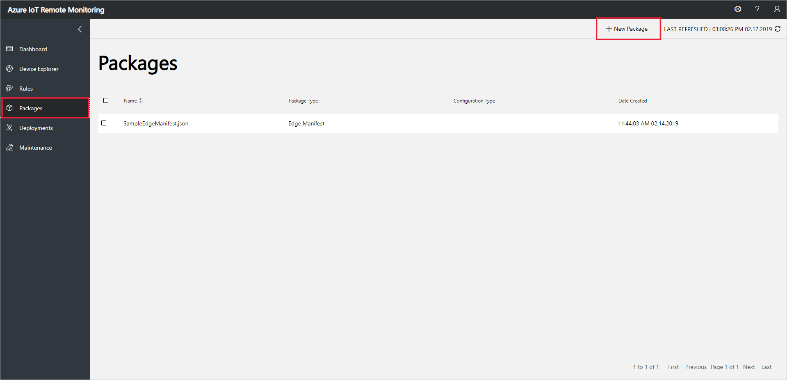

1. In the **New Package** panel, choose **Device configuration** as the package type and **Firmware** as the configuration type. Click **Browse** to find the **firmware-update.json** file on your local machine, and then click **Upload**:

    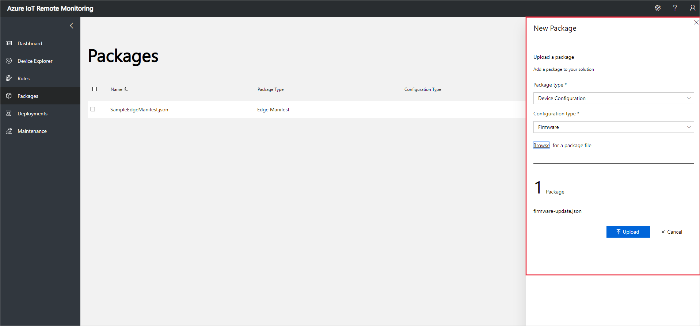

1. The list of packages now includes the **firmware-update** package.

## Deploy the configuration to your devices

In this section, you create and execute a deployment that applies the device configuration to your IoT DevKit devices.

1. In the Remote Monitoring web UI, navigate to the **Deployments** page and click **+ New deployment**:

    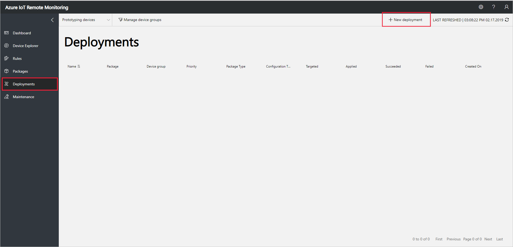

1. In the **New deployment** panel, create a deployment with the following settings:

    |Option|Value|
    |---|---|
    |Name|Deploy firmware update|
    |Package type|Device Configuration|
    |Configuration type|Firmware|
    |Package|firmware-update.json|
    |Device Group|IoT DevKit devices|
    |Priority|10|

    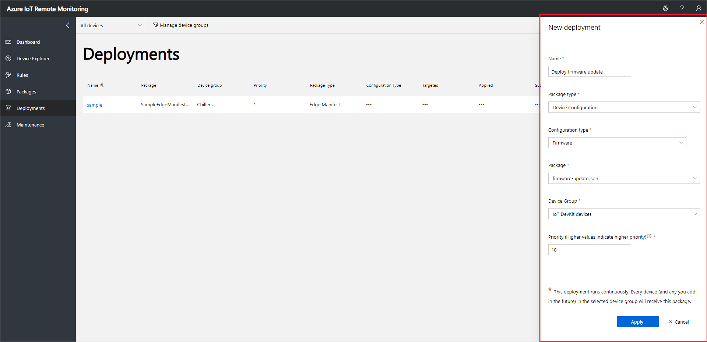

    Click **Apply**. You see a new deployment in the **Deployments** page that shows the following metrics:

    * **Targeted** shows the number of devices in the device group.
    * **Applied** shows the number of devices that were updated with the configuration content.
    * **Succeeded** shows the number of devices in the deployment that report success.
    * **Failed** shows the number of devices in the deployment that report failure.

## Monitor the deployment

After a few minutes, the IoT DevKit retrieves the new firmware information and starts downloading it to the device:

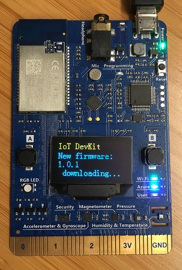

Depending on the speed of your network, the download may take up to a couple of minutes. After the firmware is downloaded, the device verifies the file size and CRC value. The screen on the MXChip displays **passed** if verification is successful.

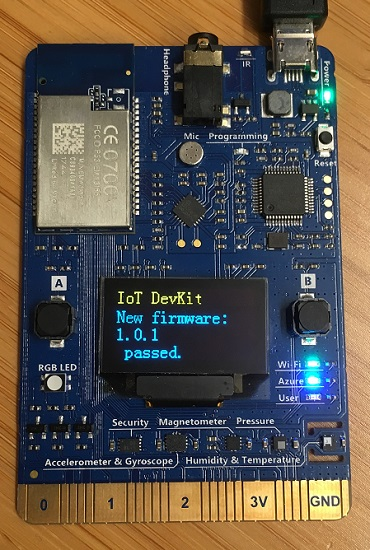

If the check is successful, the device reboots. You see a countdown from **5** to **0** before the reboot happens.

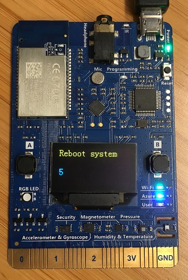

After the reboot, the IoT DevKit bootloader upgrades the firmware to the new version. The upgrade may take several seconds. During this stage, the RGB LED in the device is red and the screen is blank.

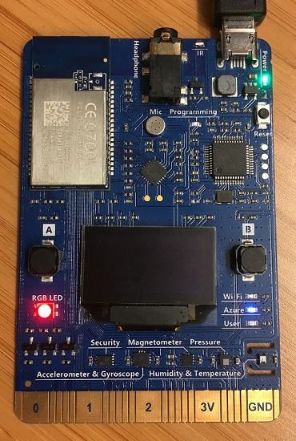

When the reboot is finished, your IoT DevKit device is now running version 1.0.1 of the firmware.

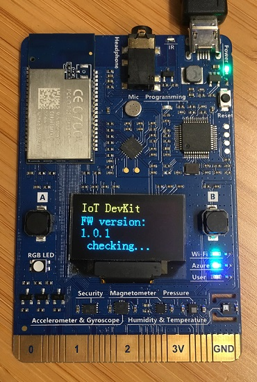

On the **Deployments** page, click on a deployment to see the status of your devices as they update. You can see the status of each device in your device group and the custom metrics you defined.

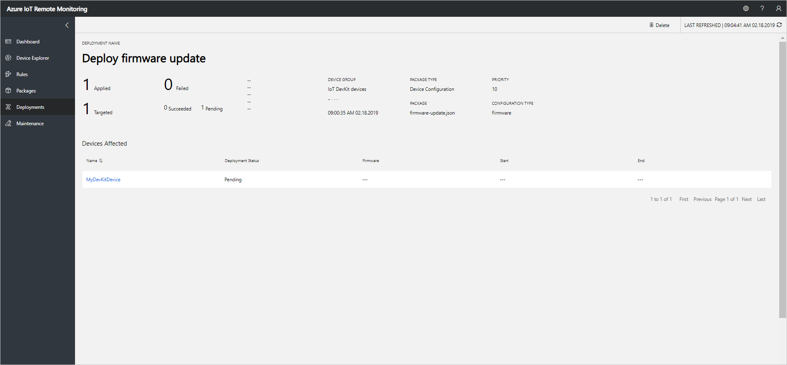

[!INCLUDE [iot-accelerators-tutorial-cleanup](../../includes/iot-accelerators-tutorial-cleanup.md)]

## Next steps

This tutorial showed you how to update the firmware of a group of devices connected to your solution. To update the devices, your solution uses automatic device management. To learn more about the automatic device management feature in your solution's underlying IoT hub, see [Configure and monitor IoT devices at scale using the Azure portal](../iot-hub/iot-hub-automatic-device-management.md).