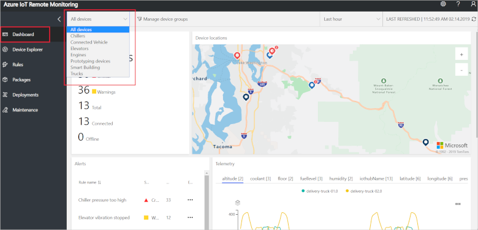
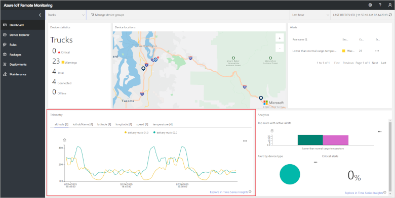
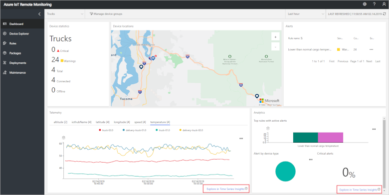
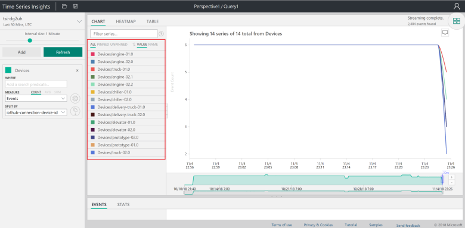
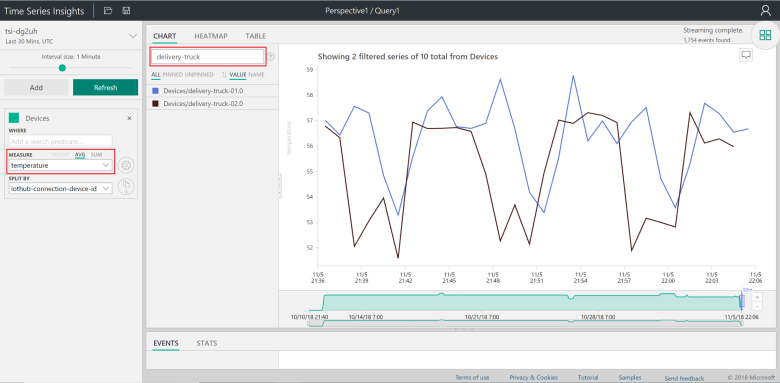
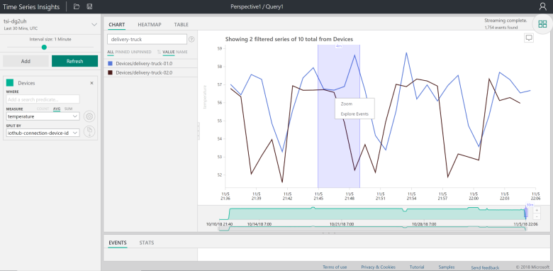
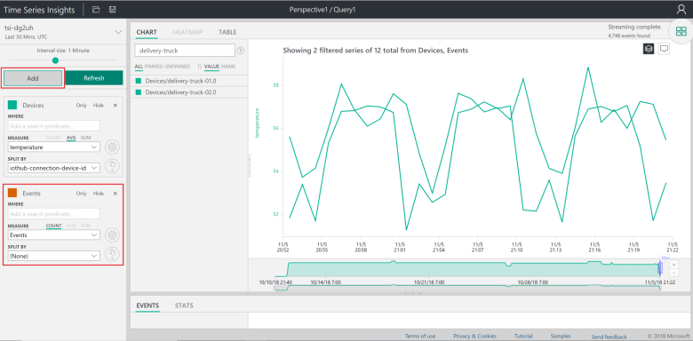
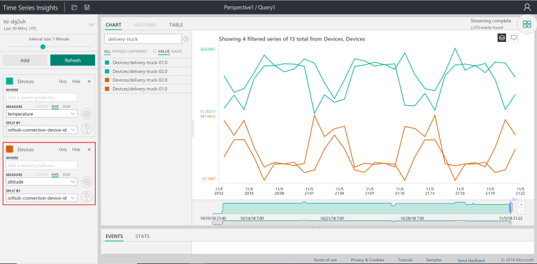
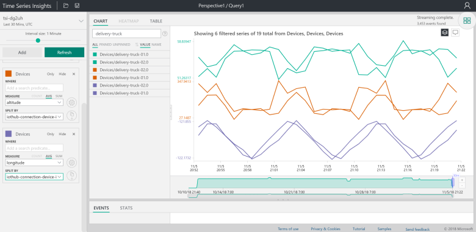
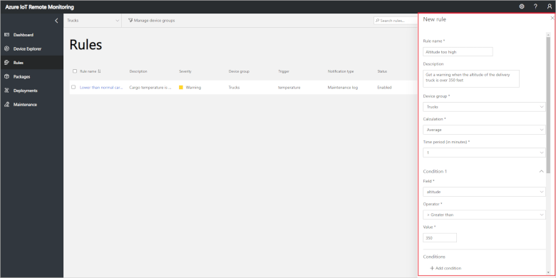

# Tutorial: Conduct a root cause analysis on an alert

In this tutorial, you learn how to use the Remote Monitoring solution accelerator to diagnose the root cause of an alert. You see that an alert has been triggered in the Remote Monitoring solution dashboard and then use the Azure Time Series Insights explorer to investigate the root cause.

The tutorial uses two simulated delivery truck devices that send location, altitude, speed, and cargo temperature telemetry. The trucks are managed by an organization called Contoso and are connected to the Remote Monitoring solution accelerator. As a Contoso operator, you need to understand why one of your trucks (delivery-truck-02) has logged a low temperature alert.

In this tutorial, you:

>[!div class="checklist"]
> * Filter the devices in the dashboard
> * View real-time telemetry
> * Explore data in the Time Series Insights explorer
> * Conduct a root cause analysis
> * Create a new rule based on your learnings

If you don't have an Azure subscription, create a [free account](https://azure.microsoft.com/free/?WT.mc_id=A261C142F) before you begin.

[!INCLUDE [iot-accelerators-tutorial-prereqs](../../includes/iot-accelerators-tutorial-prereqs.md)]

## Choose the devices to display

To select which connected devices display on the **Dashboard** page, use filters. To display only the **Truck** devices, choose the built-in **Trucks** filter in the filter drop-down:

When you apply a filter, only those devices that match the filter conditions are displayed on the map and in the telemetry panel on the **Dashboard**. You can see that there are two trucks connected to the solution accelerator, including **truck-02**.

## View real-time telemetry

The solution accelerator plots real-time telemetry in the chart on the **Dashboard** page. By default, the chart is showing altitude telemetry, which varies over time:

To view temperature telemetry for the trucks, click **Temperature** in the **Telemetry panel**. You can see how the temperature for both trucks has varied over the last 15 minutes. You can also see that an alert for low temperature has been triggered for delivery-truck-02 in the alerts pane.

## Explore the data

To identify the cause of the low temperature alarm, open the delivery truck telemetry data in the Time Series Insights explorer. Click any of the **Explore in Time Series Insights** links on the dashboard:

When the explorer launches, you see all of your devices listed:

Filter the devices by typing **delivery-truck** in the filter box, and select **temperature** as the **Measure** in the left-hand panel:

You see the same view that you saw in the Remote Monitoring dashboard. Also, you can now zoom in closer to the time frame that the alert was triggered within:

You can also add in other telemetry streams coming from the trucks. Click the **Add** button in the top left-hand corner. A new pane appears:

In the new pane, change the name of the new label to **Devices** so that it matches the previous one. Select **altitude** as the **Measure** and **iothub-connection-device-id** as the **Split By** value to add the altitude telemetry into your view:

## Diagnose the alert

When you look at the streams in the current view, you can see that the altitude profiles for the two trucks are different. Also, the temperature drop in **delivery-truck-02** happens when the truck reaches a high altitude. You are surprised by the finding, because the trucks were scheduled to take the same route.

To confirm your suspicion that the trucks took different journey paths, add in another pane to the side panel using the **Add** button. In the new pane, change the name of the new label to **Devices** so that it matches the previous one. Select **longitude** as the **Measure** and **iothub-connection-device-id** as the **Split By** value to add the longitude telemetry into your view. You can see that the trucks did take different journeys by looking at the difference between **longitude** streams:

## Create a new rule

While truck routes are typically optimized in advance, you realize that traffic patterns, weather, and other unpredictable events can cause delays and leave last minute route decisions to truck drivers based on their best judgment. However, since the temperature of your assets inside the vehicle is critical, you should create an additional rule in your Remote Monitoring solution. This rule is to ensure you receive a warning if the average altitude over a 1-minute interval goes above 350 feet:

To learn how to create and edit rules, check out the previous tutorial on [detecting device issues](iot-accelerators-remote-monitoring-automate.md).

[!INCLUDE [iot-accelerators-tutorial-cleanup](../../includes/iot-accelerators-tutorial-cleanup.md)]

## Next steps

This tutorial showed you how to use the Time Series Insights explorer with the Remote Monitoring solution accelerator to diagnose the root cause of an alert. To learn how to use the solution accelerator to identify and fix issues with your connected devices, continue to the next tutorial.

> [!div class="nextstepaction"]
> [Use device alerts to identify and fix issues with devices connected to your monitoring solution](iot-accelerators-remote-monitoring-maintain.md)
