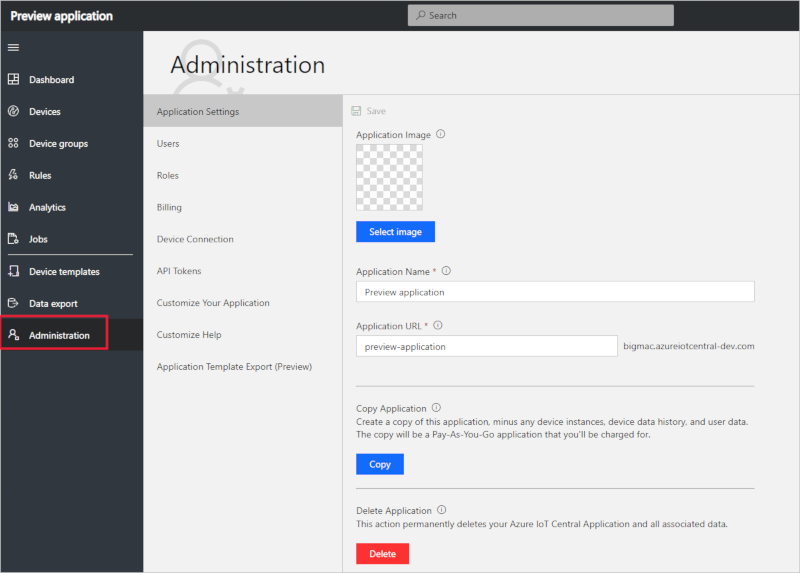

# Change IoT Central application settings

[!INCLUDE [iot-central-pnp-original](../../../includes/iot-central-pnp-original-note.md)]

This article describes how, as an administrator, you can manage application by changing application name and URL, uploading image, and delete an application in your Azure IoT Central application.

To access and use the **Administration** section, you must be in the **Administrator** role for an Azure IoT Central application. If you create an Azure IoT Central application, you're automatically assigned to the **Administrator** role for that application.

## Change application name and URL

In the **Application Settings** page, you can change the name and URL of your application, then select **Save**.

If your administrator creates a custom theme for your application, this page includes an option to hide the **Application Name** in the UI. This option is useful if the application logo in the custom theme includes the application name. For more information, see [Customize the Azure IoT Central UI](./howto-customize-ui-pnp.md?toc=/azure/iot-central-pnp/toc.json&bc=/azure/iot-central-pnp/breadcrumb/toc.json).

> [!Note]
> If you change your URL, your old URL can be taken by another Azure IoT Central customer. If that happens, it is no longer available for you to use. When you change your URL, the old URL no longer works, and you need to notify your users about the new URL to use.

## Delete an application

Use the **Delete** button to permanently delete your IoT Central application. This action permanently deletes all data that's associated with the application.

> [!Note]
> To delete an application, you must also have permissions to delete resources in the Azure subscription you chose when you created the application. To learn more, see [Use role-based access control to manage access to your Azure subscription resources](https://docs.microsoft.com/azure/active-directory/role-based-access-control-configure).

## Manage programmatically

IoT Central Azure Resource Manager SDK packages are available for Node, Python, C#, Ruby, Java, and Go. You can use these packages to create, list, update, or delete IoT Central applications. The packages include helpers to manage authentication and error handling.

You can find examples of how to use the Azure Resource Manager SDKs at [https://github.com/emgarten/iotcentral-arm-sdk-examples](https://github.com/emgarten/iotcentral-arm-sdk-examples).

To learn more, see the following GitHub repositories and packages:

| Language | Repository | Package |
| ---------| ---------- | ------- |
| Node | [https://github.com/Azure/azure-sdk-for-node](https://github.com/Azure/azure-sdk-for-node) | [https://www.npmjs.com/package/azure-arm-iotcentral](https://www.npmjs.com/package/azure-arm-iotcentral)
| Python |[https://github.com/Azure/azure-sdk-for-python](https://github.com/Azure/azure-sdk-for-python) | [https://pypi.org/project/azure-mgmt-iotcentral](https://pypi.org/project/azure-mgmt-iotcentral)
| C# | [https://github.com/Azure/azure-sdk-for-net](https://github.com/Azure/azure-sdk-for-net) | [https://www.nuget.org/packages/Microsoft.Azure.Management.IotCentral](https://www.nuget.org/packages/Microsoft.Azure.Management.IotCentral)
| Ruby | [https://github.com/Azure/azure-sdk-for-ruby](https://github.com/Azure/azure-sdk-for-ruby) | [https://rubygems.org/gems/azure_mgmt_iot_central](https://rubygems.org/gems/azure_mgmt_iot_central)
| Java | [https://github.com/Azure/azure-sdk-for-java](https://github.com/Azure/azure-sdk-for-java) | [https://search.maven.org/search?q=a:azure-mgmt-iotcentral](https://search.maven.org/search?q=a:azure-mgmt-iotcentral)
| Go | [https://github.com/Azure/azure-sdk-for-go](https://github.com/Azure/azure-sdk-for-go) | [https://github.com/Azure/azure-sdk-for-go](https://github.com/Azure/azure-sdk-for-go)

## Next steps

Now that you've learned about how to administer your Azure IoT Central application, the suggested next step is to learn about [Manage users and roles](howto-manage-users-roles-pnp.md?toc=/azure/iot-central-pnp/toc.json&bc=/azure/iot-central-pnp/breadcrumb/toc.json) in Azure IoT Central.
