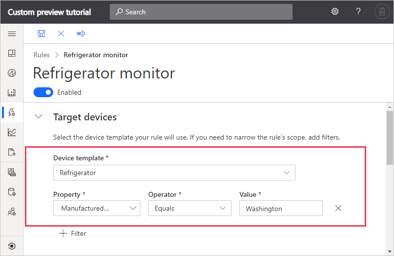
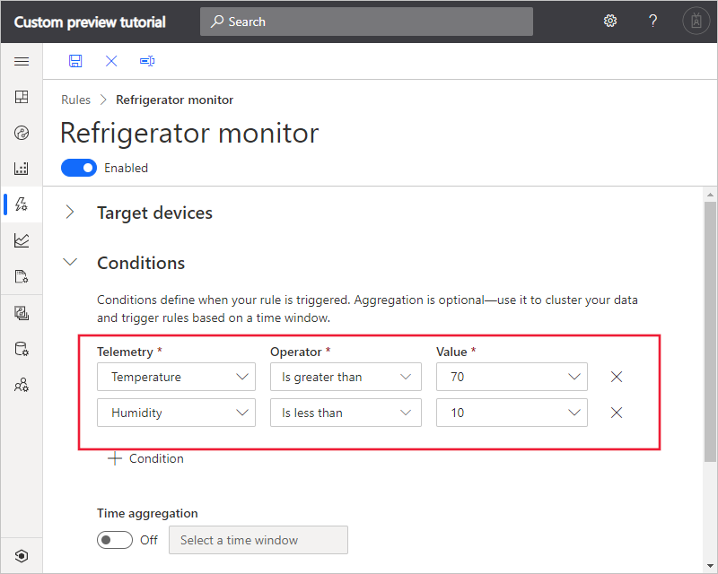
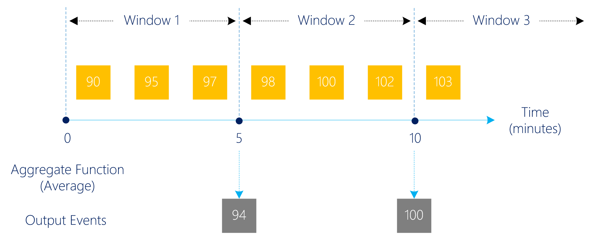

# Configure rules

*This article applies to operators, builders, and administrators.*

Rules in IoT Central serve as a customizable response tool that trigger on actively monitored events from connected devices. The following sections describe how rules are evaluated.

## Select target devices

Use the target devices section to select on what kind of devices this rule will be applied. Filters allow you to further refine what devices should be included. The filters use properties on the device template to filter down the set of devices. Filters themselves don't trigger an action. In the following screenshot, the devices that are being targeted are of device template type **Refrigerator**. The filter states that the rule should only include **Refrigerators** where the **Manufactured State** property equals **Washington**.

## Use multiple conditions

Conditions are what rules trigger on. Currently, when you add multiple conditions to a rule, they're logically AND'd together. In other words, all conditions must be met for the rule to evaluate as true.  

In the following screenshot, the conditions check when the temperature is greater than 70&deg; F and the humidity is less than 10. When both of these statements are true, the rule evaluates to true and triggers an action.

### Use a cloud property in a value field

You can reference a cloud property from the device template in the **Value** field for a condition. The cloud property and telemetry value must have similar types. For example, if **Temperature** is a double, then only cloud properties of type double show as options in the **Value** drop-down.

If you choose an event type telemetry value, the **Value** drop-down includes the option **Any**. The **Any** option means the rule fires when your application receives an event of that type, whatever the payload.

## Use aggregate windowing

Rules evaluate aggregate time windows as tumbling windows. In the screenshot below, the time window is five minutes. Every five minutes, the rule evaluates on the last five minutes of data. The data is only evaluated once in the window to which it corresponds.

## Use rules with IoT Edge modules

A restriction applies to rules that are applied to IoT Edge modules. Rules on telemetry from different modules aren't evaluated as valid rules. Take the following as an example. The first condition of the rule is on a temperature telemetry from Module A. The second condition of the rule is on a humidity telemetry on Module B. Since the two conditions are from different modules, this is an invalid set of conditions. The rule isn't valid and will throw an error on trying to save the rule.

## Next steps

Now that you've learned how to configure a rule in your Azure IoT Central application, you can:

> [!div class="nextstepaction"]
> [Analyze your data on the fly](howto-create-analytics.md)
