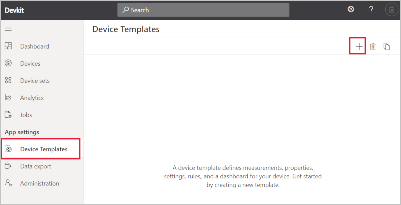
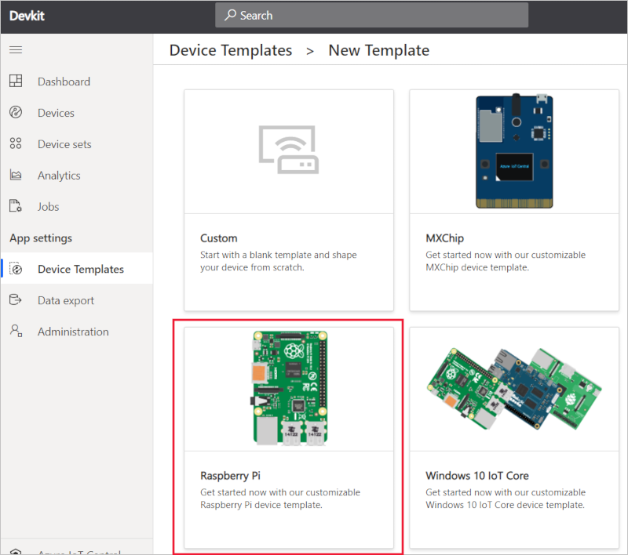

# Connect a Raspberry Pi to your Azure IoT Central application (Python)

[!INCLUDE [howto-raspberrypi-selector](../../../includes/iot-central-howto-raspberrypi-selector.md)]

[!INCLUDE [iot-central-original-pnp](../../../includes/iot-central-original-pnp-note.md)]

This article describes how, as a device developer, to connect a Raspberry Pi to your Microsoft Azure IoT Central application using the Python programming language.

## Before you begin

To complete the steps in this article, you need the following components:

* An Azure IoT Central application created from the **Legacy application** application template. For more information, see the [create an application quickstart](quick-deploy-iot-central.md).
* A Raspberry Pi device running the Raspbian operating system. The Raspberry Pi must be able to connect to the internet. For more information, see [Setting up your Raspberry Pi](https://projects.raspberrypi.org/en/projects/raspberry-pi-setting-up/3).

> [!TIP]
> To learn about setting up and connecting to a Raspberry Pi device, visit [Get started with Raspberry Pi](https://projects.raspberrypi.org/en/pathways/getting-started-with-raspberry-pi)

## Add a device template

In your Azure IoT Central application, add a new **Raspberry Pi** device template with the following characteristics:

- Telemetry, which includes the following measurements the device will collect:
  - Humidity
  - Temperature
  - Pressure
  - Magnetometer (X, Y, Z)
  - Accelerometer (X, Y, Z)
  - Gyroscope (X, Y, Z)
- Settings
  - Voltage
  - Current
  - Fan Speed
  - IR toggle.
- Properties
  - Die number device property
  - Location cloud property

1. Select **+New** from device templates
   
   

2. Select **Raspberry Pi** and create the Raspberry Pi device template
   

For the full details of the configuration of the device template, see the [Raspberry Pi Device template details](howto-connect-raspberry-pi-python.md#raspberry-pi-device-template-details).

## Add a real device

In your Azure IoT Central application, add a real device from the **Raspberry Pi** device template. Make a note of the device connection details (**Scope ID**, **Device ID**, and **Primary key**). For more information, see [Add a real device to your Azure IoT Central application](tutorial-add-device.md).

### Configure the Raspberry Pi

The following steps describe how to download and configure the sample Python application from GitHub. This sample application:

* Sends telemetry and property values to Azure IoT Central.
* Responds to setting changes made in Azure IoT Central.

1. Connect to a shell environment on your Raspberry Pi, either from the Raspberry Pi desktop or remotely using SSH.

1. Run the following command to install the IoT Central Python client:

    ```bash
    pip install iotc
    ```

1. Download the sample Python code:

    ```bash
    curl -O https://raw.githubusercontent.com/Azure/iot-central-firmware/master/RaspberryPi/app.py
    ```

1. Edit the `app.py` file you downloaded and replace the `DEVICE_ID`, `SCOPE_ID`, and `PRIMARY/SECONDARY device KEY` placeholders with the connection values you made a note of previously. Save your changes.

    > [!TIP]
    > In the shell on the Raspberry Pi, you can use either the **nano** or **vi** text editors.

1. Use the following command to run the sample:

    ```bash
    python app.py
    ```

    Your Raspberry Pi starts sending telemetry measurements to Azure IoT Central.

1. In your Azure IoT Central application, you can see how the code running on the Raspberry Pi interacts with the application:

    * On the **Measurements** page for your real device, you can see the telemetry sent from the Raspberry Pi.
    * On the **Properties** page, you can see the **Die Number** device property.
    * On the **Settings** page, you can change the settings on the Raspberry Pi such as voltage and fan speed. When the Raspberry Pi acknowledges the change, the setting shows as **synced**.

## Raspberry Pi Device template details

An application created from the **Sample Devkits** application template includes a **Raspberry Pi** device template with the following characteristics:

### Telemetry measurements

| Field name     | Units  | Minimum | Maximum | Decimal places |
| -------------- | ------ | ------- | ------- | -------------- |
| humidity       | %      | 0       | 100     | 0              |
| temp           | °C     | -40     | 120     | 0              |
| pressure       | hPa    | 260     | 1260    | 0              |
| magnetometerX  | mgauss | -1000   | 1000    | 0              |
| magnetometerY  | mgauss | -1000   | 1000    | 0              |
| magnetometerZ  | mgauss | -1000   | 1000    | 0              |
| accelerometerX | mg     | -2000   | 2000    | 0              |
| accelerometerY | mg     | -2000   | 2000    | 0              |
| accelerometerZ | mg     | -2000   | 2000    | 0              |
| gyroscopeX     | mdps   | -2000   | 2000    | 0              |
| gyroscopeY     | mdps   | -2000   | 2000    | 0              |
| gyroscopeZ     | mdps   | -2000   | 2000    | 0              |

### Settings

Numeric settings

| Display name | Field name | Units | Decimal places | Minimum | Maximum | Initial |
| ------------ | ---------- | ----- | -------------- | ------- | ------- | ------- |
| Voltage      | setVoltage | Volts | 0              | 0       | 240     | 0       |
| Current      | setCurrent | Amps  | 0              | 0       | 100     | 0       |
| Fan Speed    | fanSpeed   | RPM   | 0              | 0       | 1000    | 0       |

Toggle settings

| Display name | Field name | On text | Off text | Initial |
| ------------ | ---------- | ------- | -------- | ------- |
| IR           | activateIR | ON      | OFF      | Off     |

### Properties

| Type            | Display name | Field name | Data type |
| --------------- | ------------ | ---------- | --------- |
| Device property | Die number   | dieNumber  | number    |
| Text            | Location     | location   | N/A       |

## Next steps

Now that you've learned how to connect a Raspberry Pi to your Azure IoT Central application, the suggested next step is to learn how to [set up a custom device template](howto-set-up-template.md) for your own IoT device.
