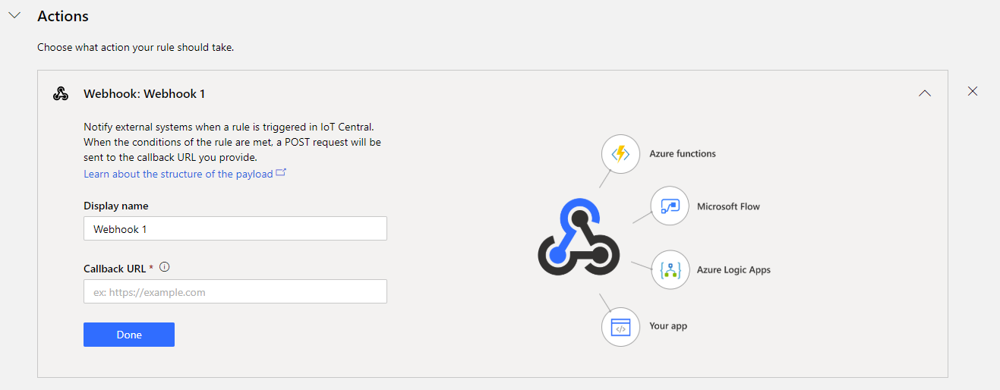

# Create webhook actions on rules in Azure IoT Central

*This topic applies to builders and administrators.*

Webhooks enable you to connect your IoT Central app to other applications and services for remote monitoring and notifications. Webhooks automatically notify other applications and services you connect whenever a rule is triggered in your IoT Central app. Your IoT Central app sends a POST request to the other application's HTTP endpoint whenever a rule is triggered. The payload contains device details and rule trigger details.

## Set up the webhook

In this example, you connect to RequestBin to get notified when rules fire using webhooks.

1. Open [RequestBin](https://requestbin.net/).

1. Create a new RequestBin and copy the **Bin URL**.

1. Create a [telemetry rule](tutorial-create-telemetry-rules.md). Save the rule and add a new action.

    

1. Choose the webhook action and provide a display name and paste the Bin URL as the Callback URL.

1. Save the rule.

Now when the rule is triggered, you see a new request appear in RequestBin.

## Payload

When a rule is triggered, an HTTP POST request is made to the callback URL containing a json payload with the telemetry, device, rule, and application details. The payload could look like the following:

```json
{
    "timestamp": "2020-04-06T00:20:15.06Z",
    "action": {
        "id": "<id>",
        "type": "WebhookAction",
        "rules": [
            "<rule_id>"
        ],
        "displayName": "Webhook 1",
        "url": "<callback_url>"
    },
    "application": {
        "id": "<application_id>",
        "displayName": "Contoso",
        "subdomain": "contoso",
        "host": "contoso.azureiotcentral.com"
    },
    "device": {
        "id": "<device_id>",
        "etag": "<etag>",
        "displayName": "MXChip IoT DevKit - 1yl6vvhax6c",
        "instanceOf": "<device_template_id>",
        "simulated": true,
        "provisioned": true,
        "approved": true,
        "cloudProperties": {
            "City": {
                "value": "Seattle"
            }
        },
        "properties": {
            "deviceinfo": {
                "firmwareVersion": {
                    "value": "1.0.0"
                }
            }
        },
        "telemetry": {
            "<interface_instance_name>": {
                "humidity": {
                    "value": 47.33228889360127
                }
            }
        }
    },
    "rule": {
        "id": "<rule_id>",
        "displayName": "Humidity monitor"
    }
}
```
If the rule monitors aggregated telemetry over a period of time, the payload will contain a different telemetry section.

```json
{
    "telemetry": {
        "<interface_instance_name>": {
            "Humidity": {
                "avg": 39.5
            }
        }
    }
}
```

## Data format change notice

If you have one or more webhooks created and saved before **3 April 2020**, you will need to delete the webhook and create a new webhook. This is because older webhooks use an older payload format that will be deprecated in the future.

### Webhook payload (format deprecated as of 3 April 2020)

```json
{
    "id": "<id>",
    "displayName": "Webhook 1",
    "timestamp": "2019-10-24T18:27:13.538Z",
    "rule": {
        "id": "<id>",
        "displayName": "High temp alert",
        "enabled": true
    },
    "device": {
        "id": "mx1",
        "displayName": "MXChip IoT DevKit - mx1",
        "instanceOf": "<device-template-id>",
        "simulated": true,
        "provisioned": true,
        "approved": true
    },
    "data": [{
        "@id": "<id>",
        "@type": ["Telemetry"],
        "name": "temperature",
        "displayName": "Temperature",
        "value": 66.27310467496761,
        "interfaceInstanceName": "sensors"
    }],
    "application": {
        "id": "<id>",
        "displayName": "x - Store Analytics Checkout---PnP",
        "subdomain": "<subdomain>",
        "host": "<host>"
    }
}
```

## Known limitations

Currently there is no programmatic way of subscribing/unsubscribing from these webhooks through an API.

If you have ideas for how to improve this feature, post your suggestions to our [User voice forum](https://feedback.azure.com/forums/911455-azure-iot-central).

## Next steps

Now that you've learned how to set up and use webhooks, the suggested next step is to explore [configuring Azure Monitor Action Groups](howto-use-action-groups.md).
