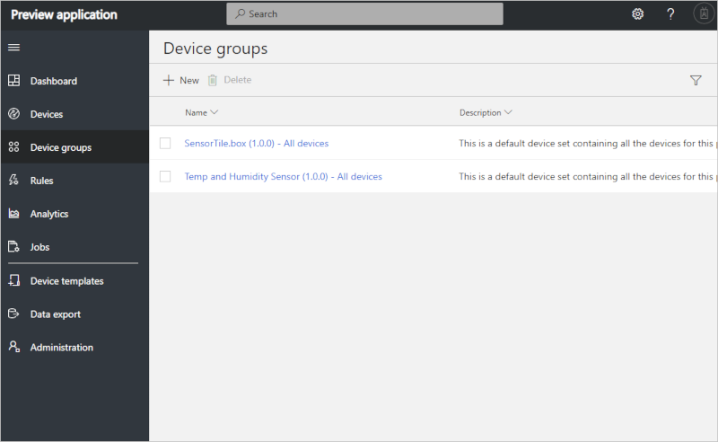
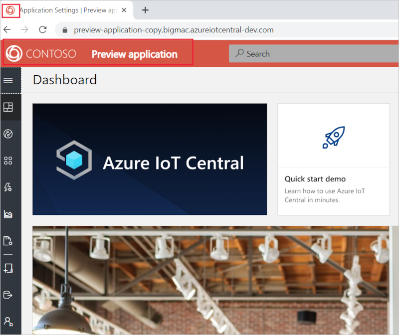
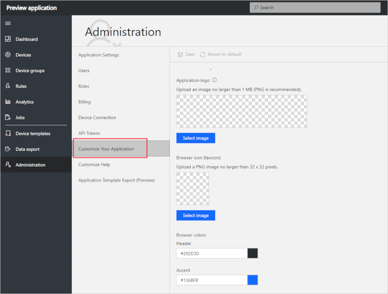
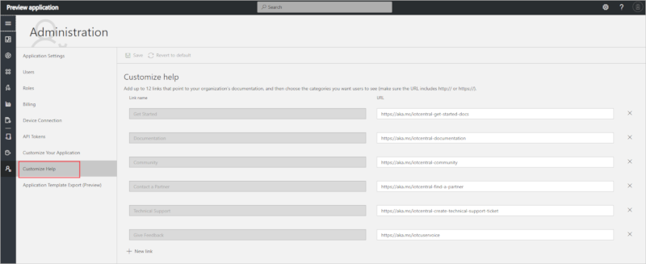
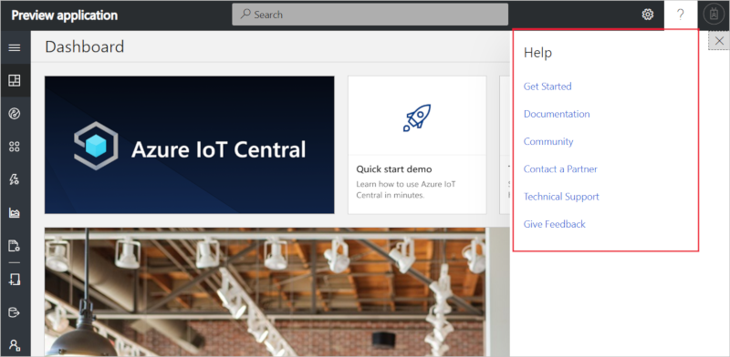

# Customize the Azure IoT Central UI (preview features)

This article describes how, as an administrator, you can customize the UI of your application by applying custom themes and modifying the help links to point to your own custom help resources. 

[!INCLUDE [iot-central-pnp-original](../../../includes/iot-central-pnp-original-note.md)]

The following screenshot shows a page using the standard theme:

The following screenshot shows a page using a custom screenshot with the customized UI elements highlighted:

## Create theme

To create a custom theme, navigate to the **Customize your application** page in the **Administration** section:

On this page, you can customize the following aspects of your application:

### Application logo

A PNG image, no larger than 1 MB, with a transparent background. This logo displays to the left on the IoT Central application title bar.

If your logo image includes the name of your application, you can hide the application name text. For more information, see [Manage your application](./howto-administer-pnp.md?toc=/azure/iot-central-pnp/toc.json&bc=/azure/iot-central-pnp/breadcrumb/toc.json#change-application-name-and-url).

### Browser icon (favicon)

A PNG image, no larger than 32 x 32 pixels, with a transparent background. A web browser can use this image in the address bar, history, bookmarks, and browser tab.

### Browser colors

You can change the color of the page header and the color used for accenting buttons and other highlights. Use a six character hex color value in the format `##ff6347`. For more information about **HEX Value** color notation, see [HTML Colors](https://www.w3schools.com/html/html_colors.asp).

> [!NOTE]
> You can always revert back to the default options on the **Customize your application** page.

### Changes for operators

If an administrator creates a custom theme, then operators and other users of your application can no longer choose a theme in **Settings**.

## Replace help links

To provide custom help information to your operators and other users, you can modify the links on the application **Help** menu.

To modify the help links, navigate to the **Customize help** page in the **Administration** section:

You can also add new entries to the help menu and remove default entries:

> [!NOTE]
> You can always revert back to the default help links on the **Customize help** page.

## Next steps

Now that you've learned how to customize the UI in your IoT Central application, here are some suggested next steps:

- [Administer your application](./howto-administer-pnp.md?toc=/azure/iot-central-pnp/toc.json&bc=/azure/iot-central-pnp/breadcrumb/toc.json)
- [Add tiles to your dashboard](./howto-add-tiles-to-your-dashboard.md?toc=/azure/iot-central-pnp/toc.json&bc=/azure/iot-central-pnp/breadcrumb/toc.json)