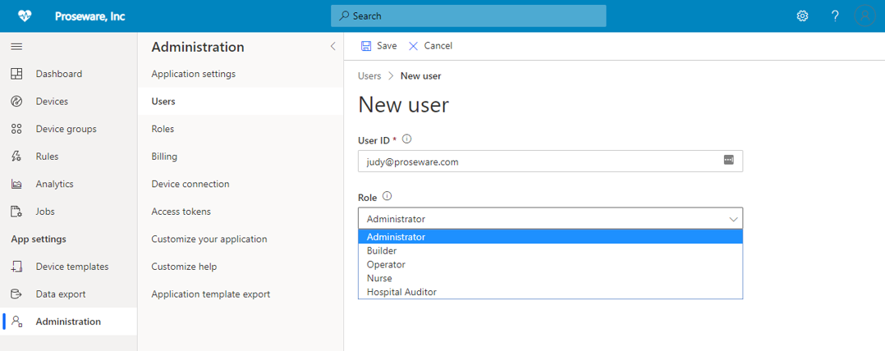
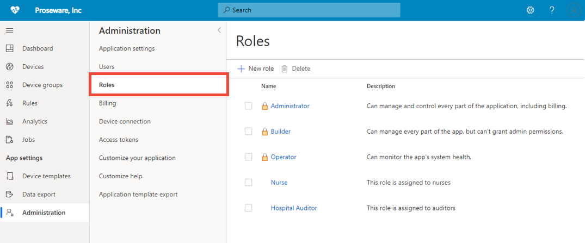
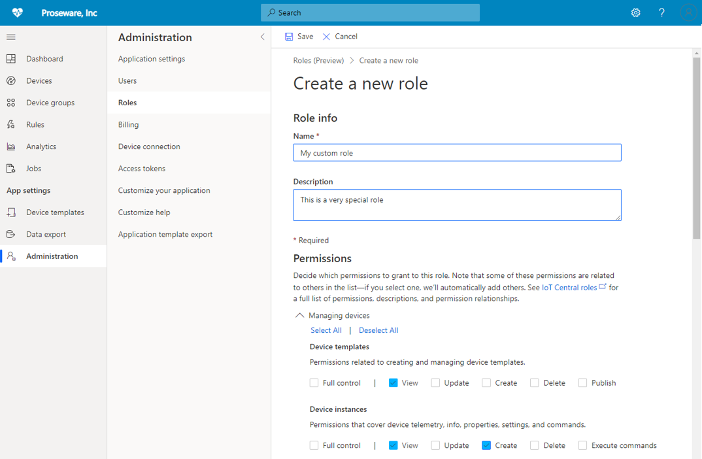

# Manage users and roles in your IoT Central application

This article describes how, as an administrator, you can add, edit, and delete users in your Azure IoT Central application. The article also describes how to manage roles in your Azure IoT Central application.

To access and use the **Administration** section, you must be in the **Administrator** role for an Azure IoT Central application. If you create an Azure IoT Central application, you're automatically added to the **Administrator** role for that application.

## Add users

Every user must have a user account before they can sign in and access an Azure IoT Central application. Microsoft Accounts (MSAs) and Azure Active Directory (Azure AD) accounts are supported in Azure IoT Central. Azure Active Directory groups aren't currently supported in Azure IoT Central.

For more information, see [Microsoft account help](https://support.microsoft.com/products/microsoft-account?category=manage-account) and  [Quickstart: Add new users to Azure Active Directory](https://docs.microsoft.com/azure/active-directory/add-users-azure-active-directory).

1. To add a user to an IoT Central application, go to the **Users** page in the **Administration** section.
    
    > [!div class="mx-imgBorder"]
    >

1. To add a user, on the **Users** page, choose **+ Add user**.

1. Choose a role for the user from the **Role** drop-down menu. Learn more about roles in the [Manage roles](#manage-roles) section of this article.

    > [!div class="mx-imgBorder"]
    >

    > [!NOTE]
    > A user who is in a custom role that grants them the permission to add other users, can only add users to a role with same or fewer permissions than their own role.

### Edit the roles that are assigned to users

Roles can't be changed after they're assigned. To change the role that's assigned to a user, delete the user, and then add the user again with a different role.

> [!NOTE]
> The roles assigned are specific to IoT Central application and cannot be managed from the Azure Portal.

## Delete users

To delete users, select one or more check boxes on the **Users** page. Then select **Delete**.

## Manage roles

Roles enable you to control who within your organization is allowed to do various tasks in IoT Central. There are three built-in roles you can assign to users of your application. You can also [create custom roles](#create-a-custom-role) if you require finer-grained control.

> [!div class="mx-imgBorder"]
> 

### Administrator

Users in the **Administrator** role can manage and control every part of the application, including billing.

The user who creates an application is automatically assigned to the **Administrator** role. There must always be at least one user in the **Administrator** role.

### Builder

Users in the **Builder** role can manage every part of the app, but can't make changes on the Administration or Continuous Data Export tabs.

### Operator

Users in the **Operator** role can monitor device health and status. They aren't allowed to make changes to device templates or to administer the application. Operators can add and delete devices, manage device sets, and run analytics and jobs. 

## Create a custom role

If your solution requires finer-grained access controls, you can create custom roles with custom sets of permissions. To create a custom role, navigate to the **Roles** page in the **Administration** section of your application. Then select **+ New role**, and add a name and description for your role. Select the permissions your role requires and then select **Save**.

You can add users to your custom role in the same way that you add users to a built-in role.

> [!div class="mx-imgBorder"]
> 

### Custom role options

When you define a custom role, you choose the set of permissions that a user is granted if they're a member of the role. Some permissions are dependent on others. For example, if you add the **Update application dashboards** permission to a role, the **View application dashboards** permission is automatically added. The following tables summarize the available permissions, and their dependencies, you can use when creating custom roles.

#### Managing devices

**Device template permissions**

| Name | Dependencies |
| ---- | -------- |
| View | None     |
| Manage | View   Other dependencies: View device instances  |
| Full Control | View, Manage   Other dependencies: View device instances |

**Device instance permissions**

| Name | Dependencies |
| ---- | -------- |
| View | None   Other dependencies: View device templates and device groups |
| Update | View   Other dependencies: View device templates and device groups  |
| Create | View   Other dependencies:  View device templates and device groups  |
| Delete | View   Other dependencies: View device templates and device groups  |
| Execute Commands | Update, View   Other dependencies: View device templates and device groups  |
| Full Control | View, Update, Create, Delete, Execute Commands   Other dependencies: View device templates and device groups  |

**Device groups permissions**

| Name | Dependencies |
| ---- | -------- |
| View | None   Other dependencies: View device templates and device instances |
| Update | View   Other dependencies: View device templates and device instances   |
| Create | View, Update   Other dependencies:  View device templates and device instances   |
| Delete | View   Other dependencies:  View device templates and device instances   |
| Full Control | View, Update, Create, Delete   Other dependencies: View device templates and device instances |

**Device connectivity management permissions**

| Name | Dependencies |
| ---- | -------- |
| Read instance | None   Other dependencies: View device templates, device groups, device instances |
| Manage instance | None |
| Read global | None   |
| Manage global | Read Global |
| Full Control | Read instance, Manage instance, Read global, Manage global.   Other dependencies: View device templates, device groups, device instances |

**Jobs permissions**

| Name | Dependencies |
| ---- | -------- |
| View | None   Other dependencies: View device templates, device instances, and device groups |
| Update | View   Other dependencies: View device templates, device instances, and device groups |
| Create | View, Update   Other dependencies:  View device templates, device instances, and device groups |
| Delete | View   Other dependencies:  View device templates, device instances, and device groups |
| Execute | View   Other dependencies: View device templates, device instances, and device groups; Update device instances; Execute commands on device instances |
| Full Control | View, Update, Create, Delete, Execute   Other dependencies:  View device templates, device instances, and device groups; Update device instances; Execute commands on device instances |

**Rules permissions**

| Name | Dependencies |
| ---- | -------- |
| View | None   Other dependencies: View device templates |
| Update | View   Other dependencies: View device templates |
| Create | View, Update   Other dependencies:  View device templates |
| Delete | View   Other dependencies: View device templates |
| Full Control | View, Update, Create, Delete   Other dependencies: View device templates |

#### Managing the app

**Application settings permissions**

| Name | Dependencies |
| ---- | -------- |
| View | None     |
| Update | View   |
| Copy | View   Other dependencies: View device templates, device instances, device groups, dashboards, data export, branding, help links, custom roles, rules |
| Delete | View   |
| Full Control | View, Update, Copy, Delete   Other dependencies: View device templates, device groups, application dashboards, data export, branding, help links, custom roles, rules |

**Application template export permissions**

| Name | Dependencies |
| ---- | -------- |
| View | None     |
| Export | View   Other dependencies:  View device templates, device instances, device groups, dashboards, data export, branding, help links, custom roles, rules |
| Full Control | View, Export   Other dependencies:  View device templates, device groups, application dashboards, data export, branding, help links, custom roles, rules |

**Billing permissions**

| Name | Dependencies |
| ---- | -------- |
| Manage | None     |
| Full Control | Manage |

#### Managing users and roles

**Custom roles permissions**

| Name | Dependencies |
| ---- | -------- |
| View | None |
| Update | View |
| Create | View, Update |
| Delete | View |
| Full Control | View, Update, Create, Delete |

**User management permissions**

| Name | Dependencies |
| ---- | -------- |
| View | None   Other dependencies: View custom roles |
| Add | View   Other dependencies:  View custom roles |
| Delete | View   Other dependencies:  View custom roles |
| Full Control | View, Add, Delete   Other dependencies:  View custom roles |

> [!NOTE]
> A user who is in a custom role that grants them the permission to add other users, can only add users to a role with same or fewer permissions than their own role.

#### Customizing the app

**Application dashboard permissions**

| Name | Dependencies |
| ---- | -------- |
| View | None     |
| Update | View   |
| Create | View, Update |
| Delete | View   |
| Full Control | View, Update, Create, Delete |

**Personal dashboards permissions**

| Name | Dependencies |
| ---- | -------- |
| View | None     |
| Update | View   |
| Create | View, Update   |
| Delete | View   |
| Full Control | View, Update, Create, Delete |

**Branding, favicon, and colors permissions**

| Name | Dependencies |
| ---- | -------- |
| View | None     |
| Update | View   |
| Full Control | View, Update |

**Help links permissions**

| Name | Dependencies |
| ---- | -------- |
| View | None     |
| Update | View   |
| Full Control | View, Update |

#### Extending the app

**Data export permissions**

| Name | Dependencies |
| ---- | -------- |
| View | None     |
| Update | View   |
| Create | View, Update  |
| Delete | View   |
| Full Control | View, Update, Create, Delete |

**API token permissions**

| Name | Dependencies |
| ---- | -------- |
| View | None     |
| Create | View   |
| Delete | View   |
| Full Control | View, Create, Delete |

## Next steps

Now that you've learned about how to manage users and roles in your Azure IoT Central application, the suggested next step is to learn how to [Manage your bill](howto-view-bill.md).
