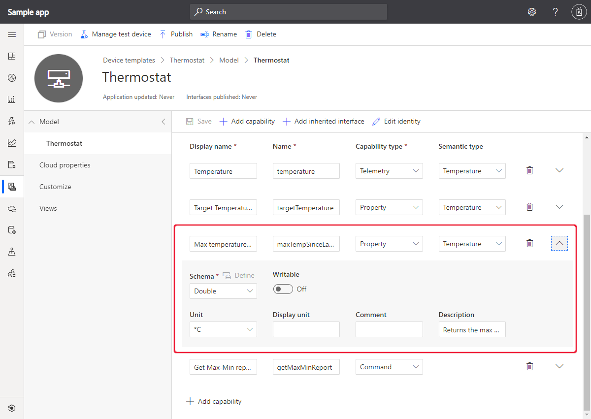
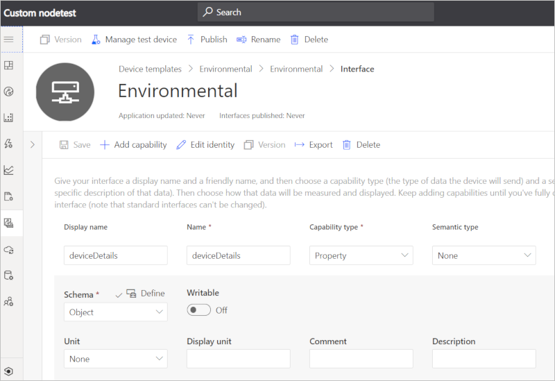
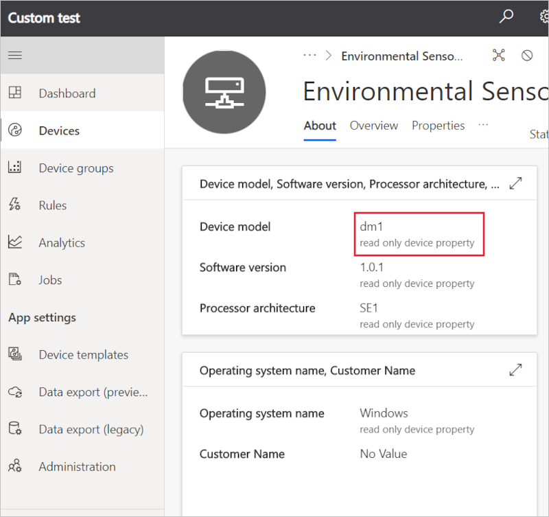
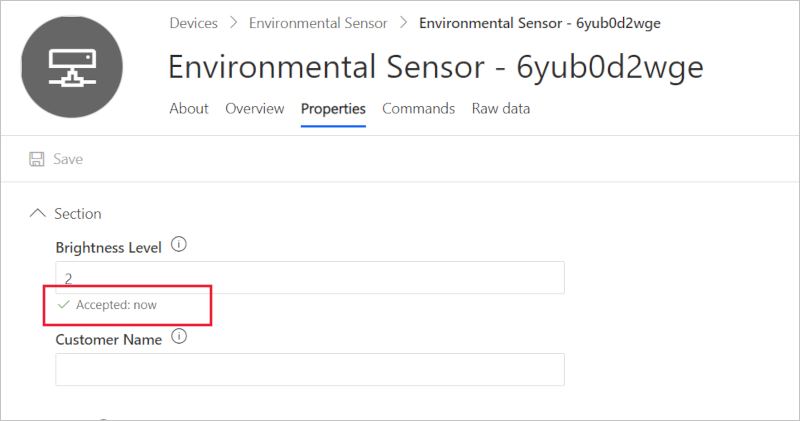

# Use properties in an Azure IoT Central solution

This article shows you how to use device properties that are defined in a device template in your Azure IoT Central application.

Properties represent point-in-time values. For example, a device can use a property to report the target temperature it's trying to reach. Properties also let you synchronize state between your device and your Azure IoT Central application. You can set writable properties from Azure IoT Central.

You can also define cloud properties in an Azure IoT Central application. Cloud property values are never exchanged with a device and are out of scope for this article.

## Define your properties

Properties are data fields that represent the state of your device. Use properties to represent the durable state of the device, such as the on/off state of a device. Properties can also represent basic device properties, such as the software version of the device. You can declare properties as read-only or writable.

The following screenshot shows a property definition in an Azure IoT Central application.



The following table shows the configuration settings for a property capability.

| Field           | Description                                                                                                                                                                                                                        |
|-----------------|------------------------------------------------------------------------------------------------------------------------------------------------------------------------------------------------------------------------------------|
| Display name    | The display name for the property value used on dashboards and forms.                                                                                                                                                              |
| Name            | The name of the property. Azure IoT Central generates a value for this field from the display name, but you can choose your own value if necessary. This field must be alphanumeric.                                                 |
| Capability type | Property.                                                                                                                                                                                                                          |
| Semantic type   | The semantic type of the property, such as temperature, state, or event. The choice of semantic type determines which of the following fields are available.                                                                       |
| Schema          | The property data type, such as double, string, or vector. The available choices are determined by the semantic type. Schema isn't available for the event and state semantic types.                                               |
| Writeable       | If the property isn't writeable, the device can report property values to Azure IoT Central. If the property is writeable, the device can report property values to Azure IoT Central. Then Azure IoT Central can send property updates to the device. |
| Severity        | Only available for the event semantic type. The severities are **Error**, **Information**, or **Warning**.                                                                                                                         |
| State values    | Only available for the state semantic type. Define the possible state values, each of which has display name, name, enumeration type, and value.                                                                                   |
| Unit            | A unit for the property value, such as **mph**, **%**, or **&deg; C**.                                                                                                                                                              |
| Display unit    | A display unit for use on dashboards and forms.                                                                                                                                                                                    |
| Comment         | Any comments about the property capability.                                                                                                                                                                                        |
| Description     | A description of the property capability.                                                                                                                                                                                          |

The properties can also be defined in an interface in a device template as shown here:

``` json
{
  "@type": "Property",
  "displayName": "Device State",
  "description": "The state of the device. Two states online/offline are available.",
  "name": "state",
  "schema": "boolean"
},
{
  "@type": "Property",
  "displayName": "Customer Name",
  "description": "The name of the customer currently operating the device.",
  "name": "name",
  "schema": "string",
  "writable": true
},
{
 "@type": "Property",
 "displayName": "Date ",
 "description": "The date on which the device is currently operating",
 "name": "date",
 "writable": true,
 "schema": "date"
},
{ 
 "@type": "Property",
 "displayName": "Location",
 "description": "The current location of the device",
 "name": "location",
 "writable": true,
 "schema": "geopoint"
},
{
 "@type": "Property",
 "displayName": "Vector Level",
 "description": "The Vector level of the device",
 "name": "vector",
 "writable": true,
 "schema": "vector"
}
```

This example shows five properties. These properties can be related to the property definition in the UI as shown here:

* `@type` to specify the type of capability: `Property`
* `name` for the property value.
* `schema` specify the data type for the property. This value can be a primitive type, such as double, integer, Boolean, or string. Complex object types, arrays, and maps are also supported.
* `writable` By default, properties are read-only. You can mark a property as writeable by using this field.

Optional fields, such as display name and description, let you add more details to the interface and capabilities.

When you create a property, you can specify the complex **Schema** types like Object and Enum.



When you select the complex **Schema**, such as **Object**, you need to define the object, too.


The following code shows the definition of an Object property type. This object has two fields with types string and integer.

``` json
{
  "@id": "<element id>",
  "@type": "Property",
  "displayName": {
    "en": "ObjectProperty"
  },
  "name": "ObjectProperty",
  "schema": {
    "@id": "<element id>",
    "@type": "Object",
    "displayName": {
      "en": "Object"
    },
    "fields": [
      {
        "@id": "<element id>",
        "@type": "SchemaField",
        "displayName": {
          "en": "Field1"
        },
        "name": "Field1",
        "schema": "integer"
      },
      {
        "@id": "<element id>",
        "@type": "SchemaField",
        "displayName": {
          "en": "Field2"
        },
        "name": "Field2",
        "schema": "string"
      }
    ]
  }
}
```

## Implement read-only properties

By default, properties are read-only. Read-only properties mean that the device reports property value updates to your Azure IoT Central application. Your Azure IoT Central application can't set the value of a read-only property.

Azure IoT Central uses device twins to synchronize property values between the device and the Azure IoT Central application. Device property values use device twin reported properties. For more information, see [device twins](../../iot-hub/tutorial-device-twins.md).

The following snippet from a device capability model shows the definition of a read-only property type:

``` json
{
  "@type": "Property",
  "name": "model",
  "displayName": "Device model",
  "schema": "string",
  "comment": "Device model name or ID. Ex. Surface Book 2."
}
```

Read-only properties are sent by the device to Azure IoT Central. The properties are sent as JSON payload. For more information, see [payloads](./concepts-telemetry-properties-commands.md).

You can use the Azure IoT device SDK to send a property update to your Azure IoT Central application.

Device twin properties can be sent to your Azure IoT Central application by using the following function:

``` javascript
hubClient.getTwin((err, twin) => {
    const properties = {
        model: 'environmentalSensor1.0'
    };
    twin.properties.reported.update(properties, (err) => {
        console.log(err ? `error: ${err.toString()}` : `status: success` )
    });
});
```

This article uses Node.js for simplicity. For complete information about device application examples, see the following tutorials:

* [Create and connect a client application to your Azure IoT Central application (Node.js)](tutorial-connect-device-nodejs.md)
* [Create and connect a client application to your Azure IoT Central application (Python)](tutorial-connect-device-python.md)

The following view in Azure IoT Central application shows the properties you can see. The view automatically makes the **Device model** property a _read-only device property_.



## Implement writable properties

Writable properties are set by an operator in the Azure IoT Central application on a form. Azure IoT Central sends the property to the device. Azure IoT Central expects an acknowledgment from the device.

The following snippet from a device capability model shows the definition of a writable property type:

``` json
{
  "@type": "Property",
  "displayName": "Brightness Level",
  "description": "The brightness level for the light on the device. Can be specified as 1 (high), 2 (medium), 3 (low)",
  "name": "brightness",
  "writable": true,
  "schema": "long"
}
```

A device client should send a JSON payload that looks like the following example as a reported property in the device twin:

``` json
{ "Brightness Level": 2 }
```

To define and handle the writeable properties your device responds to, you can use the following code:

``` javascript
hubClient.getTwin((err, twin) => {
    twin.on('properties.desired.brightness', function(desiredBrightness) {
        console.log( `Received setting: ${desiredBrightness.value}` );
        var patch = {
            brightness: {
                value: desiredBrightness.value,
                ad: 'success',
                ac: 200,
                av: desiredBrightness.$version
            }
        }
        twin.properties.reported.update(patch, (err) => {
            console.log(err ? `error: ${err.toString()}` : `status: success` )
        });
    });
});
```

The response message should include the `ac` and `av` fields. The `ad` field is optional. See the following snippets for examples:

* `ac` is a numeric field that uses the values in the following table.
* `av` is the version number sent to the device.
* `ad` is an option string description.

| Value | Label | Description |
| ----- | ----- | ----------- |
| `'ac': 200` | Completed | The property change operation was successfully completed. |
| `'ac': 202` or `'ac': 201` | Pending | The property change operation is pending or in progress. |
| `'ac': 4xx` | Error | The requested property change wasn't valid or had an error. |
| `'ac': 5xx` | Error | The device experienced an unexpected error when processing the requested change. |


For more information on device twins, see [Configure your devices from a back-end service](../../iot-hub/tutorial-device-twins.md).

When the operator sets a writeable property in the Azure IoT Central application, the application uses a device twin desired property to send the value to the device. The device then responds by using a device twin reported property. When Azure IoT Central receives the reported property value, it updates the property view with a status of **Accepted**.

The following view shows the writable properties. When you enter the value and select **Save**, the initial status is **Pending**. When the device accepts the change, the status changes to **Accepted**.




## Next steps

Now that you've learned how to use properties in your Azure IoT Central application, see:

* [Payloads](concepts-telemetry-properties-commands.md)
* [Create and connect a client application to your Azure IoT Central application (Node.js)](tutorial-connect-device-nodejs.md)