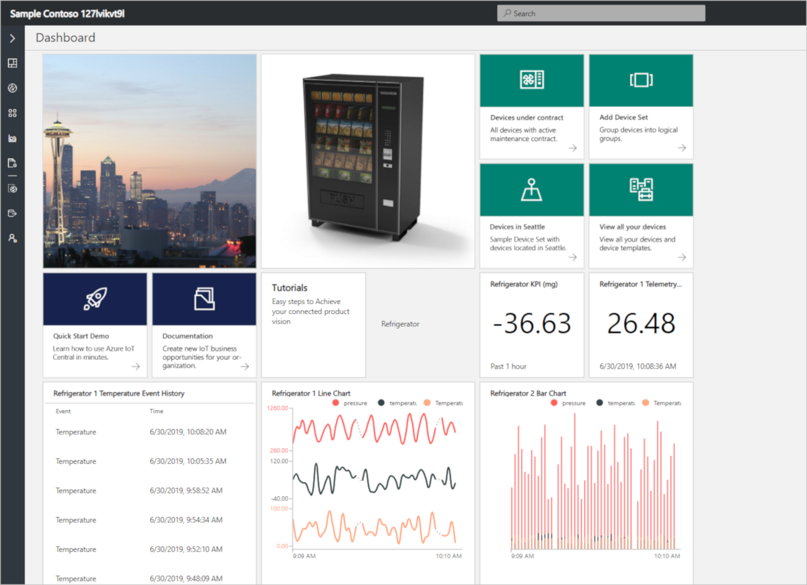

# How to use tiles
You can use tiles to customize application dashboards, device dashboards, and device set dashboards. You can add multiple tiles to a dashboard and customize those tiles to show information relevant to your application. You can also resize tiles, and customize the layout on any dashboard. The below screenshot shows the application dashboard with different tiles.

The following table summarizes the usage of tiles in Azure IoT Central:

 
| Tile | Dashboard | Description
| ----------- | ------- | ------- |
| Link | Application and device set dashboards |Link tiles are clickable tiles that display heading and description text. Use a link tile to enable a user to navigate to a URL that's related to your application. |
| Image | Application and device set dashboards |Image tiles display a custom image and can be clickable. Use an image tile to add graphics to a dashboard and optionally enable a user to navigate to a URL that's relevant to your application.|
| Label | Application dashboards |Label tiles display custom text on a dashboard. You can choose the size of the text. Use a label tile to add relevant information to the dashboard such descriptions, contact details, or help|
| Map | Application and device set dashboards |Map tiles display the location and state of a device on a map. For example, you can display where a device is and whether the fan is switched on.|
| Line Chart | Application and device dashboards |Line chart tiles display a chart of aggregate measurement for a device for a time period. For example, you can display a line chart that shows the average temperature and pressure on a device for the last hour|
| Bar Chart | Application and device dashboards |Bar chart tiles display a chart of aggregate measurements for a device for a time period. For example, you can display a bar chart that shows the average temperature and pressure on a device for the last hour |
| Event History | Application and device dashboards |Event History tile displays the events for a device over a time period. For example, you can use it to show all the temperature changes occurred for a device during the last hour. |
| State History | Application and device dashboards |State history tile displays the measurement values for a time period. For example, you can use it to show the temperature values for a device during the last hour.|
| KPI | Application and device dashboards | KPI tile displays an aggregate telemetry or event measurement for a time period. For example, you can use it to show the maximum temperature reached for a device during the last hour.|
| Last Known Value | Application and device dashboards |Last known value tile displays the latest value for a telemetry or state measurement. For example, you can use this tile to display the most recent measurements of temperature, pressure and humidity for a device.|
| Device Set Grid | Application and device set dashboards | Device set grid displays information about the device set. Use a Device Set grid tile to show information such as name, location, and model of all the devices in the device set.|

To learn more about how to configure dashboard in your Azure IoT Central application, see [Add tiles to your dashboard](./howto-add-tiles-to-your-dashboard.md).
