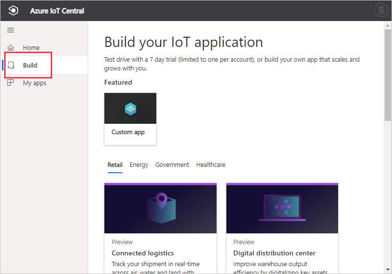

# Create an Azure IoT Central application

[!INCLUDE [iot-central-original-pnp](../../../includes/iot-central-original-pnp-note.md)]

As a _builder_, you use the Azure IoT Central UI to define your Microsoft Azure IoT Central application. This quickstart shows you how to create an Azure IoT Central application that contains a sample _device template_. The application you create does not use any preview features.

## Create an application

Navigate to the [Azure IoT Central Build](https://aka.ms/iotcentral) website. Then sign in with a Microsoft personal, work, or school account.

To start creating an Azure IoT Central application with no preview features enabled, select **Build**. This link takes you to the **Build your IoT application** page.

Then select **Custom app**.

To create a new Azure IoT Central application:

1. Azure IoT Central automatically suggests an application name based on the application template you've selected. You can accept this name or enter your own friendly application name, such as **Contoso IoT**. Azure IoT Central also generates a unique URL for you, based on the application name. You're free to change this URL prefix to something more memorable if you'd like.

1. Select the **Legacy application** template that doesn't use preview features.

    | Application template | Description |
    | -------------------- | ----------- |
    | Legacy application   | Creates an empty application for you to populate with your own device templates and devices. |

1. Choose a payment plan:
   - **7 day free trial** applications are free for seven days before they expire. They can be converted to **Pay-As-You-Go** at any time before they expire. If you create a **Trial** application, you need to enter your contact information and choose whether to receive information and tips from Microsoft.
   - **Pay-As-You-Go** applications are charged per device, with the first five devices free. If you create a **Pay-As-You-Go** application, you need to select your *Directory*, *Azure Subscription*, and *Location*:
        - *Directory* is the Azure Active Directory (AD) to create your application. It contains user identities, credentials, and other organizational information. If you don’t have an Azure AD, one is created for you when you create an Azure subscription.
        - An *Azure Subscription* enables you to create instances of Azure services. IoT Central provisions resources in your subscription. If you don’t have an Azure subscription, you can create one on the [Azure sign-up page](https://aka.ms/createazuresubscription). After you create the Azure subscription, navigate back to the **Create an application** page. Your new subscription appears in the **Azure Subscription** drop-down.
        - *Location* is the [geography](https://azure.microsoft.com/global-infrastructure/geographies/) where you’d like to create your application. Typically, you should choose the location that's physically closest to your devices to get optimal performance. Azure IoT Central is currently available in the **United States**, **Australia**, **Asia Pacific**, or in **Europe**.  Once you choose a location, you can't move your application to a different location later.

        Learn more about pricing on the [Azure IoT Central pricing page](https://azure.microsoft.com/pricing/details/iot-central/).

1. Fill additional information required for the payment plan you selected earlier, in Step 1.

1. Select **Create** at the bottom of the page.

## Next steps

In this quickstart, you created an IoT Central application. Here's the suggested next step:

> [!div class="nextstepaction"]
> [Define a new device type in your Azure IoT Central application](./tutorial-define-device-type.md)
