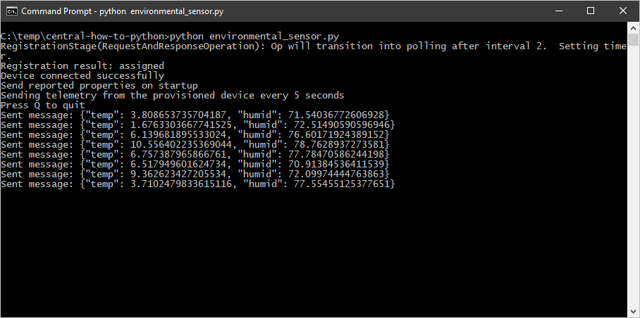
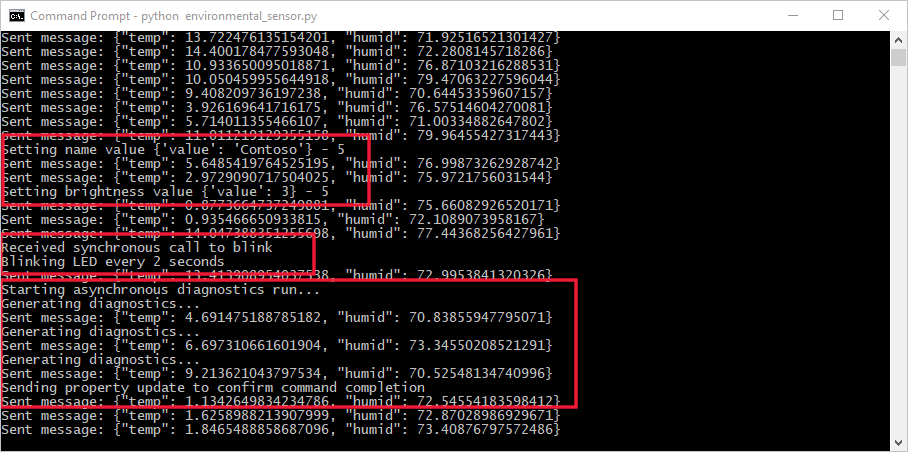

# Tutorial: Create and connect a client application to your Azure IoT Central application (Python)

[!INCLUDE [iot-central-selector-tutorial-connect](../../../includes/iot-central-selector-tutorial-connect.md)]

*This article applies to solution builders and device developers.*

This tutorial shows you how, as a device developer, to connect a Python client application to your Azure IoT Central application. The Python application simulates the behavior of an environmental sensor device. You use a sample _device capability model_ to create a _device template_ in IoT Central. You add views to the device template to enable an operator to interact with a device.

In this tutorial, you learn how to:

> [!div class="checklist"]
> * Import a device capability model to create a device template.
> * Add default and custom views to a device template.
> * Publish a device template and add a real device to your IoT Central application.
> * Create and run the Python device code and see it connect to your IoT Central application.
> * View the simulated telemetry sent from the device.
> * Use a view to manage device properties.
> * Call synchronous and asynchronous commands to control the device.

## Prerequisites

To complete the steps in this article, you need the following:

* An Azure IoT Central application created using the **Custom application** template. For more information, see the [create an application quickstart](quick-deploy-iot-central.md). The application must have been created on or after 07/14/2020.
* A development machine with [Python](https://www.python.org/) version 3.7 or later installed. You can run `python3 --version` at the command line to check your version. Python is available for a wide variety of operating systems. The instructions in this tutorial assume you're running the **python3** command at the Windows command prompt.

[!INCLUDE [iot-central-add-environmental-sensor](../../../includes/iot-central-add-environmental-sensor.md)]

### Create a Python application

The following steps show you how to create a Python client application that connects to the real device you added to the application. This Python application simulates the behavior of a real device.

1. In your command-line environment, navigate to the `environmental-sensor` folder you created previously.

1. To install the required libraries, run the following commands:

    ```cmd
    pip install azure-iot-device
    ```

1. Create a file called **environmental_sensor.py** in the `environmental-sensor` folder.

1. Add the following `import` statements at the start of the **environmental_sensor.py** file:

    ```python
    import asyncio
    import os
    import json
    import datetime
    import random

    from azure.iot.device.aio import ProvisioningDeviceClient
    from azure.iot.device.aio import IoTHubDeviceClient
    from azure.iot.device import MethodResponse
    from azure.iot.device import Message
    ```

1. Add the following asynchronous `main` function and variable declarations to the file:

    ```python
    async def main():
      # In a production environment, don't store
      # connection information in the code.
      provisioning_host = 'global.azure-devices-provisioning.net'
      id_scope = '{your Scope ID}'
      registration_id = '{your Device ID}'
      symmetric_key = '{your Primary Key}'

      delay = 2

      # All the remaining code is nested within this main function

    if __name__ == '__main__':
    asyncio.run(main())
    ```

    Update the placeholders `{your Scope ID}`, `{your Device ID}`, and `{your Primary Key}` with the values you made a note of previously. In a real application, don't hard code this information in the application.

    All the following function definitions and code are nested within the `main` function.

1. Add the following two functions inside the `main` function to register the device and connect it to your IoT Central application. Registration uses the Azure Device Provisioning Service:

    ```python
      async def register_device():
        provisioning_device_client = ProvisioningDeviceClient.create_from_symmetric_key(
          provisioning_host=provisioning_host,
          registration_id=registration_id,
          id_scope=id_scope,
          symmetric_key=symmetric_key,
        )

        registration_result = await provisioning_device_client.register()

        print(f'Registration result: {registration_result.status}')

        return registration_result

      async def connect_device():
        device_client = None
        try:
          registration_result = await register_device()
          if registration_result.status == 'assigned':
            device_client = IoTHubDeviceClient.create_from_symmetric_key(
              symmetric_key=symmetric_key,
              hostname=registration_result.registration_state.assigned_hub,
              device_id=registration_result.registration_state.device_id,
            )
            # Connect the client.
            await device_client.connect()
            print('Device connected successfully')
        finally:
          return device_client
    ```

1. Add the following function inside the `main` function to send telemetry to your IoT Central application:

    ```python
      async def send_telemetry():
        print(f'Sending telemetry from the provisioned device every {delay} seconds')
        while True:
          temp = random.randrange(1, 75)
          humid = random.randrange(30, 99)
          payload = json.dumps({'temp': temp, 'humid': humid})
          msg = Message(payload)
          await device_client.send_message(msg, )
          print(f'Sent message: {msg}')
          await asyncio.sleep(delay)
    ```

    The names of the telemetry items (`temp` and `humid`) must match the names used in the device template.

1. Add the following functions inside the `main` function to handle commands called from your IoT Central application:

    ```python
      async def blink_command(request):
        print('Received synchronous call to blink')
        response = MethodResponse.create_from_method_request(
          request, status = 200, payload = {'description': f'Blinking LED every {request.payload} seconds'}
        )
        await device_client.send_method_response(response)  # send response
        print(f'Blinking LED every {request.payload} seconds')

      async def diagnostics_command(request):
        print('Starting asynchronous diagnostics run...')
        response = MethodResponse.create_from_method_request(
          request, status = 202
        )
        await device_client.send_method_response(response)  # send response
        print('Generating diagnostics...')
        await asyncio.sleep(2)
        print('Generating diagnostics...')
        await asyncio.sleep(2)
        print('Generating diagnostics...')
        await asyncio.sleep(2)
        print('Sending property update to confirm command completion')
        await device_client.patch_twin_reported_properties({'rundiagnostics': {'value': f'Diagnostics run complete at {datetime.datetime.today()}.'}})

      async def turnon_command(request):
        print('Turning on the LED')
        response = MethodResponse.create_from_method_request(
          request, status = 200
        )
        await device_client.send_method_response(response)  # send response

      async def turnoff_command(request):
        print('Turning off the LED')
        response = MethodResponse.create_from_method_request(
          request, status = 200
        )
        await device_client.send_method_response(response)  # send response

      commands = {
        'blink': blink_command,
        'rundiagnostics': diagnostics_command,
        'turnon': turnon_command,
        'turnoff': turnoff_command,
      }

      # Define behavior for handling commands
      async def command_listener():
        while True:
          method_request = await device_client.receive_method_request()  # Wait for commands
          await commands[method_request.name](method_request)
    ```

    The names of the commands (`blink`, `turnon`, `turnoff`, and `rundiagnostics`) must match the names used in the device template.

    Currently, IoT Central doesn't use the response schema defined in the device capability model. For a synchronous command, the response payload can be any valid JSON. For an asynchronous command, the device should return a 202 response immediately, followed by reported property update when the work is finished. The format of the reported property update is:

    ```json
    {
      [command name] : {
        value: 'response message'
      }
    }
    ```

    An operator can view the response payload in the command history.

1. Add the following functions inside the `main` function to handle property updates sent from your IoT Central application. The message the device sends in response to the [writeable property update](concepts-telemetry-properties-commands.md#writeable-property-types) must include the `av` and `ac` fields. The `ad` field is optional:

    ```python
      async def name_setting(value, version):
        await asyncio.sleep(1)
        print(f'Setting name value {value} - {version}')
        await device_client.patch_twin_reported_properties({'name' : {'value': value, 'ad': 'completed', 'ac': 200, 'av': version}})

      async def brightness_setting(value, version):
        await asyncio.sleep(5)
        print(f'Setting brightness value {value} - {version}')
        await device_client.patch_twin_reported_properties({'brightness' : {'value': value, 'ad': 'completed', 'ac': 200, 'av': version}})

      settings = {
        'name': name_setting,
        'brightness': brightness_setting
      }

      # define behavior for receiving a twin patch
      async def twin_patch_listener():
        while True:
          patch = await device_client.receive_twin_desired_properties_patch() # blocking
          to_update = patch.keys() & settings.keys()
          await asyncio.gather(
            *[settings[setting](patch[setting], patch['$version']) for setting in to_update]
          )
    ```

    When the operator sets a writeable property in the IoT Central application, the application uses a device twin desired property to send the value to the device. The device then responds using a device twin reported property. When IoT Central receives the reported property value, it updates the property view with a status of **synced**.

    The names of the properties (`name` and `brightness`) must match the names used in the device template.

1. Add the following functions inside the `main` function to control the application:

    ```python
      # Define behavior for halting the application
      def stdin_listener():
        while True:
          selection = input('Press Q to quit\n')
          if selection == 'Q' or selection == 'q':
            print('Quitting...')
            break

      device_client = await connect_device()

      if device_client is not None and device_client.connected:
        print('Send reported properties on startup')
        await device_client.patch_twin_reported_properties({'state': 'true', 'processorArchitecture': 'ARM', 'swVersion': '1.0.0'})
        tasks = asyncio.gather(
          send_telemetry(),
          command_listener(),
          twin_patch_listener(),
        )

        # Run the stdin listener in the event loop
        loop = asyncio.get_running_loop()
        user_finished = loop.run_in_executor(None, stdin_listener)

        # Wait for user to indicate they are done listening for method calls
        await user_finished

        # Cancel tasks
        tasks.add_done_callback(lambda r: r.exception())
        tasks.cancel()
        await device_client.disconnect()

      else:
        print('Device could not connect')
    ```

1. Save the the **environmental_sensor.py** file.

## Run your Python application

To start the device client application, run the following command in your command-line environment:

```cmd
python3 environmental_sensor.py
```

You can see the device connects to your Azure IoT Central application and starts sending telemetry:



[!INCLUDE [iot-central-monitor-environmental-sensor](../../../includes/iot-central-monitor-environmental-sensor.md)]

You can see how the device responds to commands and property updates:



## View raw data

[!INCLUDE [iot-central-monitor-environmental-sensor-raw-data](../../../includes/iot-central-monitor-environmental-sensor-raw-data.md)]

## Next steps

As a device developer, now that you've learned the basics of how to create a device using Python, some suggested next steps are to:

* Read [What are device templates?](./concepts-device-templates.md) to learn more about the role of device templates when you're implementing your device code.
* Read [Get connected to Azure IoT Central](./concepts-get-connected.md) to learn more about how to register devices with IoT Central and how IoT Central secures device connections.

If you'd prefer to continue through the set of IoT Central tutorials and learn more about building an IoT Central solution, see:

> [!div class="nextstepaction"]
> [Create a gateway device template](./tutorial-define-gateway-device-type.md)
