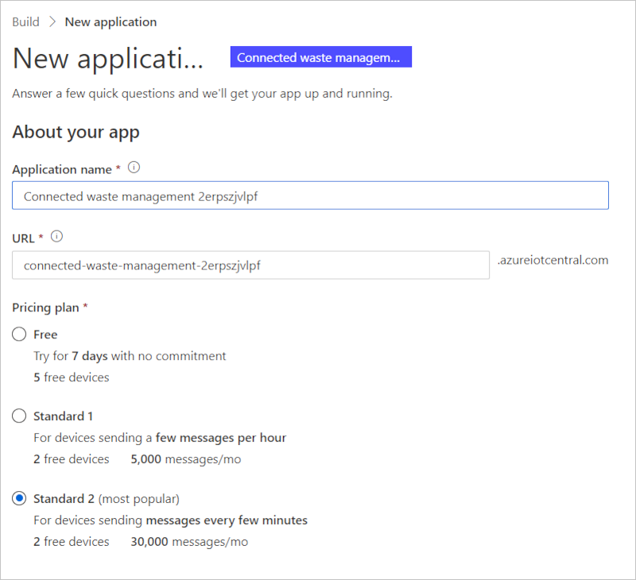
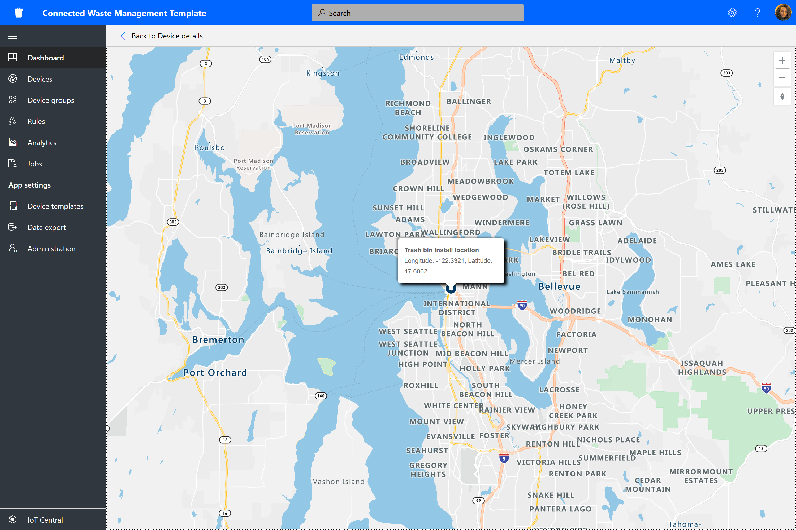
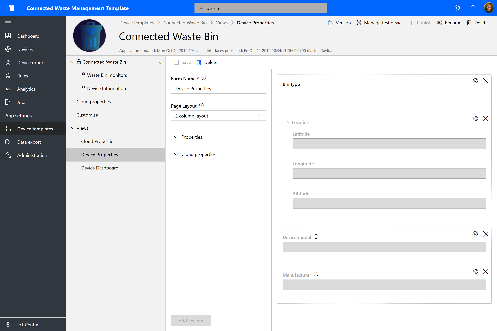
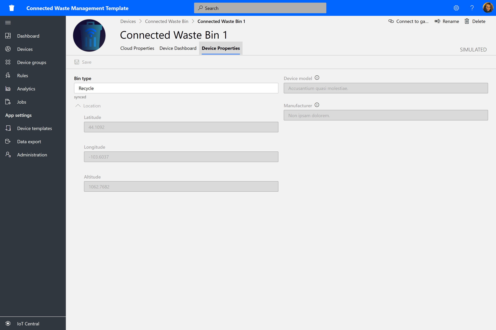
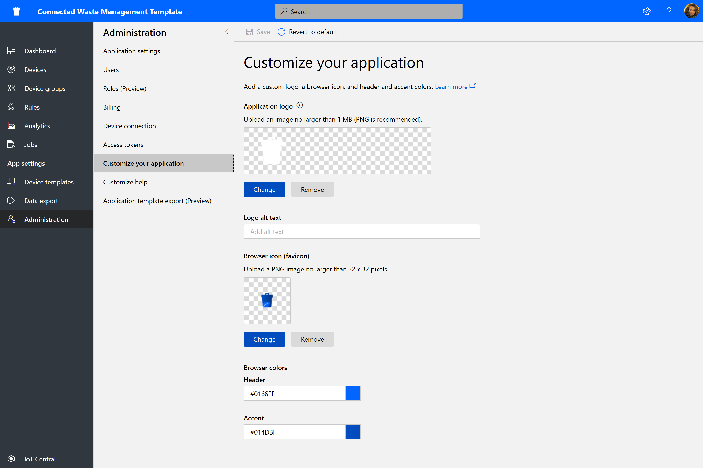

# Tutorial: Create a connected waste management app

This tutorial shows you how to use Azure IoT Central to create a connected waste management application. 

Specifically, you learn how to: 

> [!div class="checklist"]
> * Use the Azure IoT Central *Connected waste management* template to create your app.
> * Explore and customize the operator dashboard. 
> * Explore the connected waste bin device template.
> * Explore simulated devices.
> * Explore and configure rules.
> * Configure jobs.
> * Customize your application branding.

## Prerequisites

An Azure subscription is recommended. Alternatively, you can use a free, 7-day trial. If you don't have an Azure subscription, you can create one on the [Azure sign-up page](https://aka.ms/createazuresubscription).

## Create your app in Azure IoT Central

In this section, you use the Connected waste management template to create your app in Azure IoT Central. Here's how:

1. Go to [Azure IoT Central](https://aka.ms/iotcentral).

    If you have an Azure subscription, sign in with the credentials you use to access it. Otherwise, sign in by using a Microsoft account:

    

1. From the left pane, select **Build**. Then select the **Government** tab. The government page displays several government application templates.

    

1. Select the **Connected waste management** application template. 
This template includes a sample connected waste bin device template, a simulated device, an operator dashboard, and preconfigured monitoring rules.    

1. Select **Create app**, which opens the **New application** dialog box. Fill in the information for the following fields:
    * **Application name**. By default, the application uses **Connected waste management**, followed by a unique ID string that Azure IoT Central generates. Optionally, you can choose a friendly application name. You can change the application name later, too.
    * **URL**. Optionally, you can choose your desired URL. You can change the URL later. 
    * **Pricing plan**. If you have an Azure subscription, enter your directory, Azure subscription, and region in the appropriate fields of the **Billing info** dialog box. If you don't have a subscription, select **Free** to enable 7-day trial subscription, and complete the required contact information.  

    For more information about directories and subscriptions, see [Quickstart - Create an Azure IoT Central application](../core/quick-deploy-iot-central.md).

1. At the bottom of the page, select **Create**. 

    
    
    

 
Your newly created application comes with preconfigured:
* Sample operator dashboards.
* Sample predefined connected waste bin device templates.
* Simulated connected waste bin devices.
* Rules and jobs.
* Sample branding. 

It's your application, and you can modify it anytime. Let's now explore the application and make some customizations.  

## Explore and customize the operator dashboard 

Take a look at the **Wide World waste management dashboard**, which you see after creating your app.

   

As a builder, you can create and customize views on the dashboard for operators. First, let's explore the dashboard. 

>[!NOTE]
>All data shown in the dashboard is based on simulated device data, which you'll see  more of in the next section. 

The dashboard consists of different tiles:

* **Wide World Waste utility image tile**: The first tile in the dashboard is an image tile of a fictitious waste utility, "Wide World Waste." You can customize the tile and put in your own image, or you can remove it. 

* **Waste bin image tile**: You can use image and content tiles to create a visual representation of the device that's being monitored, along with a description. 

* **Fill level KPI tile**: This tile displays a value reported by a *fill level* sensor in a waste bin. Fill level and other sensors, like *odor meter* or *weight* in a waste bin, can be remotely monitored. An operator can take action, like dispatching a trash collection truck. 

* **Waste monitoring area map**: This tile uses Azure Maps, which you can configure directly in Azure IoT Central. The map tile displays device location. Try to hover over the map and try the controls over the map, like zoom-in, zoom-out, or expand.

     

* **Fill, odor, weight level bar chart**: You can visualize one or multiple kinds of device telemetry data in a bar chart. You can also expand the bar chart.  

  

* **Field Services**: The dashboard includes a link to how to integrate with Dynamics 365 Field Services from your Azure IoT Central application. For example, you can use Field Services to create tickets for dispatching trash collection services. 

### Customize the dashboard 

You can customize the dashboard by selecting the **Edit** menu. Then you can add new tiles or configure existing ones. Here's what the dashboard looks like in editing mode: 

You can also select **+ New** to create a new dashboard and configure from scratch. You can have multiple dashboards, and you can switch between your dashboards from the dashboard menu. 

## Explore the device template

A device template in Azure IoT Central defines the capabilities of a device, which can include telemetry, properties, or commands. As a builder, you can define device templates that represent the capabilities of the devices you will connect. 

The Connected waste management application comes with a sample template for a connected waste bin device.

To view the device template:

1. In Azure IoT Central, from the left pane of your app, select **Device templates**. 

    

1. In the **Device templates** list, select **Connected Waste Bin**.

1. Examine the device template capabilities. You can see that it defines sensors like **Fill level**, **Odor meter**, **Weight**, and **Location**.

   

### Customize the device template

Try to customize the following:
1. From the device template menu, select **Customize**.
1. Find the **Odor meter** telemetry type.
1. Update the **Display name** of **Odor meter** to **Odor level**.
1. Try to update the unit of measurement, or set **Min value** and **Max value**.
1. Select **Save**. 

### Add a cloud property 

Here's how:
1. From the device template menu, select **Cloud property**.
1. Select **+ Add Cloud Property**. In Azure IoT Central, you can add a property that is relevant to the device but isn't expected to be sent by a device. For example, a cloud property might be an alerting threshold specific to installation area, asset information, or maintenance information. 
1. Select **Save**. 
 
### Views 
The connected waste bin device template comes with predefined views. Explore the views, and update them if you want to. The views define how operators see the device data and input cloud properties. 

  

### Publish 

If you made any changes, remember to publish the device template. 

### Create a new device template 

To create a new device template, select **+ New**, and follow the steps. You can create a custom device template from scratch, or you can choose a device template from the Azure device catalog. 

## Explore simulated devices

In Azure IoT Central, you can create simulated devices to test your device template and application. 

The Connected waste management application has two simulated devices associated with the connected waste bin device template. 

### View the devices

1. From the left pane of Azure IoT Central, select **Device**. 

   

1. Select **Connected Waste Bin** device.  

     

1. Go to the **Cloud Properties** tab. Update the value of **Bin full alert threshold** from **95** to **100**. 

Explore the **Device Properties** and **Device Dashboard** tabs. 

> [!NOTE]
> All the tabs have been configured from the device template views.

### Add new devices

You can add new devices by selecting **+ New** on the **Devices** tab. 

## Explore and configure rules

In Azure IoT Central, you can create rules to automatically monitor device telemetry, and to trigger actions when one or more conditions are met. The actions might include sending email notifications, triggering an action in Power Automate, or starting a webhook action to send data to other services.

The Connected waste management application has four sample rules.

### View rules
1. From the left pane of Azure IoT Central, select **Rules**.

   

1. Select **Bin full alert**.

     

 1. The **Bin full alert** checks the following condition: **Fill level is greater than or equal to Bin full alert threshold**.

    The **Bin full alert threshold** is a cloud property that's defined in the connected waste bin device template. 

Now let's create an email action.

### Create an email action

In the **Actions** list of the rule, you can configure an email action:
1. Select **+ Email**. 
1. For **Display name**, enter **High pH alert**.
1. For **To**, enter the email address associated with your Azure IoT Central account. 
1. Optionally, enter a note to include in the text of the email.
1. Select **Done** > **Save**. 

You'll now receive an email when the configured condition is met.

>[!NOTE]
>The application sends email each time a condition is met. Disable the rule to stop receiving email from the automated rule. 
  
To create a new rule, from the left pane of **Rules**, select **+New**.

## Configure jobs

In Azure IoT Central, jobs allow you to trigger device or cloud properties updates on multiple devices. You can also use jobs to trigger device commands on multiple devices. Azure IoT Central automates the workflow for you. 

1. From the left pane of Azure IoT Central, select **Jobs**. 
1. Select **+New**, and configure one or more jobs. 

## Customize your application 

As a builder, you can change several settings to customize the user experience in your application.

### Change the application theme

Here's how:
1. Go to **Administration** > **Customize your application**.
1. Select **Change** to choose an image to upload for the **Application logo**.
1. Select **Change** to choose an image to upload for the **Browser icon** (an image that will appear on browser tabs).
1. You can also replace the default browser colors by adding HTML hexadecimal color codes. Use the **Header** and **Accent** fields for this purpose.

   

1. You can also change application images. Select **Administration** > **Application settings** > **Select image** to choose an image to upload as the application image.
1. Finally, you can also change the theme by selecting **Settings** on the masthead of the application.

## Clean up resources

If you're not going to continue to use this application, delete your application with the following steps:

1. From the left pane of your Azure IoT Central app, select **Administration**.
1. Select **Application settings** > **Delete**.

## Next steps

> [!div class="nextstepaction"]
> [Connected waste management concepts](./concepts-connectedwastemanagement-architecture.md)
