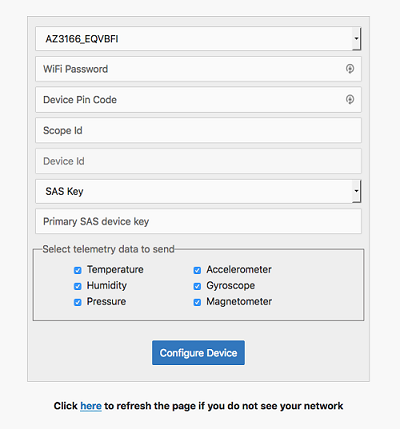
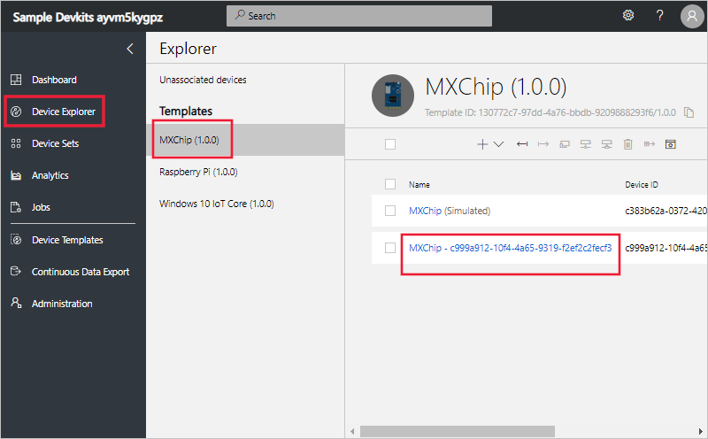
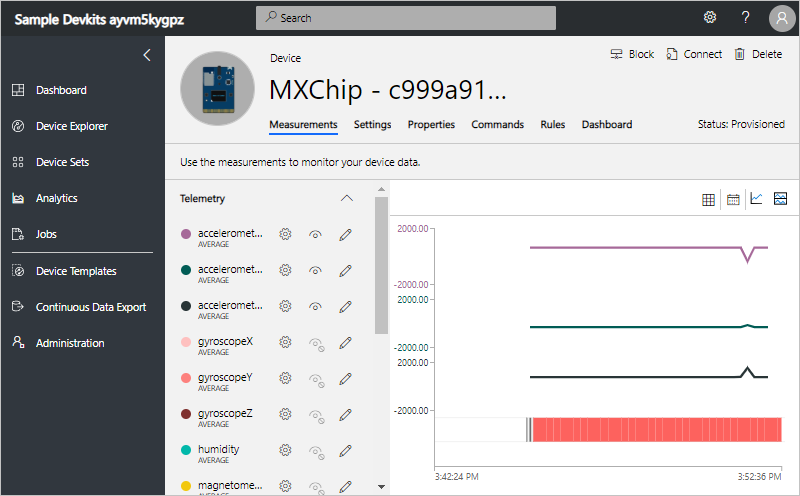
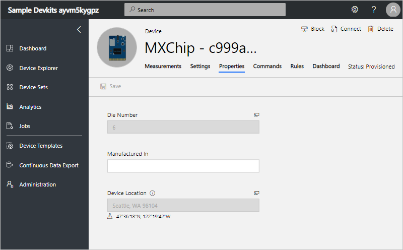
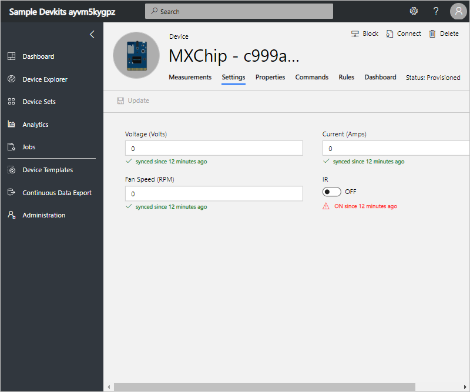
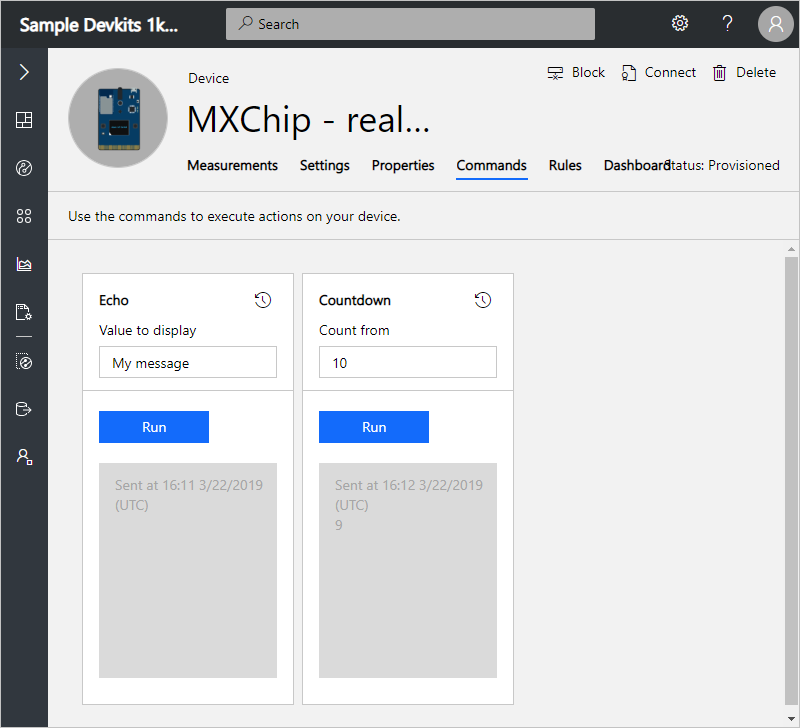
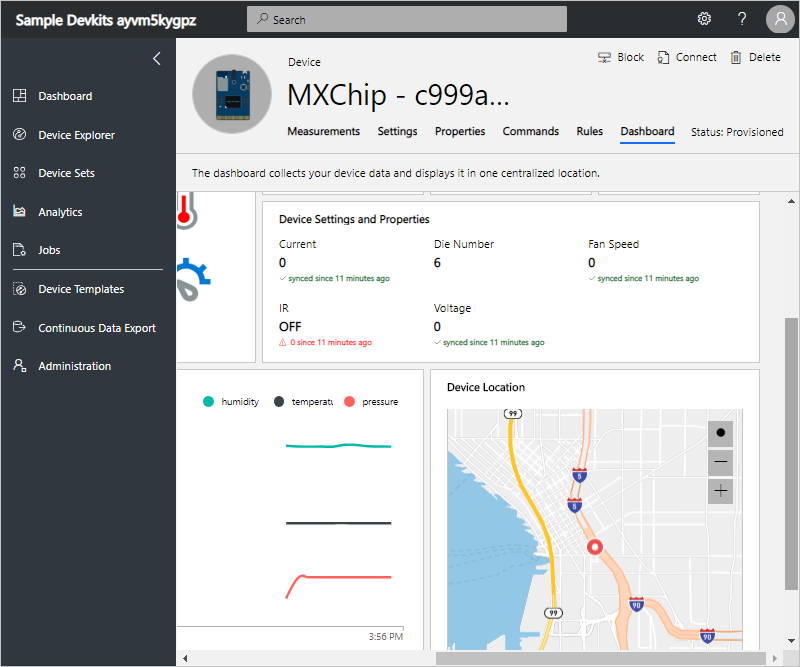
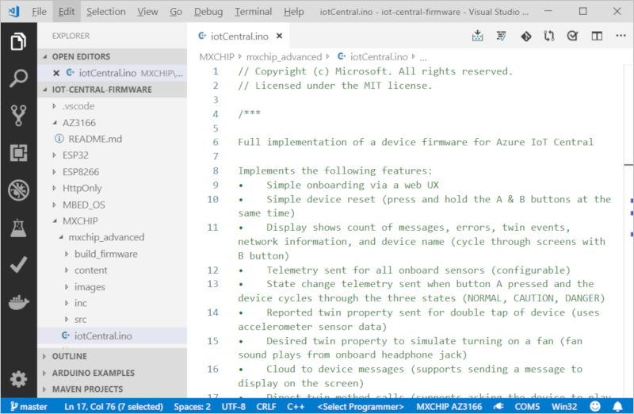

# Connect an MXChip IoT DevKit device to your Azure IoT Central application

[!INCLUDE [iot-central-original-pnp](../../includes/iot-central-original-pnp-note.md)]

This article describes how, as a device developer, to connect a MXChip IoT DevKit (DevKit) device to your Microsoft Azure IoT Central application.

## Before you begin

To complete the steps in this article, you need the following resources:

1. An Azure IoT Central application created from the **Sample Devkits** application template. For more information, see the [create an application quickstart](quick-deploy-iot-central.md).
1. A DevKit device. To purchase a DevKit device, visit [MXChip IoT DevKit](https://microsoft.github.io/azure-iot-developer-kit/).

## Sample Devkits application

An application created from the **Sample Devkits** application template includes a **MXChip** device template that defines the following device characteristics:

- Telemetry measurements for **Humidity**, **Temperature**, **Pressure**, **Magnetometer** (measured along X, Y, Z axis), **Accelerometer** (measured along X, Y, Z axis), and **Gyroscope** (measured along X, Y, Z axis).
- State measurement for **Device State**.
- Event measurement for **Button B Pressed**.
- Settings for **Voltage**, **Current**, **Fan Speed**, and an **IR** toggle.
- Device properties **die number** and **Device Location**, which is a location property.
- Cloud property **Manufactured In**.
- Commands **Echo** and **Countdown**. When a real device receives an **Echo** command, it shows the sent value on the device's display. When a real device receives a **Countdown** command, the LED cycles through a pattern, and the device sends countdown values back to IoT Central.

For full details about the configuration, see [MXChip Device template details](#mxchip-device-template-details)

## Add a real device

### Get your device connection details

In your Azure IoT Central application, add a real device from the **MXChip** device template and make a note of the device connection details: **Scope ID, Device ID, and Primary key**:

1. Add a **real device** from Device Explorer, select **+New > Real** to add a real device.

    * Enter a lowercase **Device ID**, or use the suggested **Device ID**.
    * Enter a **Device Name**, or use the suggested name

    

1. To get the device connection details, **Scope ID**, **Device ID**, and **Primary key**, select **Connect** on the device page.

    

1. Make a note of the connection details. You're temporarily disconnected from the internet when you prepare your DevKit device in the next step.

### Prepare the DevKit device

If you've previously used the device and want to reconfigure it to use a different WiFi network, connection string, or telemetry measurement, press both the **A** and **B** buttons at the same time. If it doesn't work, press **Reset** button and try again.

#### To prepare the DevKit device

1. Download the latest pre-built Azure IoT Central firmware for the MXChip from the [releases](https://aka.ms/iotcentral-docs-MXChip-releases) page on GitHub.
1. Connect the DevKit device to your development machine using a USB cable. In Windows, a file explorer window opens on a drive mapped to the storage on the DevKit device. For example, the drive might be called **AZ3166 (D:)**.
1. Drag the **iotCentral.bin** file onto the drive window. When the copying is complete, the device reboots with the new firmware.

1. When the DevKit device restarts, the following screen displays:

    ```
    Connect HotSpot:
    AZ3166_??????
    go-> 192.168.0.1
    PIN CODE xxxxx
    ```

    > [!NOTE]
    > If the screen displays anything else, reset the device and press the **A**  and **B** buttons on the device at the same time to reboot the device.

1. The device is now in access point (AP) mode. You can connect to this WiFi access point from your computer or mobile device.

1. On your computer, phone, or tablet connect to the WiFi network name shown on the screen of the device. When you connect to this network, you don't have internet access. This state is expected, and you're only connected to this network for a short time while you configure the device.

1. Open your web browser and navigate to [http://192.168.0.1/start](http://192.168.0.1/start). The following web page displays:

    

    On the web page, enter:
    - The name of your WiFi network
    - Your WiFi network password
    - The PIN code shown on the device's display
    - The connection details **Scope ID**, **Device ID**, and **Primary key** of your device (you should have already saved this following the steps)
    - Select all the available telemetry measurements

1. After you choose **Configure Device**, you see this page:

    

1. Press the **Reset** button on your device.

## View the telemetry

When the DevKit device restarts, the screen on the device shows:

* The number of telemetry messages sent.
* The number of failures.
* The number of desired properties received and the number of reported properties sent.

> [!NOTE]
> If the device appears to loop when it tries to connect, check if the device is **Blocked** in IoT Central, and **Unblock** the device so it can connect to the app.

Shake the device to send a reported property. The device sends a random number as the **Die number** device property.

You can view the telemetry measurements and reported property values, and configure settings in Azure IoT Central:

1. Use **Device Explorer** to navigate to the **Measurements** page for the real MXChip device you added:

    

1. On the **Measurements** page, you can see the telemetry coming from the MXChip device:

    

1. On the **Properties** page, you can view the last die number and the device location reported by the device:

    

1. On the **Settings** page, you can update the settings on the MXChip device:

    

1. On the **Commands** page, you can call the **Echo** and **Countdown** commands:

    

1. On the **Dashboard** page, you can see the location map

    

## Download the source code

If you want to explore and modify the device code, you can download it from GitHub. If you plan to modify the code, you should follow these instructions to [prepare the development environment](https://microsoft.github.io/azure-iot-developer-kit/docs/get-started/#step-5-prepare-the-development-environment) for your desktop operating system.

To download the source code, run the following command on your desktop machine:

```cmd/sh
git clone https://github.com/Azure/iot-central-firmware
```

The previous command downloads the source code to a folder called `iot-central-firmware`.

> [!NOTE]
> If **git** is not installed in your development environment, you can download it from [https://git-scm.com/download](https://git-scm.com/download).

## Review the code

Use Visual Studio Code to open the `MXCHIP/mxchip_advanced` folder in the `iot-central-firmware` folder:



To see how the telemetry is sent to the Azure IoT Central application, open the **telemetry.cpp** file in the `src` folder:

- The function `TelemetryController::buildTelemetryPayload` creates the JSON telemetry payload using data from the sensors on the device.

- The function `TelemetryController::sendTelemetryPayload` calls `sendTelemetry` in the **AzureIOTClient.cpp** to send the JSON payload to the IoT Hub your Azure IoT Central application uses.

To see how property values are reported to the Azure IoT Central application, open the **telemetry.cpp** file in the `src` folder:

- The function `TelemetryController::loop` sends the **location** reported property approximately every 30 seconds. It uses the `sendReportedProperty` function in the **AzureIOTClient.cpp** source file.

- The function `TelemetryController::loop` sends the **dieNumber** reported property when the device accelerometer detects a double tap. It uses the `sendReportedProperty` function in the **AzureIOTClient.cpp** source file.

To see how the device responds to commands called from the IoT Central application, open the **registeredMethodHandlers.cpp** file in the `src` folder:

- The **dmEcho** function is the handler for the **echo** command. It shows the **displayedValue** filed in the payload on the device's screen.

- The **dmCountdown** function is the handler for the **countdown** command. It changes the color of the device's LED and uses a reported property to send the countdown value back to the IoT Central application. The reported property has the same name as the command. The function uses the `sendReportedProperty` function in the **AzureIOTClient.cpp** source file.

The code in the **AzureIOTClient.cpp** source file uses functions from the [Microsoft Azure IoT SDKs and libraries for C](https://github.com/Azure/azure-iot-sdk-c) to interact with IoT Hub.

For information about how to modify, build, and upload the sample code to your device, see the **readme.md** file in the `MXCHIP/mxchip_advanced` folder.

## MXChip Device template details

An application created from the Sample Devkits application template includes a MXChip device template with the following characteristics:

### Measurements

#### Telemetry

| Field name     | Units  | Minimum | Maximum | Decimal places |
| -------------- | ------ | ------- | ------- | -------------- |
| humidity       | %      | 0       | 100     | 0              |
| temp           | °C     | -40     | 120     | 0              |
| pressure       | hPa    | 260     | 1260    | 0              |
| magnetometerX  | mgauss | -1000   | 1000    | 0              |
| magnetometerY  | mgauss | -1000   | 1000    | 0              |
| magnetometerZ  | mgauss | -1000   | 1000    | 0              |
| accelerometerX | mg     | -2000   | 2000    | 0              |
| accelerometerY | mg     | -2000   | 2000    | 0              |
| accelerometerZ | mg     | -2000   | 2000    | 0              |
| gyroscopeX     | mdps   | -2000   | 2000    | 0              |
| gyroscopeY     | mdps   | -2000   | 2000    | 0              |
| gyroscopeZ     | mdps   | -2000   | 2000    | 0              |

#### States 
| Name          | Display name   | NORMAL | CAUTION | DANGER | 
| ------------- | -------------- | ------ | ------- | ------ | 
| DeviceState   | Device State   | Green  | Orange  | Red    | 

#### Events 
| Name             | Display name      | 
| ---------------- | ----------------- | 
| ButtonBPressed   | Button B Pressed  | 

### Settings

Numeric settings

| Display name | Field name | Units | Decimal places | Minimum | Maximum | Initial |
| ------------ | ---------- | ----- | -------------- | ------- | ------- | ------- |
| Voltage      | setVoltage | Volts | 0              | 0       | 240     | 0       |
| Current      | setCurrent | Amps  | 0              | 0       | 100     | 0       |
| Fan Speed    | fanSpeed   | RPM   | 0              | 0       | 1000    | 0       |

Toggle settings

| Display name | Field name | On text | Off text | Initial |
| ------------ | ---------- | ------- | -------- | ------- |
| IR           | activateIR | ON      | OFF      | Off     |

### Properties

| Type            | Display name | Field name | Data type |
| --------------- | ------------ | ---------- | --------- |
| Device property | Die number   | dieNumber  | number    |
| Device property | Device Location   | location  | location    |
| Text            | Manufactured In     | manufacturedIn   | N/A       |

### Commands

| Display name | Field name | Return type | Input field display name | Input field name | Input field type |
| ------------ | ---------- | ----------- | ------------------------ | ---------------- | ---------------- |
| Echo         | echo       | text        | value to display         | displayedValue   | text             |
| Countdown    | countdown  | number      | Count from               | countFrom        | number           |

## Next steps

Now that you've learned how to connect a MXChip IoT DevKit to your Azure IoT Central application, the suggested next step is to learn how to [set up a custom device template](howto-set-up-template.md) for your own IoT device.
