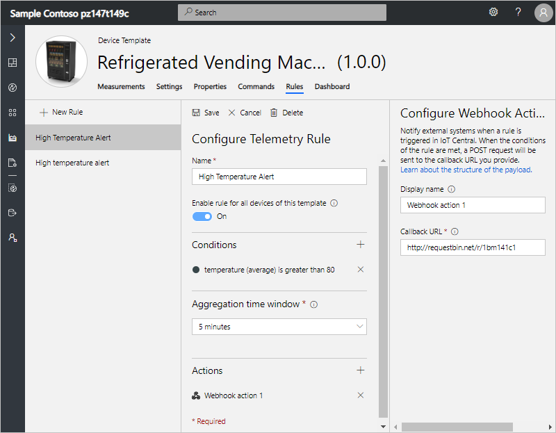

# Create webhook actions on rules in Azure IoT Central

*This topic applies to builders and administrators.*

[!INCLUDE [iot-central-original-pnp](../../includes/iot-central-original-pnp-note.md)]

Webhooks enable you to connect your IoT Central app to other applications and services for remote monitoring and notifications. Webhooks automatically notify other applications and services you connect whenever a rule is triggered in your IoT Central app. Your IoT Central app sends a POST request to the other application's HTTP endpoint whenever a rule is triggered. The payload contains device details and rule trigger details.

## Set up the webhook

In this example, you connect to RequestBin to get notified when rules fire using webhooks.

1. Open [RequestBin](https://requestbin.net/).

1. Create a new RequestBin and copy the **Bin URL**.

1. Create a [telemetry rule](howto-create-telemetry-rules.md) or an [event rule](howto-create-event-rules.md). Save the rule and add a new action.

    

1. Choose the webhook action and provide a display name and paste the Bin URL as the Callback URL.

1. Save the rule.

Now when the rule is triggered, you see a new request appear in RequestBin.

## Payload

When a rule is triggered, an HTTP POST request is made to the callback URL containing a json payload with the measurements, device, rule, and application details. For a telemetry rule, the payload looks like the following:

```json
{
    "id": "ID",
    "timestamp": "date-time",
    "device" : {
        "id":"ID",
        "name":  "Refrigerator1",
        "simulated" : true,
        "deviceId": "deviceID",
        "deviceTemplate":{
            "id": "ID",
            "version":"1.0.0"
        },
        "properties":{
            "device":{
                "firmwareversion":"1.0"
            },
            "cloud":{
                "location":"One Microsoft Way"
            }
        },
        "measurements":{
            "telemetry":{
                "temperature":20,
                "pressure":10
            }
        }

    },
    "rule": {
        "id": "ID",
        "name": "High temperature alert",
        "enabled": true,
        "deviceTemplate": {
            "id":"GUID",
            "version":"1.0.0"
        }
    },
    "application": {
        "id": "ID",
        "name": "Contoso app",
        "subdomain":"contoso-app"
    }
}
```

## Known limitations

Currently there is no programmatic way of subscribing/unsubscribing from these webhooks through an API.

If you have ideas for how to improve this feature, post your suggestions to our [Uservoice forum](https://feedback.azure.com/forums/911455-azure-iot-central).

## Next steps

Now that you've learned how to set up and use webhooks, the suggested next step is to explore [building workflows in Microsoft Flow](howto-add-microsoft-flow.md).
