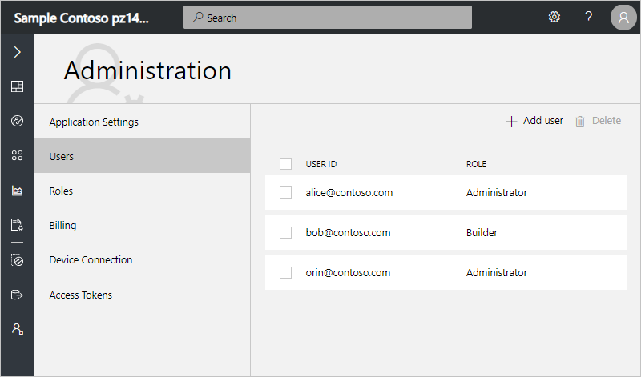

# Manage users and roles in your IoT Central application

This article describes how, as an administrator, you can add, edit, and delete users in your Azure IoT Central application and also how to manage roles in your Azure IoT Central application.

To access and use the **Administration** section, you must be in the **Administrator** role for an Azure IoT Central application. If you create an Azure IoT Central application, you're automatically assigned to the **Administrator** role for that application.

## Add users

Every user must have a user account before they can sign in and access an Azure IoT Central application. Microsoft Accounts (MSAs) and Azure Active Directory (Azure AD) accounts are supported in Azure IoT Central. Azure Active Directory groups aren't currently supported in Azure IoT Central.

For more information, see [Microsoft account help](https://support.microsoft.com/products/microsoft-account?category=manage-account) and  [Quickstart: Add new users to Azure Active Directory](https://docs.microsoft.com/azure/active-directory/add-users-azure-active-directory).

1. To add a user to an IoT Central application, go to the **Users** page in the **Administration** section.

    

1. To add a user, on the **Users** page, choose **+ Add user**.

1. Choose a role for the user from the **Role** drop-down menu. Learn more about roles in the [Manage roles](#manage-roles) section of this article.

    

    > [!NOTE]
    >  To add users in bulk, enter the user IDs of all the users you'd like to add separated by semi-colons. Choose a role from the **Role** drop-down menu. Then select **Save**.

### Edit the roles that are assigned to users

Roles can't be changed after they are assigned. To change the role that's assigned to a user, delete the user, and then add the user again with a different role.

> [!NOTE]
> The roles assigned are specific to IoT Central application and cannot be managed from the Azure Portal.

## Delete users

To delete users, select one or more check boxes on the **Users** page. Then select **Delete**.

## Manage roles

Roles enable you to control who within your organization can perform various tasks in IoT Central. There are three roles you can assign to users of your application.

### Administrator

Users in the **Administrator** role have access to all functionality in an application.

The user who creates an application is automatically assigned to the **Administrator** role. There must always be at least one user in the **Administrator** role.

### Application Builder

Users in the **Application Builder** role can do everything in an application except administer the application. Builders can create, edit, and delete device templates and devices, manage device sets, and run analytics and jobs. Builders won't have access to the **Administration** section of the application.

### Application Operator

Users in the **Application Operator** role can't make changes to device templates and can't administer the application. Operators can add and delete devices, manage device sets, and run analytics and jobs. Operators won't have access to the **Application Builder** and **Administration** pages.

## Next steps

Now that you've learned about how to manage users and roles in your Azure IoT Central, the suggested next step is to learn about [View your bill](howto-view-bill.md) in Azure IoT Central.
