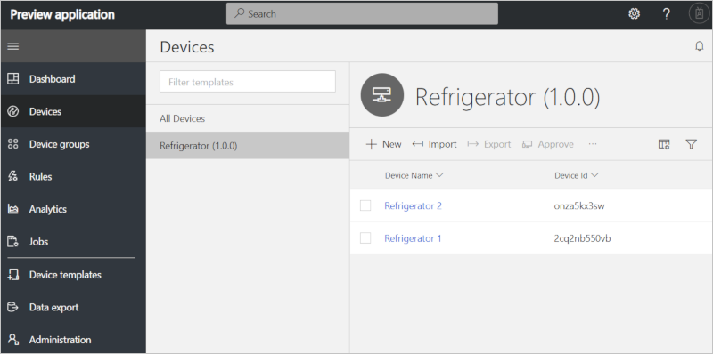
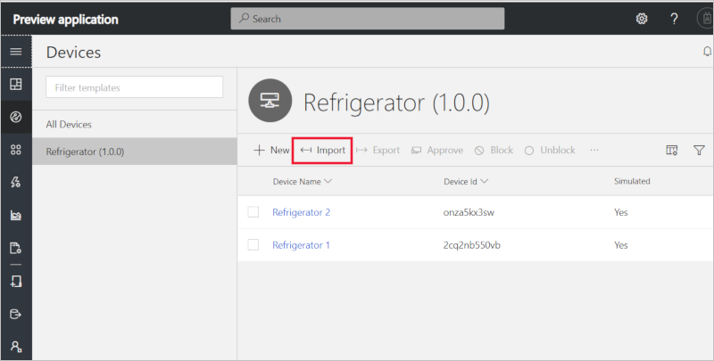
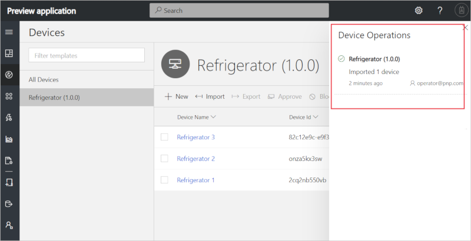
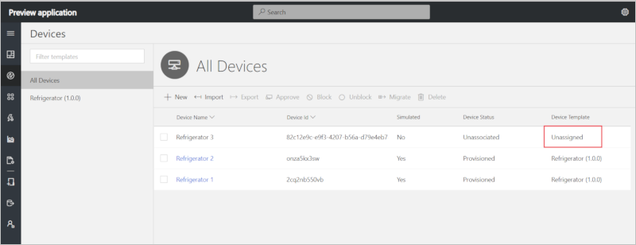
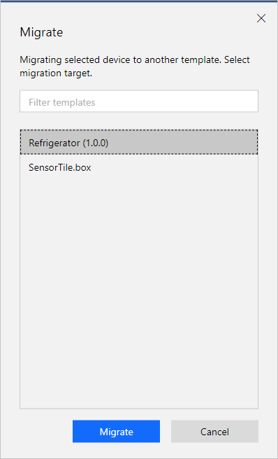
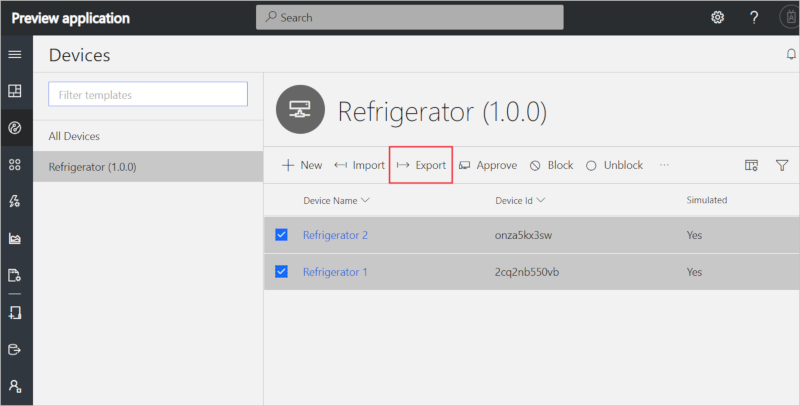
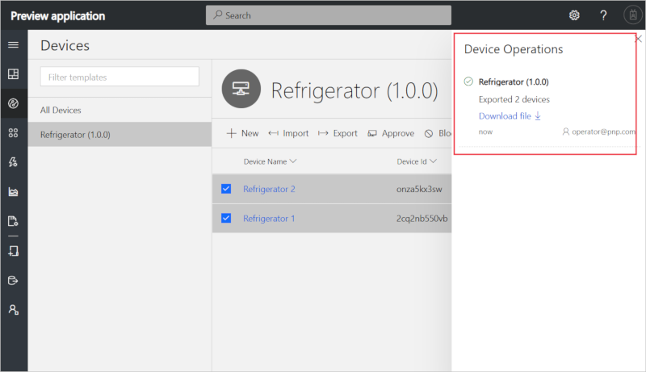

# Manage devices in your Azure IoT Central application (preview features)

[!INCLUDE [iot-central-pnp-original](../../../includes/iot-central-pnp-original-note.md)]

This article describes how, as an operator, to manage devices in your Azure IoT Central application. As an operator, you can:

- Use the **Devices** page to view, add, and delete devices connected to your Azure IoT Central application.
- Maintain an up-to-date inventory of your devices.
- Keep your device metadata up-to-date by changing the values stored in the device properties from your views.
- Control the behavior of your devices by updating a setting on a specific device from your views.

## View your devices

To view an individual device:

1. Choose **Devices** on the left pane. Here you see a list of all devices and of your device templates.

1. Choose a device template.

1. In the right-hand pane of the **Devices** page, you see a list of devices created from that device template. Choose an individual device to see the device details page for that device:

    

## Add a device

To add a device to your Azure IoT Central application:

1. Choose **Devices** on the left pane.

1. Choose the device template from which you want to create a device.

1. Choose + **New**.

1. Turn the **Simulated** toggle to **On** or **Off**. A real device is for a physical device that you connect to your Azure IoT Central application. A simulated device has sample data generated for you by Azure IoT Central.

1. Click **Create**.

1. This device now appears in your device list for this template. Select the device to see the device details page that contains all views for the device.

## Import devices

To connect large number of devices to your application, you can bulk import devices from a CSV file. The CSV file should have the following columns and headers:

* **IOTC_DeviceID** - the device ID should be all lowercase.
* **IOTC_DeviceName** - this column is optional.

To bulk-register devices in your application:

1. Choose **Devices** on the left pane.

1. On the left panel, choose the device template for which you want to bulk create the devices.

    > [!NOTE]
    > If you don’t have a device template yet then you can import devices under **All devices** and register them without a template. After devices have been imported, you can then migrate them to a template.

1. Select **Import**.

    

1. Select the CSV file that has the list of Device IDs to be imported.

1. Device import starts once the file has been uploaded. You can track the import status in the Device Operations panel. This panel appears automatically after the import starts or you can access it through the bell icon in the top right-hand corner.

1. Once the import completes, a success message is shown in the Device Operations panel.

    

If the device import operation fails, you see an error message on the Device Operations panel. A log file capturing all the errors is generated that you can download.

**Migrating devices to a template**

If you register devices by starting the import under **All devices**, then the devices are created without any device template association. Devices must be associated with a template to explore the data and other details about the device. Follow these steps to associate devices with a template:

1. Choose **Devices** on the left pane.

1. On the left panel, choose **All devices**:

    

1. Use the filter on the grid to determine if the value in the **Device Template** column is "Unassociated" for any of your devices.

1. Select the devices you want to associate with a template:

1. Select **Migrate**:

    

1. Choose the template from the list of available templates and select **Migrate**.

1. The selected devices are associated with the device template you chose.

## Export devices

To connect a real device to IoT Central, you need its connection string. You can export device details in bulk to get the information you need to create device connection strings. The export process creates a CSV file with the device identity, device name, and keys for all the selected devices.

To bulk export devices from your application:

1. Choose **Devices** on the left pane.

1. On the left pane, choose the device template from which you want to export the devices.

1. Select the devices that you want to export and then select the **Export** action.

    

1. The export process starts. You can track the status using the Device Operations panel.

1. When the export completes, a success message is shown along with a link to download the generated file.

1. Select the **Download File** link to download the file to a local folder on the disk.

    

1. The exported CSV file contains the following columns: device ID, device name, device keys, and X509 certificate thumbprints:

    * IOTC_DEVICEID
    * IOTC_DEVICENAME
    * IOTC_SASKEY_PRIMARY
    * IOTC_SASKEY_SECONDARY
    * IOTC_X509THUMBPRINT_PRIMARY
    * IOTC_X509THUMBPRINT_SECONDARY

For more information about connection strings and connecting real devices to your IoT Central application, see [Device connectivity in Azure IoT Central](overview-iot-central-get-connected.md).

## Delete a device

To delete either a real or simulated device from your Azure IoT Central application:

1. Choose **Devices** on the left pane.

1. Choose the device template of the device you want to delete.

1. Use the filter tools to filter and search for your devices. Check the box next to the devices to delete.

1. Choose **Delete**. You can track the status of this deletion in your Device Operations panel.

## Change a property

Cloud properties are the device metadata associated with the device, such as city and serial number. Writeable properties control the behavior of a device. In other words, they enable you to provide inputs to your device.  Device properties are set by the device and are read-only within IoT Central. You can view and update properties on the **Device Details** views for your device.

1. Choose **Devices** on the left pane.

1. Choose the device template of the device whose properties you want to change and select the target device.

1. Choose the view that contains properties for your device, this view enables you to input values and select **Save** at the top of the page. Here you see the properties your device has and their current values. Cloud properties and writeable properties have editable fields, while device properties are read-only. For writeable properties, you can see their sync status at the bottom of the field. 

1. Modify the properties to the values you need. You can modify multiple properties at a time and update them all at the same time.

1. Choose **Save**. If you saved writeable properties, the values are sent to your device. When the device confirms the change for the writeable property, the status returns back to **synced**. If you saved a cloud property, the value is updated.

## Next steps

Now that you've learned how to manage devices in your Azure IoT Central application, here is the suggested next step:

> [!div class="nextstepaction"]
> [How to use device groups](tutorial-use-device-groups.md)

<!-- Next how-tos in the sequence -->
