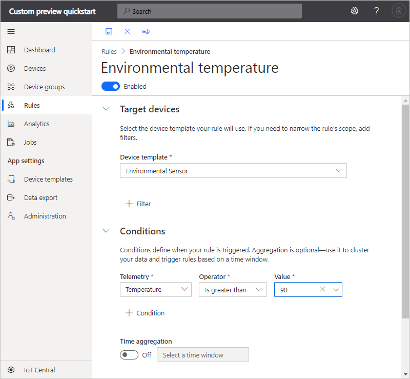
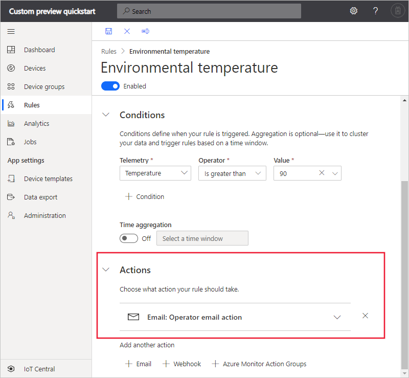

# Quickstart: Configure rules and actions for your device in Azure IoT Central (preview features)

*This article applies to operators, builders, and administrators.*

[!INCLUDE [iot-central-pnp-original](../../../includes/iot-central-pnp-original-note.md)]

In this quickstart, you create a rule that sends an email when the temperature in an environmental sensor device exceeds 90&deg; F.

## Prerequisites

Before you begin, you should complete the two previous quickstarts [Create an Azure IoT Central application](./quick-deploy-iot-central.md) and [Add a simulated device to your IoT Central application](./quick-create-pnp-device.md) to create the **Environment Sensor** device template to work with.

## Create a telemetry-based rule

1. To add a new telemetry-based rule to your application, in the left pane, select **Rules**.

1. To create a new rule, select **+ New**.

1. Enter **Environmental temperature** as the rule name.

1. In the **Target devices** section, select the **Environment Sensor** as the device template. This option filters the devices the rule applies to by device template type. You can add more filter criteria choosing **+ Filter**.

1. In the **Conditions** section, you define what triggers your rule. Use the following information to define a condition based on temperature telemetry:

    | Field                                        | Value                             |
    | -------------------------------------------- | ------------------------------    |
    | Measurement                                  | Temperature                       |
    | Operator                                     | is greater than                   |
    | Value                                        | 90                                |

    To add more conditions, select **+ Condition**.

    

1. To add an email action to run when the rule triggers, select **+ Email**.

1. Use the information in the following table to define your action:

    | Setting   | Value                                             |
    | --------- | ------------------------------------------------- |
    | Display name | Operator email action                          |
    | To        | Your email address                                |
    | Notes     | Environmental temperature exceeded the threshold. |

    > [!NOTE]
    > To receive an email notification, the email address must be a [user ID in the application](howto-administer.md), and that user must have signed in to the application at least once.

    

1. Select **Save**. Your rule is listed on the **Rules** page.

## Test the rule

Shortly after you save the rule, it becomes live. When the conditions defined in the rule are met, your application sends a message to the email address you specified in the action.

> [!NOTE]
> After your testing is complete, turn off the rule to stop receiving alerts in your inbox.

## Next steps

In this quickstart, you learned how to:

* Create a telemetry-based rule
* Add an action

To learn more about monitoring devices connected to your application, continue to the quickstart:

> [!div class="nextstepaction"]
> [Use Azure IoT Central to monitor your devices](quick-monitor-devices.md).
