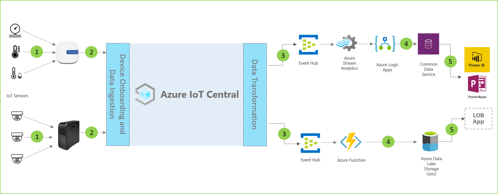

# In-store analytics architecture

In-store analytics solutions allow you to monitor various conditions within the retail store environment. These solutions can be built by using one of the application templates within IoT Central and the architecture below as guidance.

- Set of IoT sensors sending telemetry data to a gateway device
- Gateway devices sending telemetry and aggregated insights to IoT Central
- Continuous data export to the desired Azure service for manipulation
- Data can be structured in the desired format and sent to a storage service
- Business applications can query data and generate insights that power retail operations
 
Let's take a look at key components that generally play a part in an in-store analytics solution.

## Condition monitoring sensors

An IoT solution starts with a set of sensors capturing meaningful signals from within a retail store environment. It is reflected by different kinds of sensors on the far left of the architecture diagram above.

## Gateway devices

Many IoT sensors can feed raw signals directly to the cloud or to a gateway device located near them. The gateway device performs data aggregation at the edge before sending summary insights to an IoT Central application. The gateway devices are also responsible for relaying command and control operations to the sensor devices when applicable. 

## IoT Central application

The Azure IoT Central application ingests data from different kinds of IoT sensors as well gateway devices within the retail store environment and generates a set of meaningful insights.

Azure IoT Central also provides a tailored experience to the store operator enabling them to remotely monitor and manage the infrastructure devices.

## Data transform
The Azure IoT Central application within a solution can be configured to export raw or aggregated insights to a set of Azure PaaS (Platform-as-a Service) services that can perform data manipulation and enrich these insights before landing them in a business application. 

## Business application
The IoT data can be used to power different kinds of business applications deployed within a retail environment. A retail store manager or staff member can use these applications to visualize business insights and take meaningful actions in real time. To learn how to build a real-time Power BI dashboard for your retail team, follow the [tutorial](./tutorial-in-store-analytics-create-app.md).

## Next steps
* Get started with the [In-Store Analytics Checkout](https://aka.ms/checkouttemplate) and [In-Store Analytics Condition Monitoring](https://aka.ms/conditiontemplate) application templates. 
* Take a look at the [end to end tutorial](https://aka.ms/storeanalytics-tutorial) that walks you through how to build a solution using one of the In-Store Analytics application templates.
