# Tutorial:  Customize the operator dashboard and manage devices in Azure IoT Central

In this tutorial, as a builder, you learn how to customize the operator dashboard in your Azure IoT Central in-store analytics application. Application operators can use the customized dashboard to run the application and manage the attached devices.

In this tutorial, you learn how to:
> [!div class="checklist"]
> * Change the dashboard name
> * Customize image tiles on the dashboard
> * Arrange tiles to modify the layout
> * Add telemetry tiles to display conditions
> * Add property tiles to display device details
> * Add command tiles to run commands

## Prerequisites

The builder should complete the tutorial to create the Azure IoT Central in-store analytics application and add devices:

* [Create an in-store analytics application in Azure IoT Central](./tutorial-in-store-analytics-create-app.md) (Required)

## Change the dashboard name
To customize the operator dashboard, you have to edit the default dashboard in your application. Also, you can create additional new dashboards. The first step to customize the dashboard in your application is to change the name.

1. Navigate to the [Azure IoT Central application manager](https://aka.ms/iotcentral) website.

1. Open the condition monitoring application that you created in the [Create an in-store analytics application in Azure IoT Central](./tutorial-in-store-analytics-create-app.md) tutorial.

1. Select **Edit** on the dashboard toolbar. In edit mode, you can customize the appearance, layout, and content of the dashboard.

    

1. Optionally, hide the left pane. Hiding the left pane gives you a larger working area for editing the dashboard.

1. Enter a friendly name for your dashboard in **Dashboard name.** This tutorial uses a fictional company named Contoso, and the example dashboard name is *Contoso dashboard*. 

1. Select **Save**. Your changes are saved to the dashboard and edit mode is disabled.

    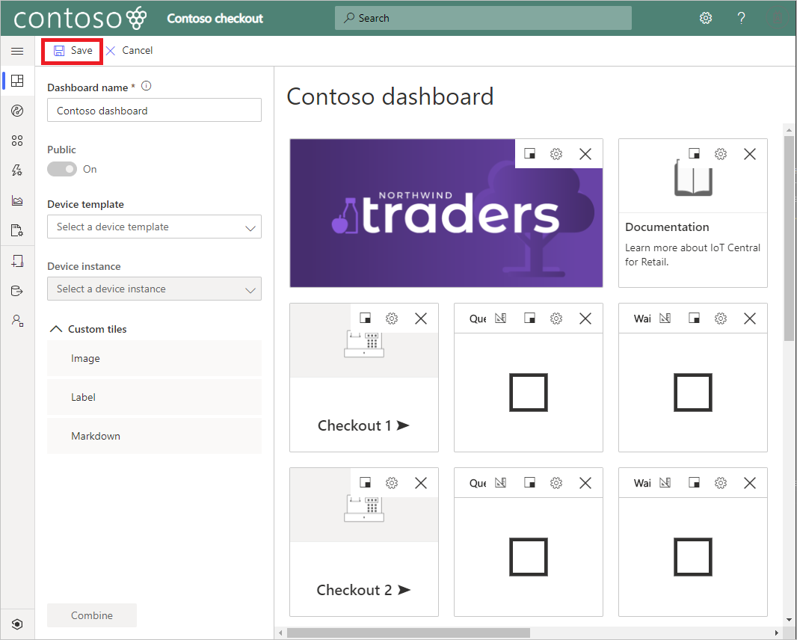

## Customize image tiles on the dashboard
An Azure IoT Central application dashboard consists of one or more tiles. A tile is a rectangular container for displaying content on a dashboard. You associate various types of content with tiles, and you drag, drop, and resize tiles to customize a dashboard layout. There are several types of tiles for displaying content. Image tiles contain images, and you can add a URL that enables users to click the image. Label tiles display plain text. Markdown tiles contain formatted content and let you set an image, a URL, a title, and markdown code that renders as HTML. Telemetry, property, or command tiles display device-specific data. 

In this section, you learn how to customize image tiles on the dashboard.

To customize the image tile that displays a brand image on the dashboard:

1. Select **Edit** on the dashboard toolbar. 

1. Select **Configure** on the image tile that displays the Northwind brand image. 

    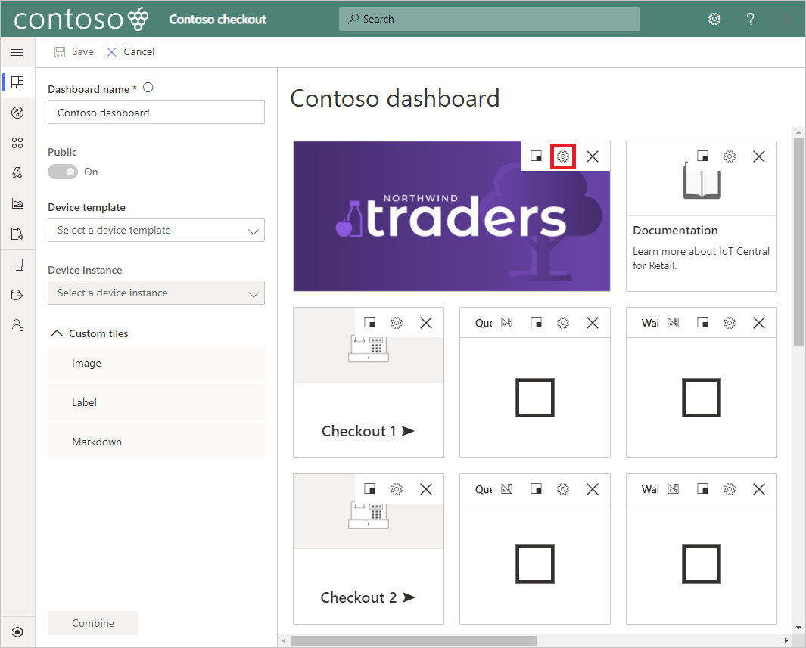

1. Change the **Title**. The title appears when a user hovers over the image.

1. Select **Image**. A dialog opens and enables you to upload a custom image. 

1. Optionally, specify a URL for the image.

1. Select **Update configuration**. The **Update configuration** button saves changes to the dashboard and leaves edit mode enabled.

    

1. Optionally, select **Configure** on the tile titled **Documentation**, and specify a URL for support content. 

To customize the image tile that displays a map of the sensor zones in the store:

1. Select **Configure** on the image tile that displays the default store zone map. 

1. Select **Image**, and use the dialog to upload a custom image of a store zone map. 

1. Select **Update configuration**.

    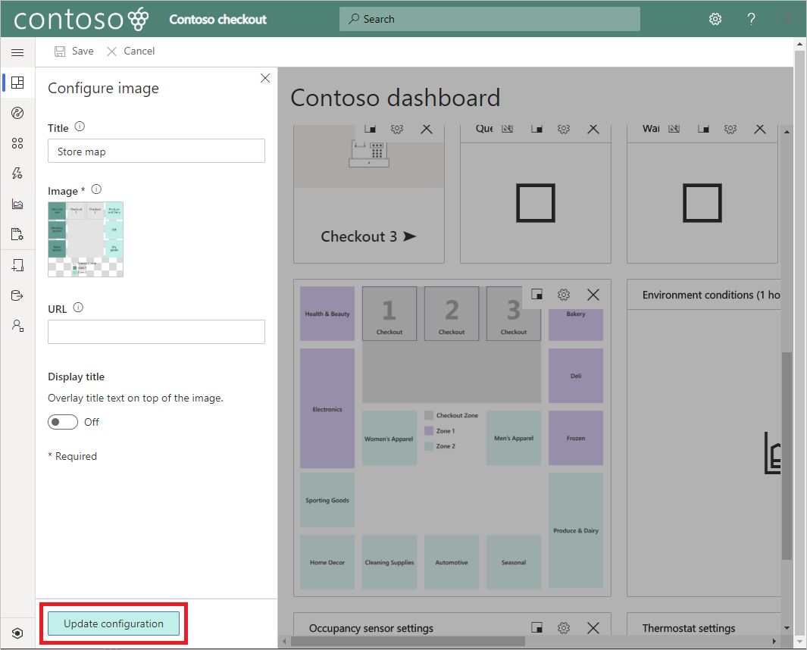

    The example Contoso store map shows four zones: two checkout zones, a zone for apparel and personal care, and a zone for groceries and deli. In this tutorial, you'll associate sensors with these zones to provide telemetry.

    

1. Select **Save**. 

## Arrange tiles to modify the layout
A key step in customizing a dashboard is to rearrange the tiles to create a useful view. Application operators use the dashboard to visualize device telemetry, manage devices, and monitor conditions in a store. Azure IoT Central simplifies the application builder task of creating a dashboard. The dashboard edit mode enables you to quickly add, move, resize, and delete tiles. The **In-store analytics - checkout** application template also simplifies the task of creating a dashboard. It provides a working dashboard layout, with sensors connected, and tiles that display checkout line counts and environmental conditions.

In this section, you rearrange the dashboard in the **In-store analytics - checkout** application template to create a custom layout.

To remove tiles that you don't plan to use in your application:

1. Select **Edit** on the dashboard toolbar. 

1. Select **X Delete** to remove the following tiles: **Back to all zones**, **Visit store dashboard**, **Wait time**, and all three tiles associated with **Checkout 3**. The Contoso store dashboard doesn't use these tiles. 

    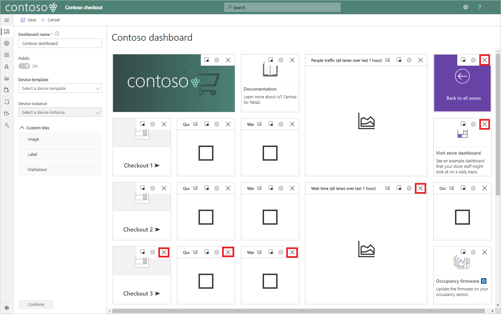

1. Scroll to bring the remaining dashboard tiles into view.

1. Select **X Delete** to remove the following tiles: **Warm-up checkout zone**, **Cool-down checkout zone**, **Occupancy sensor settings**, **Thermostat sensor settings**, and **Environment conditions**. 

   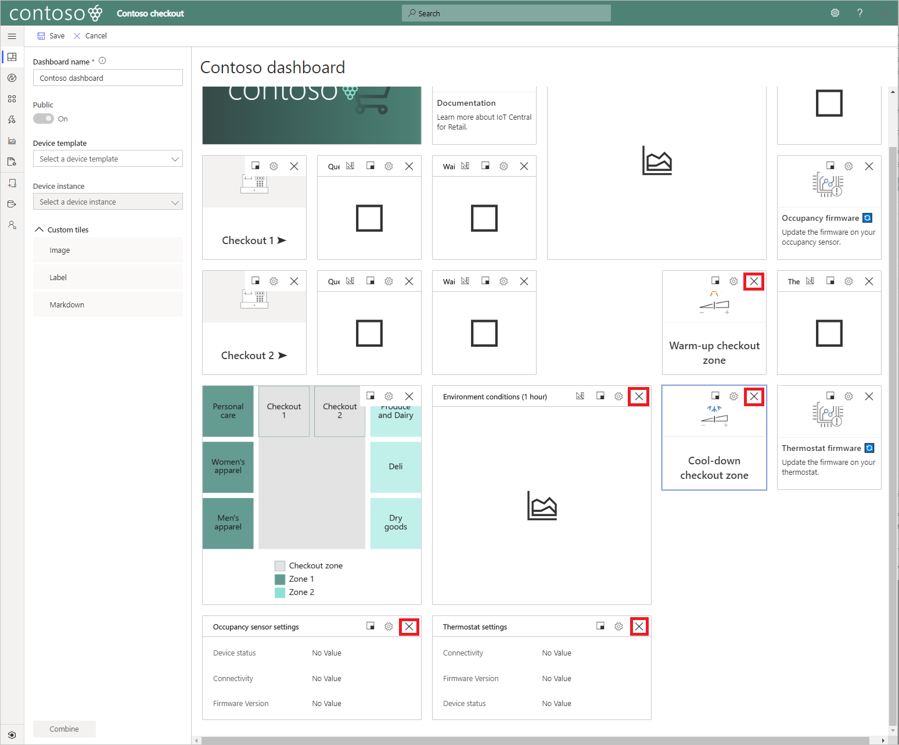

1. Select **Save**. Removing unused tiles frees up space in the edit page, and simplifies the dashboard view for operators.

1. View your changes to the dashboard.

   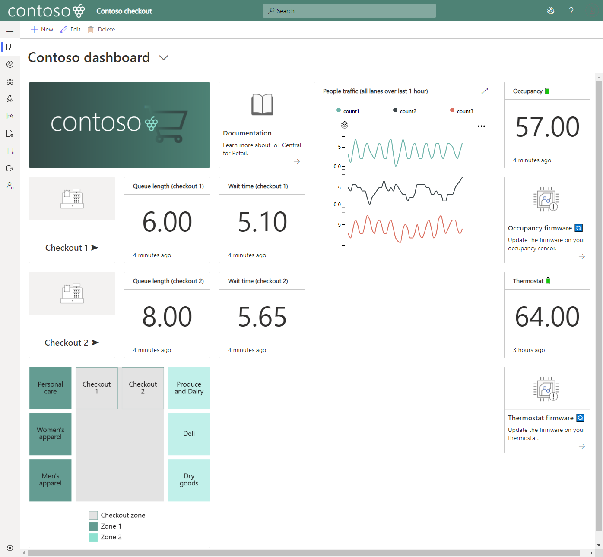

After you remove unused tiles, rearrange the remaining tiles to create an organized layout. The new layout includes space for tiles you add in a later step.

To rearrange the remaining tiles:

1. Select **Edit**.

1. Select the **Occupancy firmware** tile and drag it to the right of the **Occupancy** battery tile.

1. Select the **Thermostat firmware** tile and drag it to the right of the **Thermostat** battery tile.

1. Select **Save**.

1. View your layout changes. 

    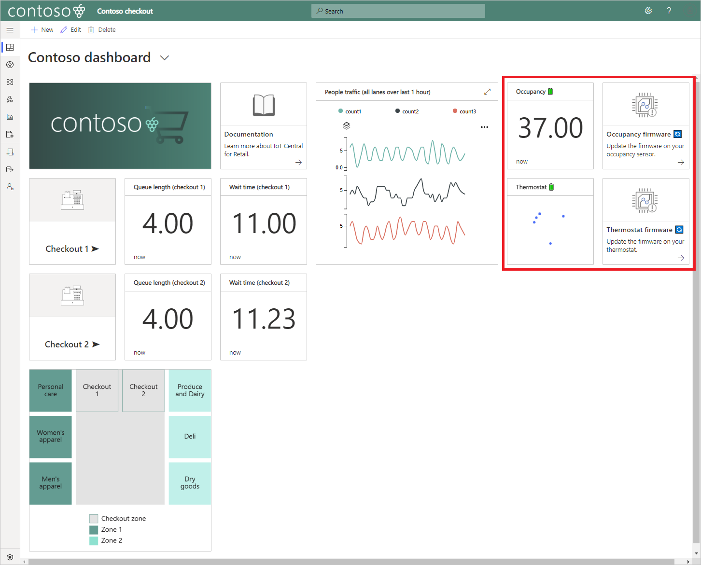

## Add telemetry tiles to display conditions
After you customize the dashboard layout, you're ready to add tiles to show telemetry. To create a telemetry tile, select a device template and device instance, then select device-specific telemetry to display in the tile. The **In-store analytics - checkout** application template includes several telemetry tiles in the dashboard. The four tiles in the two checkout zones display telemetry from the simulated occupancy sensor. The **People traffic** tile shows counts in the two checkout zones. 

In this section, you add two more telemetry tiles to show environmental telemetry from the RuuviTag sensors you added in the [Create an in-store analytics application in Azure IoT Central](./tutorial-in-store-analytics-create-app.md) tutorial. 

To add tiles to display environmental data from the RuuviTag sensors:

1. Select **Edit**.

1. Select `RuuviTag` in the **Device template** list. 

1. Select a **Device instance** of one of the two RuuviTag sensors. In the example Contoso store, select `Zone 1 Ruuvi` to create a telemetry tile for Zone 1. 

1. Select `Relative humidity` and `temperature` in the **Telemetry** list. These are the telemetry items that display for each zone on the tile.

1. Select **Combine**. 

    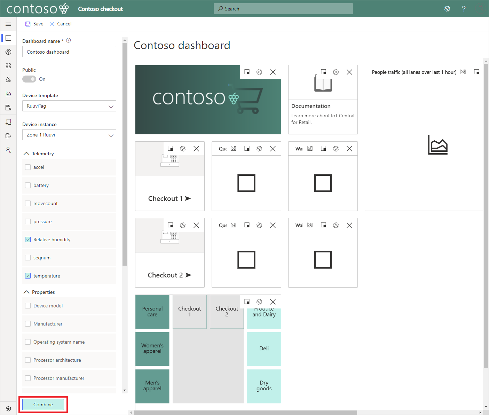

    A new tile appears to display combined humidity and temperature telemetry for the selected sensor. 

1. Select **Configure** on the new tile for the RuuviTag sensor. 

1. Change the **Title** to *Zone 1 environment*. 

1. Select **Update configuration**.

1. Repeat the previous steps to create a tile for the second sensor instance. Set the **Title** to *Zone 2 environment* and then select **Update configuration.**

1. Drag the tile titled **Zone 2 environment** below the **Thermostat firmware** tile. 

1. Drag the tile titled **Zone 1 environment** below the **People traffic** tile. 

1. Select **Save**. The dashboard displays zone telemetry in the two new tiles.

    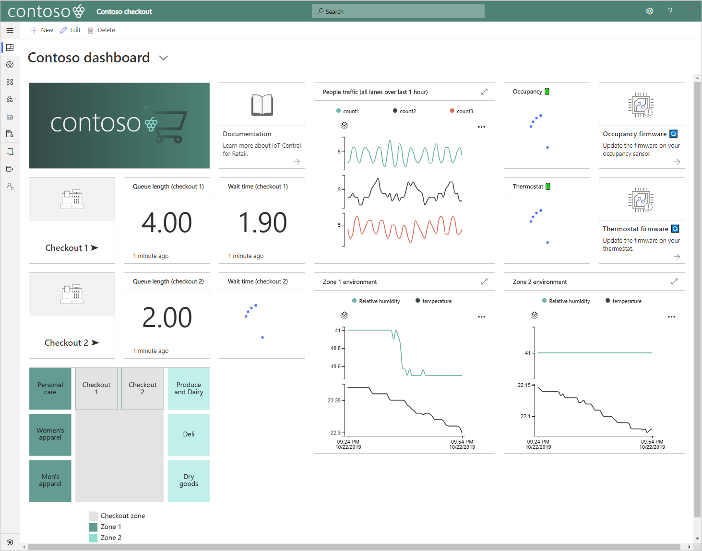

To edit the **People traffic** tile to show telemetry for only two checkout zones:

1. Select **Edit**. 

1. Select **Configure** on the **People traffic** tile.

1. In **Telemetry** select **count 1**, **count 2**, and **count 3**. 

1. Select **Update configuration**. It clears the existing configuration on the tile. 

1. Select **Configure** again on the **People traffic** tile.

1. In **Telemetry** select **count 1**, and **count 2**. 

1. Select **Update configuration**. 

1. Select **Save**.  The updated dashboard displays counts for only your two checkout zones, which are based on the simulated occupancy sensor.

    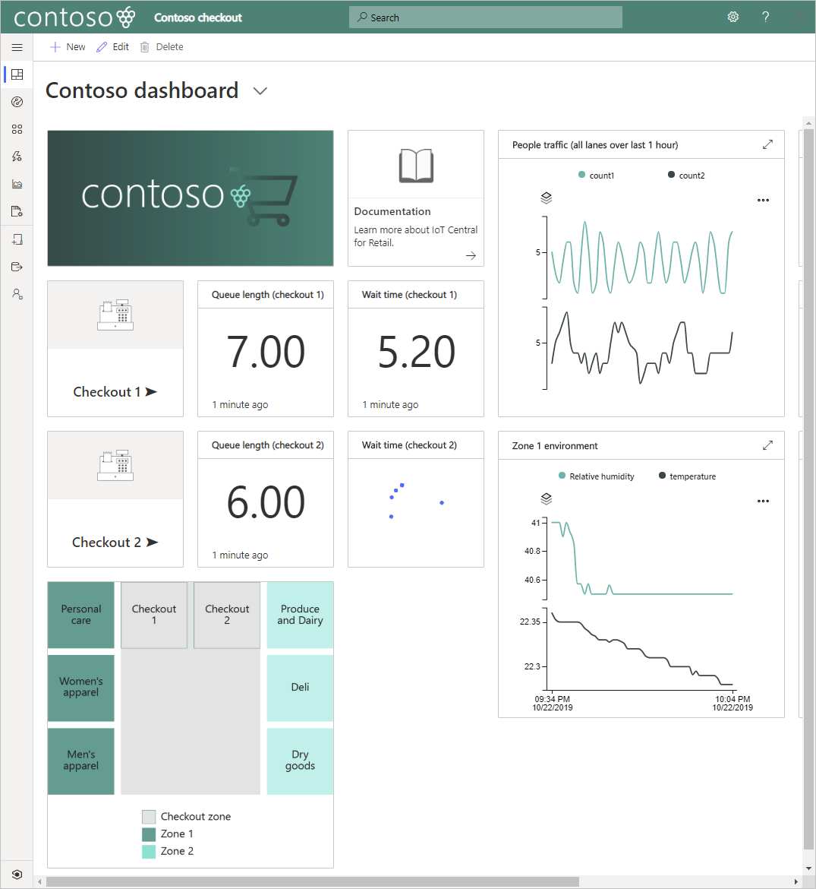

## Add property tiles to display device details
Application operators use the dashboard to manage devices, and monitor status. Add a tile for each RuuviTag to enable operators to view the software version. 

To add a property tile for each RuuviTag:

1. Select **Edit**.

1. Select `RuuviTag` in the **Device template** list. 

1. Select a **Device instance** of one of the two RuuviTag sensors. In the example Contoso store, select `Zone 1 Ruuvi` to create a telemetry tile for Zone 1. 

1. Select **Properties > Software version**.

1. Select **Combine**. 

1. Select **Configure** on the newly created tile titled **Software version**. 

1. Change the **Title** to *Ruuvi 1 software version*.

1. Select **Update configuration**. 

1. Drag the tile titled **Ruuv 1 software version** below the **Zone 1 environment** tile.

1. Repeat the previous steps to create a software version property tile for the second RuuviTag. 

1. Select **Save**.  

    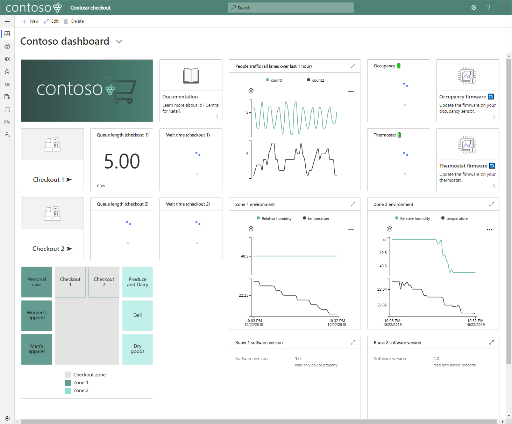

## Add command tiles to run commands
Application operators also use the dashboard to manage devices by running commands. You can add command tiles to the dashboard that will execute predefined commands on a device. In this section, you add a command tile to enable operators to reboot the Rigado gateway. 

To add a command tile to reboot the gateway:

1. Select **Edit**. 

1. Select `C500` in the **Device template** list. It is the template for the Rigado C500 gateway. 

1. Select the gateway instance in **Device instance**.

1. Select **Command > Reboot** and drag it into the dashboard beside the store map. 

1. Select **Save**. 

1. View your completed Contoso dashboard. 

    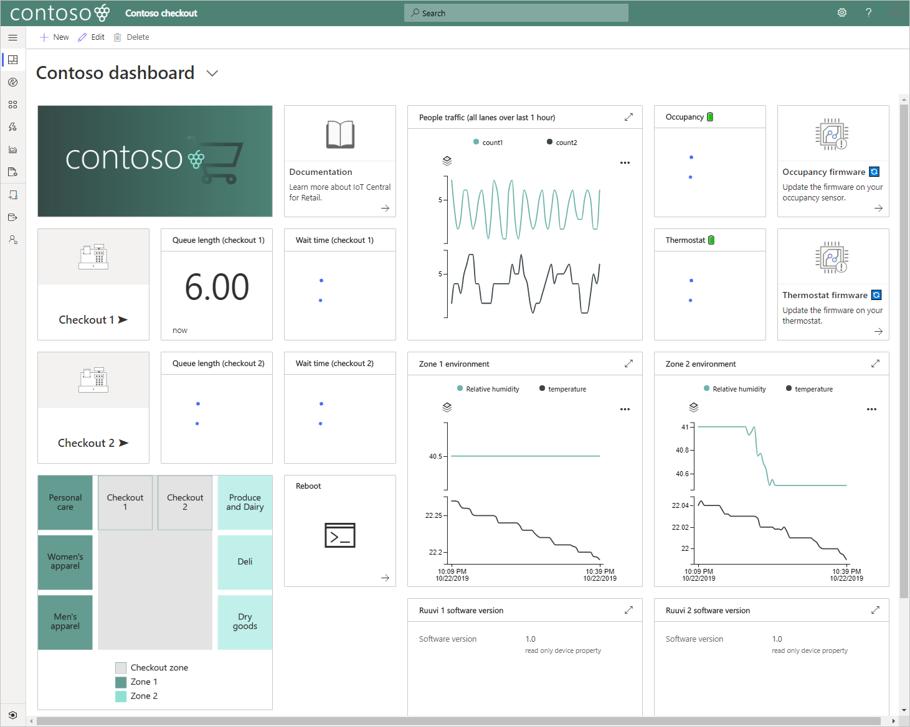

1. Optionally, select the **Reboot** tile to run the reboot command on your gateway.

## Clean up resources

[!INCLUDE [iot-central-clean-up-resources](../../../includes/iot-central-clean-up-resources.md)]

## Next steps

In this tutorial, you learned how to:

* Change the dashboard name
* Customize image tiles on the dashboard
* Arrange tiles to modify the layout
* Add telemetry tiles to display conditions
* Add property tiles to display device details
* Add command tiles to run commands

Now that you've customized the dashboard in your Azure IoT Central in-store analytics application, here is the suggested next step:

> [!div class="nextstepaction"]
> [Export data and visualize insights](./tutorial-in-store-analytics-export-data-visualize-insights.md)
