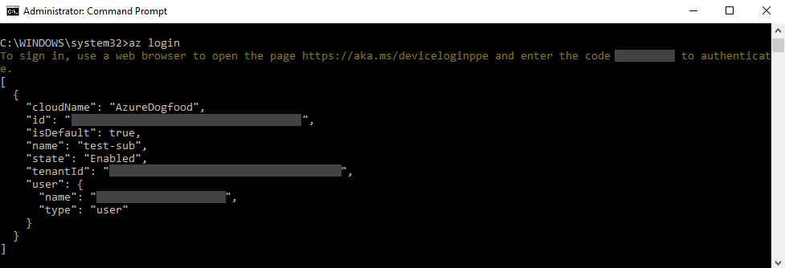
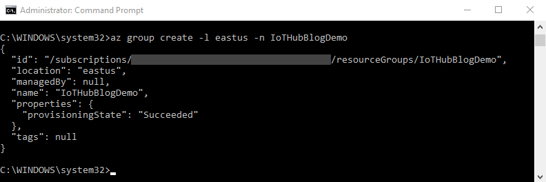
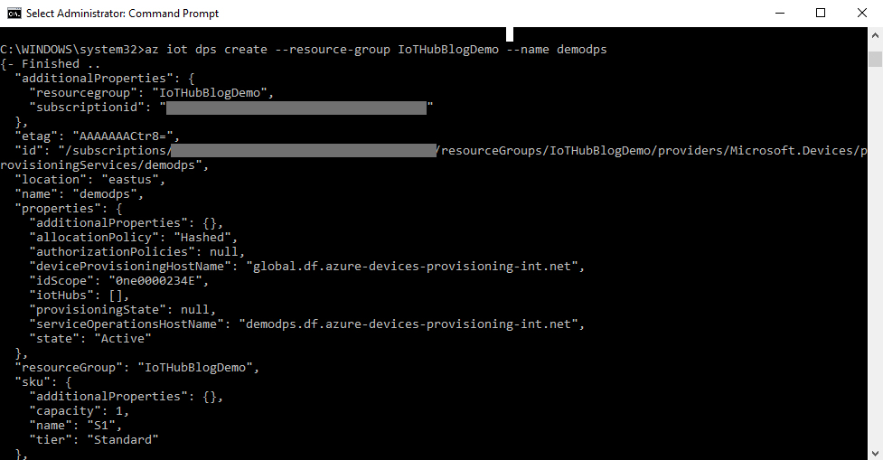
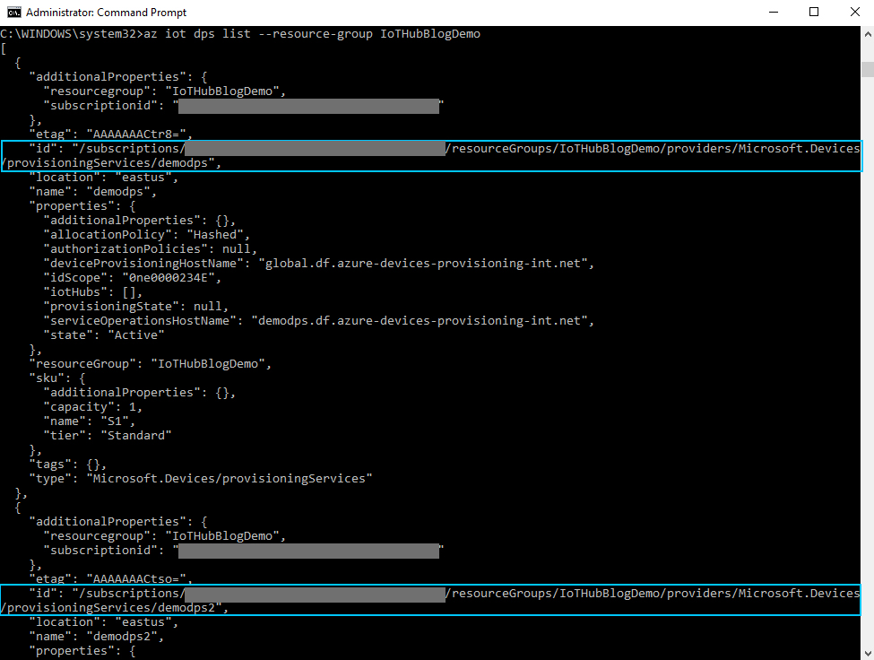

# How to use Azure CLI and the IoT extension to manage the IoT Hub Device Provisioning Service

[Azure CLI](https://docs.microsoft.com/cli/azure?view=azure-cli-latest) is an open-source cross platform command-line tool for managing Azure resources such as IoT Edge. Azure CLI is available on Windows, Linux, and macOS. Azure CLI enables you to manage Azure IoT Hub resources, Device Provisioning service instances, and linked-hubs out of the box.

The IoT extension enriches Azure CLI with features such as device management and full IoT Edge capability.

In this tutorial, you first complete the steps to setup Azure CLI and the IoT extension. Then you learn how to run CLI commands to perform basic Device Provisioning Service operations. 

[!INCLUDE [iot-hub-cli-version-info](../../includes/iot-hub-cli-version-info.md)]

## Installation 

### Install Python

[Python 2.7x or Python 3.x](https://www.python.org/downloads/) is required.

### Install the Azure CLI

Follow the [installation instruction](https://docs.microsoft.com/cli/azure/install-azure-cli?view=azure-cli-latest) to setup Azure CLI in your environment. At a minimum, your Azure CLI version must be 2.0.70 or above. Use `az –version` to validate. This version supports az extension commands and introduces the Knack command framework. One simple way to install on Windows is to download and install the [MSI](https://aka.ms/InstallAzureCliWindows).

### Install IoT extension

[The IoT extension readme](https://github.com/Azure/azure-iot-cli-extension) describes several ways to install the extension. The simplest way is to run `az extension add --name azure-iot`. After installation, you can use `az extension list` to validate the currently installed extensions or `az extension show --name azure-iot` to see details about the IoT extension. To remove the extension, you can use `az extension remove --name azure-iot`.


## Basic Device Provisioning Service operations

The example shows you how to log in to your Azure account, create an Azure Resource Group (a container that holds related resources for an Azure solution), create an IoT Hub, create a Device Provisioning service, list the existing Device Provisioning services and create a linked IoT hub with CLI commands. 

Complete the installation steps described previously before you begin. If you don't have an Azure account yet, you can [create a free account](https://azure.microsoft.com/free/?v=17.39a) today. 


### 1. Log in to the Azure account
  
```azurecli
az login
```



### 2. Create a resource group IoTHubBlogDemo in eastus

```azurecli
az group create -l eastus -n IoTHubBlogDemo
```




### 3. Create two Device Provisioning services

```azurecli
az iot dps create --resource-group IoTHubBlogDemo --name demodps
```



```azurecli
az iot dps create --resource-group IoTHubBlogDemo --name demodps2
```

### 4. List all the existing Device Provisioning services under this resource group

```azurecli
az iot dps list --resource-group IoTHubBlogDemo
```




### 5. Create an IoT Hub blogDemoHub under the newly created resource group

```azurecli
az iot hub create --name blogDemoHub --resource-group IoTHubBlogDemo
```


### 6. Link one existing IoT Hub to a Device Provisioning service

```azurecli
az iot dps linked-hub create --resource-group IoTHubBlogDemo --dps-name demodps --connection-string <connection string> -l westus
```


## Next steps
In this tutorial, you learned how to:

> [!div class="checklist"]
> * Enroll the device
> * Start the device
> * Verify the device is registered

Advance to the next tutorial to learn how to provision multiple devices across load-balanced hubs. 

> [!div class="nextstepaction"]
> [Provision devices across load-balanced IoT hubs](./tutorial-provision-multiple-hubs.md)
