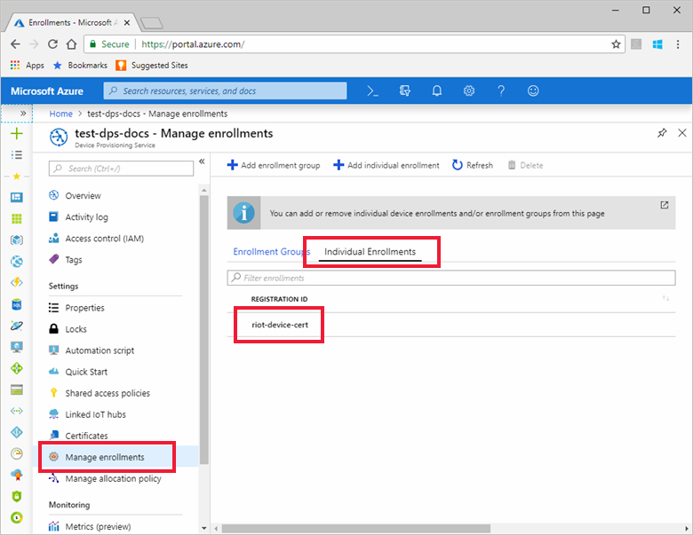
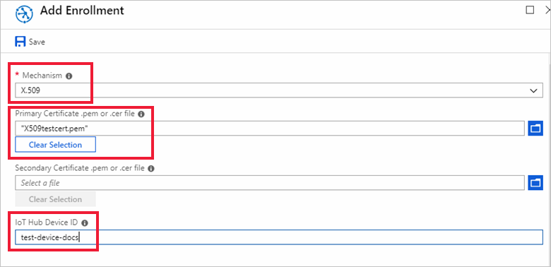
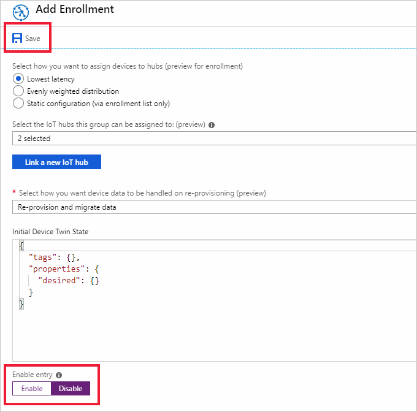

# How to disenroll a device from Azure IoT Hub Device Provisioning Service

Proper management of device credentials is crucial for high-profile systems like IoT solutions. A best practice for such systems is to have a clear plan of how to revoke access for devices when their credentials, whether a shared access signatures (SAS) token or an X.509 certificate, might be compromised. 

Enrollment in the Device Provisioning Service enables a device to be [provisioned](about-iot-dps.md#provisioning-process). A provisioned device is one that has been registered with IoT Hub, allowing it to receive its initial [device twin](~/articles/iot-hub/iot-hub-devguide-device-twins.md) state and begin reporting telemetry data. This article describes how to disenroll a device from your provisioning service instance, preventing it from being provisioned again in the future.

> [!NOTE] 
> Be aware of the retry policy of devices that you revoke access for. For example, a device that has an infinite retry policy might continuously try to register with the provisioning service. That situation consumes service resources and possibly affects performance.

## Disallow devices by using an individual enrollment entry

Individual enrollments apply to a single device and can use either X.509 certificates or SAS tokens (in a real or virtual TPM) as the attestation mechanism. (Devices that use SAS tokens as their attestation mechanism can be provisioned only through an individual enrollment.) To disallow a device that has an individual enrollment, you can either disable or delete its enrollment entry. 

To temporarily disallow the device by disabling its enrollment entry: 

1. Sign in to the Azure portal and select **All resources** from the left menu.
2. In the list of resources, select the provisioning service that you want to disallow your device from.
3. In your provisioning service, select **Manage enrollments**, and then select the **Individual Enrollments** tab.
4. Select the enrollment entry for the device that you want to disallow. 

    

5. On your enrollment page, scroll to the bottom, and select **Disable** for the **Enable entry** switch, and then select **Save**.  

   

To permanently disallow the device by deleting its enrollment entry:

1. Sign in to the Azure portal and select **All resources** from the left menu.
2. In the list of resources, select the provisioning service that you want to disallow your device from.
3. In your provisioning service, select **Manage enrollments**, and then select the **Individual Enrollments** tab.
4. Select the check box next to the enrollment entry for the device that you want to disallow. 
5. Select **Delete** at the top of the window, and then select **Yes** to confirm that you want to remove the enrollment. 

   

After you finish the procedure, you should see your entry removed from the list of individual enrollments.  

## Disallow an X.509 intermediate or root CA certificate by using an enrollment group

X.509 certificates are typically arranged in a certificate chain of trust. If a certificate at any stage in a chain becomes compromised, trust is broken. The certificate must be disallowed to prevent Device Provisioning Service from provisioning devices downstream in any chain that contains that certificate. To learn more about X.509 certificates and how they are used with the provisioning service, see [X.509 certificates](./concepts-security.md#x509-certificates). 

An enrollment group is an entry for devices that share a common attestation mechanism of X.509 certificates signed by the same intermediate or root CA. The enrollment group entry is configured with the X.509 certificate associated with the intermediate or root CA. The entry is also configured with any configuration values, such as twin state and IoT hub connection, that are shared by devices with that certificate in their certificate chain. To disallow the certificate, you can either disable or delete its enrollment group.

To temporarily disallow the certificate by disabling its enrollment group: 

1. Sign in to the Azure portal and select **All resources** from the left menu.
2. In the list of resources, select the provisioning service that you want to disallow the signing certificate from.
3. In your provisioning service, select **Manage enrollments**, and then select the **Enrollment Groups** tab.
4. Select the enrollment group using the certificate that you want to disallow.
5. Select **Disable** on the **Enable entry** switch, and then select **Save**.  

   

    
To permanently disallow the certificate by deleting its enrollment group:

1. Sign in to the Azure portal and select **All resources** from the left menu.
2. In the list of resources, select the provisioning service that you want to disallow your device from.
3. In your provisioning service, select **Manage enrollments**, and then select the **Enrollment Groups** tab.
4. Select the check box next to the enrollment group for the certificate that you want to disallow. 
5. Select **Delete** at the top of the window, and then select **Yes** to confirm that you want to remove the enrollment group. 

   

After you finish the procedure, you should see your entry removed from the list of enrollment groups.  

> [!NOTE]
> If you delete an enrollment group for a certificate, devices that have the certificate in their certificate chain might still be able to enroll if an enabled enrollment group for the root certificate or another intermediate certificate higher up in their certificate chain exists.

## Disallow specific devices in an enrollment group

Devices that implement the X.509 attestation mechanism use the device's certificate chain and private key to authenticate. When a device connects and authenticates with Device Provisioning Service, the service first looks for an individual enrollment that matches the device's credentials. The service then searches enrollment groups to determine whether the device can be provisioned. If the service finds a disabled individual enrollment for the device, it prevents the device from connecting. The service prevents the connection even if an enabled enrollment group for an intermediate or root CA in the device's certificate chain exists. 

To disallow an individual device in an enrollment group, follow these steps:

1. Sign in to the Azure portal and select **All resources** from the left menu.
2. From the list of resources, select the provisioning service that contains the enrollment group for the device that you want to disallow.
3. In your provisioning service, select **Manage enrollments**, and then select the **Individual Enrollments** tab.
4. Select the **Add individual enrollment** button at the top. 
5. On the **Add Enrollment** page, select **X.509** as the attestation **Mechanism** for the device.

    Upload the device certificate, and enter the device ID of the device to be disallowed. For the certificate, use the signed end-entity certificate installed on the device. The device uses the signed end-entity certificate for authentication.

    

6. Scroll to the bottom of the **Add Enrollment** page and select **Disable** on the **Enable entry** switch, and then select **Save**. 

    

When you successfully create your enrollment, you should see your disabled device enrollment listed on the **Individual Enrollments** tab. 

## Next steps

Disenrollment is also part of the larger deprovisioning process. Deprovisioning a device includes both disenrollment from the provisioning service, and deregistering from IoT hub. To learn about the full process, see [How to deprovision devices that were previously auto-provisioned](how-to-unprovision-devices.md) 
