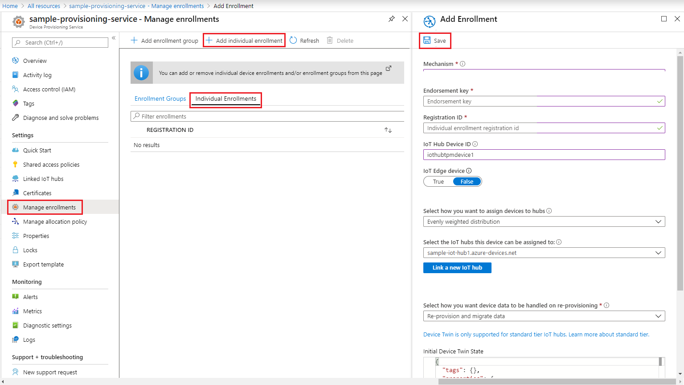
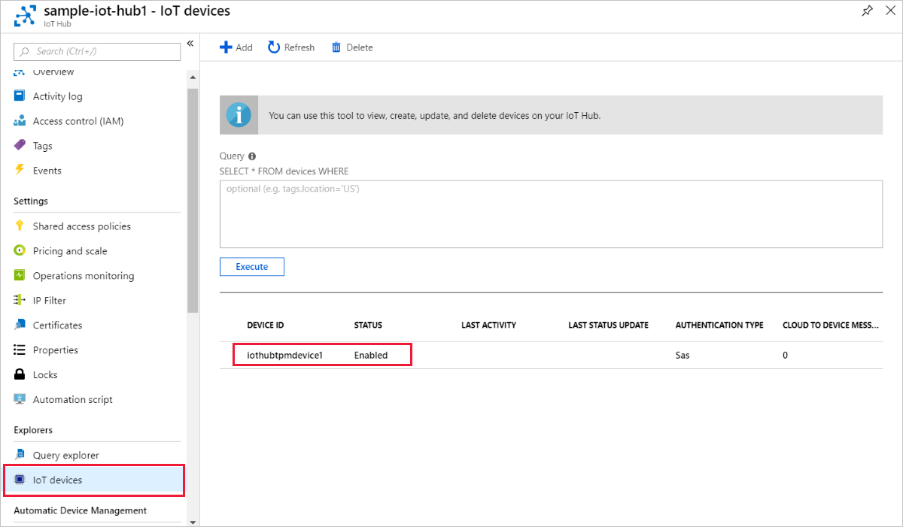

# Create and provision a simulated TPM device using C# device SDK for IoT Hub Device Provisioning Service

[!INCLUDE [iot-dps-selector-quick-create-simulated-device-tpm](../../includes/iot-dps-selector-quick-create-simulated-device-tpm.md)]

These steps show you how to use the [Azure IoT Samples for C#](https://github.com/Azure-Samples/azure-iot-samples-csharp) to simulate a TPM device on a development machine running the Windows OS. The sample also connects the simulated device to an IoT Hub using the Device Provisioning Service. 

The sample code uses the Windows TPM simulator as the [Hardware Security Module (HSM)](https://azure.microsoft.com/blog/azure-iot-supports-new-security-hardware-to-strengthen-iot-security/) of the device. 

If you're unfamiliar with the process of autoprovisioning, be sure to also review [Auto-provisioning concepts](concepts-auto-provisioning.md). Also make sure you've completed the steps in [Set up IoT Hub Device Provisioning Service with the Azure portal](./quick-setup-auto-provision.md) before continuing. 

The Azure IoT Device Provisioning Service supports two types of enrollments:
- [Enrollment groups](concepts-service.md#enrollment-group): Used to enroll multiple related devices.
- [Individual Enrollments](concepts-service.md#individual-enrollment): Used to enroll a single device.

This article will demonstrate individual enrollments.

[!INCLUDE [IoT Device Provisioning Service basic](../../includes/iot-dps-basic.md)]

<a id="setupdevbox"></a>
## Prepare the development environment 

1. Make sure you have the [.NET Core 2.1 SDK or later](https://www.microsoft.com/net/download/windows) installed on your machine. 

1. Make sure `git` is installed on your machine and is added to the environment variables accessible to the command window. See [Software Freedom Conservancy's Git client tools](https://git-scm.com/download/) for the latest version of `git` tools to install, which includes the **Git Bash**, the command-line app that you can use to interact with your local Git repository. 

1. Open a command prompt or Git Bash. Clone the Azure IoT Samples for C# GitHub repo:
    
    ```cmd
    git clone https://github.com/Azure-Samples/azure-iot-samples-csharp.git
    ```

## Provision the simulated device


1. Sign in to the Azure portal. Click the **All resources** button on the left-hand menu and open your Device Provisioning service. From the **Overview** blade, note down the **_ID Scope_** value.

     


2. In a command prompt, change directories to the project directory for the TPM device provisioning sample.

    ```cmd
    cd .\azure-iot-samples-csharp\provisioning\Samples\device\TpmSample
    ```

2. Type the following command to build and run the TPM device provisioning sample. Replace the `<IDScope>` value with the ID Scope for your provisioning service. 

    ```cmd
    dotnet run <IDScope>
    ```

    This command will launch the TPM chip simulator in a separate command prompt.  

1. The command window displays the **_Endorsement Key_**,  the **_Registration ID_**, and a suggested **_Device ID_** needed for device enrollment. Take note of these values. You will use these value to create an individual enrollment in your Device Provisioning Service instance. 
   > [!NOTE]
   > Do not confuse the window that contains command output with the window that contains output from the TPM simulator. You may have to click the command window to bring it to the foreground.

     

4. In the Azure portal, on the Device Provisioning Service summary blade, select **Manage enrollments**. Select the **Individual Enrollments** tab and click the **Add individual enrollment** button at the top. 

5. Under **Add Enrollment**, enter the following information:
   - Select **TPM** as the identity attestation *Mechanism*.
   - Enter the *Registration ID* and *Endorsement key* for your TPM device that you noted earlier.
   - Optionally select an IoT hub linked with your provisioning service.
   - Enter a unique device ID. You can enter the device ID suggested in the sample output or enter your own. If you use your own, make sure to avoid sensitive data when naming your device. 
   - Optionally update the **Initial device twin state** with the desired initial configuration for the device.
   - Once complete, click the **Save** button. 

       

   On successful enrollment, the *Registration ID* of your device will appear in the list under the *Individual Enrollments* tab. 

6. Press Enter in the command window (that displayed the **_Endorsement Key_**,  the **_Registration ID_**, and a suggested **_Device ID_**)  to enroll the simulated device. Notice the messages that simulate the device booting and connecting to the Device Provisioning Service to get your IoT hub information. 

1. Verify that the device has been provisioned. On successful provisioning of the simulated device to the IoT hub linked with your provisioning service, the device ID appears on the hub's **IoT Devices** blade. 

     

    If you changed the *initial device twin state* from the default value in the enrollment entry for your device, it can pull the desired twin state from the hub and act accordingly. For more information, see [Understand and use device twins in IoT Hub](../iot-hub/iot-hub-devguide-device-twins.md)


## Clean up resources

If you plan to continue working on and exploring the device client sample, do not clean up the resources created in this Quickstart. If you do not plan to continue, use the following steps to delete all resources created by this Quickstart.

1. Close the device client sample output window on your machine.
1. Close the TPM simulator window on your machine.
1. From the left-hand menu in the Azure portal, click **All resources** and then select your Device Provisioning service. At the top of the **All resources** blade, click **Delete**.  
1. From the left-hand menu in the Azure portal, click **All resources** and then select your IoT hub. At the top of the **All resources** blade, click **Delete**.  

## Next steps

In this Quickstart, you’ve created a TPM simulated device on your machine and provisioned it to your IoT hub using the IoT Hub Device Provisioning Service. To learn how to enroll your TPM device programmatically, continue to the Quickstart for programmatic enrollment of a TPM device. 

> [!div class="nextstepaction"]
> [Azure Quickstart - Enroll TPM device to Azure IoT Hub Device Provisioning Service](quick-enroll-device-tpm-csharp.md)
