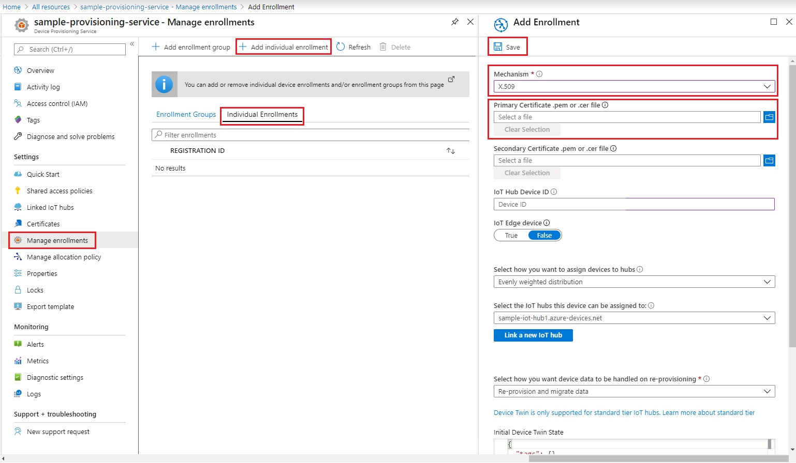
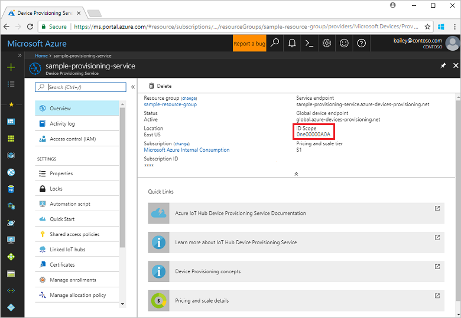

# Quickstart: Create and provision an X.509 device using C# device SDK for IoT Hub Device Provisioning Service

[!INCLUDE [iot-dps-selector-quick-create-simulated-device-x509](../../includes/iot-dps-selector-quick-create-simulated-device-x509.md)]

These steps show you how to use device code from the [Azure IoT Samples for C#](https://github.com/Azure-Samples/azure-iot-samples-csharp) to provision an X.509 device. In this article, you will run device sample code on your development machine to connect to an IoT Hub using the Device Provisioning Service.

## Prerequisites

If you're unfamiliar with the process of autoprovisioning, review the [provisioning](about-iot-dps.md#provisioning-process) overview. Also make sure you've completed the steps in [Set up IoT Hub Device Provisioning Service with the Azure portal](./quick-setup-auto-provision.md) before continuing.

The Azure IoT Device Provisioning Service supports two types of enrollments:
- [Enrollment groups](concepts-service.md#enrollment-group): Used to enroll multiple related devices.
- [Individual Enrollments](concepts-service.md#individual-enrollment): Used to enroll a single device.

This article will demonstrate individual enrollments.

[!INCLUDE [IoT Device Provisioning Service basic](../../includes/iot-dps-basic.md)]

<a id="setupdevbox"></a>
## Prepare the development environment 

1. Make sure `git` is installed on your machine and is added to the environment variables accessible to the command window. See [Software Freedom Conservancy's Git client tools](https://git-scm.com/download/) for the latest version of `git` tools to install, which includes the **Git Bash**, the command-line app that you can use to interact with your local Git repository. 

1. Open a command prompt or Git Bash. Clone the Azure IoT Samples for C# GitHub repo:
    
    ```bash
    git clone https://github.com/Azure-Samples/azure-iot-samples-csharp.git
    ```

1. Make sure you have the [.NET Core 3.1 SDK or later](https://dotnet.microsoft.com/download) installed on your machine. You can use the following command to check your version.

    ```bash
    dotnet --info
    ```

## Create a self-signed X.509 device certificate

In this section you, will create a self-signed X.509 test certificate using `iothubx509device1` as the subject common name. It is important to keep in mind the following points:

* Self-signed certificates are for testing only, and should not be used in production.
* The default expiration date for a self-signed certificate is one year.
* The device ID of the IoT device will be the subject common name on the certificate. Make sure to use a subject name that complies with the [Device ID string requirements](../iot-hub/iot-hub-devguide-identity-registry.md#device-identity-properties).

You will use sample code from the [X509Sample](https://github.com/Azure-Samples/azure-iot-samples-csharp/tree/master/provisioning/Samples/device/X509Sample) to create the certificate to be used with the individual enrollment entry for the device.


1. In a PowerShell prompt, change directories to the project directory for the X.509 device provisioning sample.

    ```powershell
    cd .\azure-iot-samples-csharp\provisioning\Samples\device\X509Sample
    ```

2. The sample code is set up to use X.509 certificates stored within a password-protected PKCS12 formatted file (certificate.pfx). Additionally, you need a public key certificate file (certificate.cer) to create an individual enrollment later in this quickstart. To generate the self-signed certificate and its associated .cer and .pfx files, run the following command:

    ```powershell
    PS D:\azure-iot-samples-csharp\provisioning\Samples\device\X509Sample> .\GenerateTestCertificate.ps1 iothubx509device1
    ```

3. The script prompts you for a PFX password. Remember this password, you must use it later again when you run the sample. You can run `certutil` to dump the certificate and verify the subject name.

    ```powershell
    PS D:\azure-iot-samples-csharp\provisioning\Samples\device\X509Sample> certutil .\certificate.pfx
    Enter PFX password:
    ================ Certificate 0 ================
    ================ Begin Nesting Level 1 ================
    Element 0:
    Serial Number: 7b4a0e2af6f40eae4d91b3b7ff05a4ce
    Issuer: CN=iothubx509device1, O=TEST, C=US
     NotBefore: 2/1/2021 6:18 PM
     NotAfter: 2/1/2022 6:28 PM
    Subject: CN=iothubx509device1, O=TEST, C=US
    Signature matches Public Key
    Root Certificate: Subject matches Issuer
    Cert Hash(sha1): e3eb7b7cc1e2b601486bf8a733887a54cdab8ed6
    ----------------  End Nesting Level 1  ----------------
      Provider = Microsoft Strong Cryptographic Provider
    Signature test passed
    CertUtil: -dump command completed successfully.    
    ```

 ## Create an individual enrollment entry for the device


1. Sign in to the Azure portal, select the **All resources** button on the left-hand menu and open your provisioning service.

2. From the Device Provisioning Service menu, select **Manage enrollments**. Select **Individual Enrollments** tab and select the **Add individual enrollment** button at the top. 

3. In the **Add Enrollment** panel, enter the following information:
   - Select **X.509** as the identity attestation *Mechanism*.
   - Under the *Primary certificate .pem or .cer file*, choose *Select a file* to select the certificate file **certificate.cer** created in the previous steps.
   - Leave **Device ID** blank. Your device will be provisioned with its device ID set to the common name (CN) in the X.509 certificate, **iothubx509device1**. This common name will also be the name used for the registration ID for the individual enrollment entry. 
   - Optionally, you may provide the following information:
       - Select an IoT hub linked with your provisioning service.
       - Update the **Initial device twin state** with the desired initial configuration for the device.
   - Once complete, press the **Save** button. 

     [](./media/quick-create-simulated-device-x509-csharp/device-enrollment.png#lightbox)
    
   On successful enrollment, your X.509 enrollment entry appears as **iothubx509device1** under the *Registration ID* column in the *Individual Enrollments* tab. 


## Provision the device

1. From the **Overview** blade for your provisioning service, note the **_ID Scope_** value.

     


2. Type the following command to build and run the X.509 device provisioning sample. Replace the `<IDScope>` value with the ID Scope for your provisioning service. 

    The certificate file will default to *./certificate.pfx* and prompt for the .pfx password.  

    ```powershell
    dotnet run -- -s <IDScope>
    ```

    If you want to pass everything as a parameter, you can use the following example format.

    ```powershell
    dotnet run -- -s 0ne00000A0A -c certificate.pfx -p 1234
    ```


3. The device will connect to DPS and be assigned to an IoT Hub. The device will additionally send a telemetry message to the hub.

    ```output
    Loading the certificate...
    Found certificate: 10952E59D13A3E388F88E534444484F52CD3D9E4 CN=iothubx509device1, O=TEST, C=US; PrivateKey: True
    Using certificate 10952E59D13A3E388F88E534444484F52CD3D9E4 CN=iothubx509device1, O=TEST, C=US
    Initializing the device provisioning client...
    Initialized for registration Id iothubx509device1.
    Registering with the device provisioning service...
    Registration status: Assigned.
    Device iothubx509device2 registered to sample-iot-hub1.azure-devices.net.
    Creating X509 authentication for IoT Hub...
    Testing the provisioned device with IoT Hub...
    Sending a telemetry message...
    Finished.
    ```

4. Verify that the device has been provisioned. On successful provisioning of the device to the IoT hub linked with your provisioning service, the device ID appears on the hub's **IoT devices** blade. 

     

    If you changed the *initial device twin state* from the default value in the enrollment entry for your device, it can pull the desired twin state from the hub and act accordingly. For more information, see [Understand and use device twins in IoT Hub](../iot-hub/iot-hub-devguide-device-twins.md)


## Clean up resources

If you plan to continue working on and exploring the device client sample, do not clean up the resources created in this quickstart. If you do not plan to continue, use the following steps to delete all resources created by this quickstart.

1. Close the device client sample output window on your machine.
1. From the left-hand menu in the Azure portal, select **All resources** and then select your Device Provisioning service. At the top of the **Overview** blade, press **Delete** at the top of the pane.  
1. From the left-hand menu in the Azure portal, select **All resources** and then select your IoT hub. At the top of the **Overview** blade, press **Delete** at the top of the pane.  

## Next steps

In this quickstart, you provisioned an X.509 device to your IoT hub using the Azure IoT Hub Device Provisioning Service. To learn how to enroll your X.509 device programmatically, continue to the quickstart for programmatic enrollment of X.509 devices. 

> [!div class="nextstepaction"]
> [Azure quickstart - Enroll X.509 devices to Azure IoT Hub Device Provisioning Service](quick-enroll-device-x509-csharp.md)
